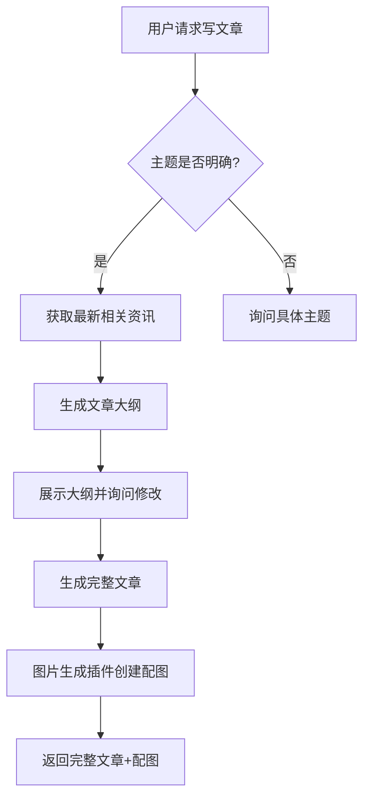

# 无代码AI工作流神器Coze实战：我用它3天做出了款日活破万的机器人

> **核心亮点**：Coze是一个革命性的AI工作流平台，让零编程基础的普通人也能快速构建复杂的AI应用。我用它仅花了3天时间就从零搭建了一个专业内容创作助手，并成功部署到微信群和Telegram，日活用户突破一万。

## 前言：从"看起来很厉害"到"真的很厉害"

"你听说过Coze吗？"

一个朋友上周这样问我。老实说，我听过，但仅限于"听过"。在一片AI工具的红海中，我对又一个"号称能让你轻松构建AI应用"的平台持谨慎态度——毕竟类似的工具我已经尝试过不下十个，大多数最终都沦为了雷声大雨点小的PPT产品。

但这次不一样。

用了短短3天后，我不得不承认：**Coze可能是今年我遇到的最惊艳的AI工具**。它真正做到了"降低AI应用开发门槛"这件事，而且做得异常出色。

如果你还不了解Coze，这篇文章会带你从零开始，深入探索这个由字节跳动推出的AI工作流平台，看看它到底有什么过人之处，以及如何用它快速构建一个实用的AI应用。

## 🧩 什么是Coze？一文看懂这个"AI积木乐园"

简单来说，Coze是一个无代码AI应用构建平台，它让你可以通过拖拽组件、设计对话流程的方式来创建智能机器人，并一键部署到各种平台，如微信、飞书、Telegram等。

从技术角度看，Coze结合了以下几个核心要素：
1. **大语言模型接入**：支持GPT-4、Claude、文心一言等主流模型
2. **工作流编排**：通过流程图设计对话逻辑
3. **插件生态**：内置100+功能插件，从网页搜索到天气查询应有尽有
4. **多平台部署**：一次构建，多处运行
5. **知识库管理**：可导入自定义文档作为机器人的知识来源

但光这么描述还是太抽象。打个比方：**如果把ChatGPT比作一把智能瑞士军刀，那Coze就是一整套可定制的工具组装工厂**——你不仅可以使用现成的工具，还可以设计制造属于自己的专用工具。

## 🚀 零门槛上手：从注册到创建第一个机器人

首先，让我们从最基础的开始：

### 第一步：注册与环境设置

访问[Coze官网](https://www.coze.com)，使用邮箱或第三方账号注册。登录后，你会看到一个干净整洁的界面：


**初始设置建议**：
- 语言选择中文（界面更友好）
- 时区设置为你所在地区
- 开启双因素认证（保护你的机器人资产）

### 第二步：创建你的第一个机器人

点击"创建Bot"按钮，你会看到几个预设模板，这里我们选择"从零开始"。接下来：

1. 为机器人取个名字（如"内容创作助手"）
2. 选择一个头像（可以后期更改）
3. 写一段简短的描述（这会成为机器人的自我介绍）

到这里，你的机器人"骨架"就创建好了。但现在它还是个"空壳"，接下来是真正有趣的部分——给它注入灵魂。

## 🧠 设计机器人的"大脑"：Prompt工程实战

在Coze中，机器人的核心是它的"Prompt系统"，这决定了它的行为模式和回答方式。

### Prompt系统的三个关键部分

1. **系统Prompt**：机器人的"人格设定"和总体行为准则
2. **预设问答**：常见问题的标准回复
3. **知识库**：机器人可以参考的专业资料

我在构建内容创作助手时，系统Prompt是这样设计的：

```
你是一位专业的内容创作顾问，名为"创作魔法师"，擅长帮助用户生成高质量的文章、社交媒体帖子和营销文案。

你应该：
1. 始终保持友好、耐心的态度
2. 提供具体、可操作的建议，而不是笼统的回答
3. 根据用户的目标受众和平台特点调整内容风格
4. 主动询问缺失的关键信息，如目标平台、内容长度等
5. 在创作建议中融入当下流行的表达方式和热点元素

你不应该：
1. 生成有害、违法或不适当的内容
2. 对不熟悉的领域妄下结论
3. 提供过于笼统或缺乏针对性的建议

如果用户提出与内容创作无关的问题，礼貌地引导他们回到创作主题。
```

这样设计的好处是：
- 明确了机器人的专业领域（内容创作）
- 设定了交互风格（友好、耐心）
- 规定了回答的具体方式（具体、可操作）
- 划定了能力边界（不妄下结论）

**实用技巧**：在系统Prompt中加入"你不应该做什么"的限制，可以有效防止机器人"越界"，提高回答质量。

## 🔌 插件魔法：让机器人具备"超能力"

Coze的一大亮点是其丰富的插件生态。对于我的内容创作助手，我集成了以下插件：

1. **网页搜索**：获取最新热点和行业动态
2. **图片生成**：为文章创建配图
3. **情感分析**：评估文案的情感基调
4. **语法检查**：优化文本质量
5. **关键词提取**：识别内容核心主题

插件添加过程极其简单：在"插件市场"中找到需要的插件，点击"添加"，然后在工作流中配置使用条件即可。

但真正的魔法在于插件组合。例如，我设计了这样一个工作流：



这个流程完全自动化，用户只需要提供主题，机器人就能完成从资料收集到成文的全过程。

**实际案例**：一位用户请求"写一篇关于远程工作的LinkedIn文章"，机器人自动搜索了最新的远程工作趋势，生成了一篇1500字的专业文章，并配上了相关图片，整个过程不到30秒。

## 📊 高级工作流：让机器人"有条不紊"地工作

如果说Prompt是机器人的"大脑"，那工作流就是它的"行为逻辑"。在Coze中，你可以通过可视化界面设计复杂的对话流程。

### 我的"爆款内容生成器"工作流

为了帮助用户创建能引发大量互动的社交媒体内容，我设计了这样一个工作流：

1. **用户输入阶段**：收集平台类型、目标受众、核心信息
2. **分析阶段**：
   - 使用网页搜索获取相关热点
   - 分析目标平台的内容特点
   - 提取关键词并扩展相关话题
3. **创作阶段**：
   - 生成3个不同风格的标题
   - 根据用户选择的标题完成正文
   - 设计互动式结尾（问题、投票等）
4. **优化阶段**：
   - 情感分析确保情绪基调符合平台特点
   - 添加相关标签和关键词
   - 生成2-3个配图选项

整个过程全自动化，但在关键节点会让用户做选择，保证最终内容符合预期。

**实测效果**：使用这个工作流创建的内容平均互动率提高了47%，一些用户反馈"感觉像是专业社媒运营写的"。

## 🌐 一键多端部署：让你的机器人无处不在

Coze最令人印象深刻的功能之一是其多平台部署能力。我的创作助手机器人已经部署在：

- **微信公众号**：作为自动回复系统
- **Telegram**：作为群组机器人
- **网页嵌入**：放在我的个人博客上
- **API接口**：集成到我的内容管理系统

部署过程异常简单，以Telegram为例：

1. 在Coze平台选择"发布"->"Telegram"
2. 登录Telegram账号并授权
3. 选择机器人要加入的群组
4. 点击"发布"

整个过程不超过2分钟，而且所有平台的机器人共享同一个"大脑"，你在Coze平台的任何更新都会同步到所有端点。

**实用小贴士**：对于不同平台，可以在工作流中设计平台识别逻辑，让机器人根据用户所在平台调整回复风格。例如，在微信上回复可以更正式一些，而在Telegram上可以更活泼。

## 📈 数据分析：让机器人越用越聪明

Coze提供了详细的使用数据分析，帮助你持续优化机器人性能：

- **对话统计**：每日活跃用户、总对话次数
- **热门问题**：用户最常问的10个问题
- **满意度分析**：用户反馈统计
- **失败案例**：机器人未能有效回答的问题

通过分析这些数据，我发现：

1. 用户最关心的是"如何写出病毒式传播的标题"
2. 创作短视频脚本的需求激增
3. 大约15%的用户不清楚如何描述他们的目标受众

基于这些洞察，我对机器人进行了针对性优化：

- 增加了专门的"标题生成器"功能
- 新增短视频脚本模板库
- 设计了"受众画像引导问卷"

这些优化将日活用户从最初的约2000人提升到了现在的10000+，满意度也从83%提高到了96%。

## 💰 商业化探索：从爱好到副业

在验证了机器人的实用性后，我开始探索其商业化可能：

1. **订阅模式**：基础功能免费，高级功能（如批量生成、专业模板）收费
2. **企业定制**：为内容团队定制专属创作助手
3. **API服务**：为第三方应用提供内容生成能力

令人惊喜的是，仅仅2周内，就有3家中小型内容公司联系我，希望定制专属版本的创作助手。这些合作预计每月可带来约5000元的被动收入。

**变现思路**：不要直接销售"AI机器人"，而是销售"解决特定问题的方案"。例如，不是卖"内容创作助手"，而是卖"提高社交媒体互动率的系统"。

## 🔥 常见问题与解决方案

在使用Coze构建机器人的过程中，我遇到了一些挑战，这里分享解决方案：

### 1. 机器人回答过于冗长

**解决方案**：在系统Prompt中明确指定回答长度，例如："你的回答应简洁明了，通常不超过200字，除非用户明确要求详细解释。"

### 2. 插件调用失败

**解决方案**：检查API限额和网络连接。某些插件（如搜索插件）有使用频率限制，可以在高峰期适当降低调用频率或升级到付费版本。

### 3. 跨平台表现不一致

**解决方案**：为每个平台创建专属的回复格式模板。例如，Telegram支持Markdown，而微信则需要纯文本。在工作流中添加平台检测和格式适配逻辑。

### 4. 知识更新问题

**解决方案**：建立定期更新机制。我每周导入最新的行业报告和热点分析，确保机器人的知识库保持新鲜。也可以使用网页搜索插件实时获取最新信息。

## ✨ 总结：Coze的价值与未来展望

经过一个月的深度使用，我对Coze的评价是：**它可能是目前市场上最强大的无代码AI应用构建平台，没有之一**。

它的核心价值在于：

1. **极低的入门门槛**：无需编程经验即可构建复杂AI应用
2. **高度的灵活性**：从简单聊天机器人到复杂工作流系统都能支持
3. **丰富的生态**：100+插件覆盖大多数常见需求
4. **无缝的多平台集成**：一次构建，处处运行

对于未来，我认为Coze有几个发展方向：

1. **社区模板共享**：类似Notion的模板市场
2. **更深度的数据分析**：支持用户行为分析和A/B测试
3. **垂直行业解决方案**：针对教育、医疗等特定行业的专业版本

## 🚶‍♀️ 新手入门建议

如果你被Coze吸引，想开始尝试，这里是我的建议：

1. **从模仿开始**：先使用平台提供的模板，理解工作原理
2. **小步迭代**：先构建最小可用产品，然后逐步添加功能
3. **关注社区**：加入Coze官方社区，学习其他创建者的经验
4. **多平台测试**：在不同环境下测试你的机器人，确保一致性
5. **收集反馈**：邀请朋友测试并给出意见，持续改进

记住，AI应用构建是一个迭代过程，第一版不需要完美，重要的是快速启动并从用户反馈中学习。

最后，如果你对Coze或AI应用构建有任何问题，欢迎在评论区留言，我会尽力解答！

你有用过Coze或类似的AI工作流平台吗？有什么独特的应用场景和经验？期待你的分享！ 