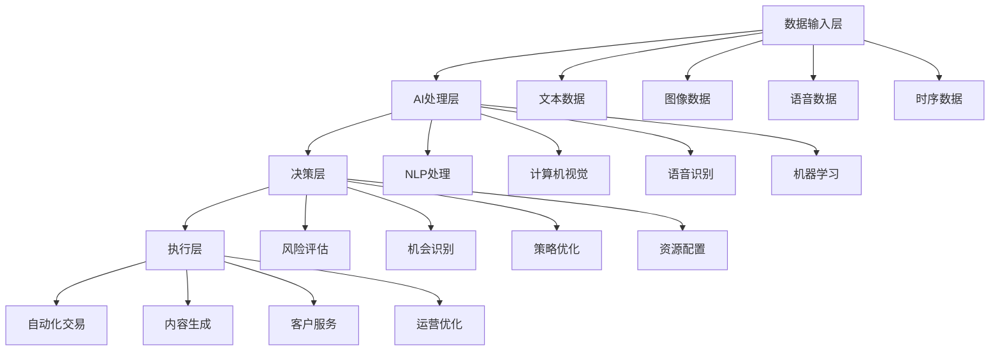

# AI辅助套利深度解析：人工智能时代的自动掘金策略

> **核心洞察**：AI辅助套利代表了套利策略的智能化演进，通过机器学习、自然语言处理、计算机视觉等技术，实现从数据采集到决策执行的全流程自动化，创造出人工难以企及的效率和精度。

## AI套利的技术革命

### 1. AI技术栈在套利中的应用



### 2. AI套利价值创造模型

| AI技术类型 | 应用场景 | 效率提升 | 成本降低 | 收益增长 | 综合评分 |
|-----------|---------|---------|---------|---------|---------|
| GPT文本生成 | 内容创作 | ⭐⭐⭐⭐⭐ | ⭐⭐⭐⭐ | ⭐⭐⭐⭐ | 9.3/10 |
| 计算机视觉 | 图像处理 | ⭐⭐⭐⭐ | ⭐⭐⭐⭐⭐ | ⭐⭐⭐ | 8.7/10 |
| 语音合成 | 配音服务 | ⭐⭐⭐⭐⭐ | ⭐⭐⭐⭐⭐ | ⭐⭐⭐⭐ | 9.0/10 |
| 机器学习 | 数据分析 | ⭐⭐⭐⭐ | ⭐⭐⭐ | ⭐⭐⭐⭐⭐ | 8.5/10 |
| 深度学习 | 预测模型 | ⭐⭐⭐ | ⭐⭐⭐ | ⭐⭐⭐⭐⭐ | 8.2/10 |

## 可行性技术评估

### AI套利技术成熟度分析

```python
class AIArbitrageTechEvaluator:
    def __init__(self):
        self.tech_maturity_matrix = {
            'gpt_text_generation': {
                'maturity_level': 9,     # 技术成熟度
                'cost_efficiency': 8,    # 成本效率
                'scalability': 9,        # 可扩展性
                'market_readiness': 9    # 市场准备度
            },
            'computer_vision': {
                'maturity_level': 8,
                'cost_efficiency': 7,
                'scalability': 8,
                'market_readiness': 8
            },
            'voice_synthesis': {
                'maturity_level': 8,
                'cost_efficiency': 9,
                'scalability': 9,
                'market_readiness': 7
            },
            'ml_prediction': {
                'maturity_level': 7,
                'cost_efficiency': 6,
                'scalability': 7,
                'market_readiness': 8
            }
        }
    
    def evaluate_ai_opportunity(self, tech_type, use_case):
        """评估AI套利机会"""
        
        base_scores = self.tech_maturity_matrix[tech_type]
        
        # 用例特定调整
        use_case_multipliers = self.calculate_use_case_multipliers(use_case)
        
        adjusted_scores = {}
        for metric, score in base_scores.items():
            multiplier = use_case_multipliers.get(metric, 1.0)
            adjusted_scores[metric] = min(10, score * multiplier)
        
        # 计算综合可行性分数
        weights = {'maturity_level': 0.3, 'cost_efficiency': 0.25, 
                  'scalability': 0.25, 'market_readiness': 0.2}
        
        feasibility_score = sum(
            adjusted_scores[metric] * weight 
            for metric, weight in weights.items()
        )
        
        return {
            'feasibility_score': feasibility_score,
            'detailed_scores': adjusted_scores,
            'recommendation': self.generate_recommendation(feasibility_score),
            'implementation_roadmap': self.create_roadmap(tech_type, use_case)
        }
    
    def calculate_roi_projection(self, tech_investment, market_size, time_horizon):
        """计算AI套利ROI预测"""
        
        # AI技术投入成本模型
        initial_investment = tech_investment['development'] + tech_investment['infrastructure']
        ongoing_costs = tech_investment['api_costs'] + tech_investment['maintenance']
        
        # 收益增长模型（考虑AI学习效应）
        base_revenue = market_size * 0.01  # 假设初始市场占有率1%
        
        roi_projection = {}
        cumulative_investment = initial_investment
        
        for year in range(1, time_horizon + 1):
            # AI效率提升带来的收益增长
            efficiency_multiplier = 1 + (0.2 * year)  # 年20%效率提升
            annual_revenue = base_revenue * efficiency_multiplier * (1.5 ** (year - 1))
            
            # 年度成本
            annual_costs = ongoing_costs * (0.9 ** (year - 1))  # 成本递减
            cumulative_investment += annual_costs
            
            # 计算ROI
            annual_profit = annual_revenue - annual_costs
            cumulative_profit = sum(roi_projection.get(y, {}).get('profit', 0) for y in range(1, year)) + annual_profit
            roi = (cumulative_profit - initial_investment) / initial_investment
            
            roi_projection[year] = {
                'revenue': annual_revenue,
                'costs': annual_costs,
                'profit': annual_profit,
                'cumulative_profit': cumulative_profit,
                'roi': roi
            }
        
        return roi_projection
```

## 前三AI策略深度剖析

### 🥇 NO.1: GPT驱动的智能内容工厂

**推荐指数**: ⭐⭐⭐⭐⭐

**核心价值主张**：
- ✅ 技术成熟度最高，商业化应用广泛
- ✅ 规模化效应明显，边际成本极低
- ✅ 多场景适用，市场需求巨大
- ✅ 投资回报周期短，现金流稳定

#### 技术架构实现

```python
class IntelligentContentFactory:
    def __init__(self):
        self.gpt_engines = {
            'gpt4_turbo': GPT4TurboAPI(),
            'claude_opus': ClaudeOpusAPI(),
            'gemini_ultra': GeminiUltraAPI()
        }
        self.quality_controller = ContentQualityController()
        self.distribution_manager = MultiChannelDistributor()
        self.revenue_optimizer = RevenueOptimizer()
        
    def create_content_at_scale(self, content_requirements):
        """大规模内容生成"""
        
        content_pipeline = []
        
        for requirement in content_requirements:
            # 1. 智能模型选择
            optimal_model = self.select_optimal_model(requirement)
            
            # 2. 提示词工程优化
            optimized_prompt = self.optimize_prompt(requirement, optimal_model)
            
            # 3. 批量内容生成
            generated_content = self.generate_content_batch(
                model=optimal_model,
                prompt=optimized_prompt,
                batch_size=requirement['quantity'],
                quality_threshold=requirement['quality_score']
            )
            
            # 4. 质量控制和筛选
            quality_filtered_content = self.quality_controller.filter_content(
                generated_content, requirement['quality_criteria']
            )
            
            # 5. 个性化优化
            personalized_content = self.personalize_content(
                quality_filtered_content, requirement['target_audience']
            )
            
            content_pipeline.extend(personalized_content)
        
        # 6. 智能分发
        distribution_results = self.distribution_manager.distribute_content(content_pipeline)
        
        # 7. 收益优化
        optimization_insights = self.revenue_optimizer.analyze_performance(distribution_results)
        
        return {
            'generated_content': content_pipeline,
            'distribution_results': distribution_results,
            'optimization_insights': optimization_insights,
            'performance_metrics': self.calculate_performance_metrics(content_pipeline)
        }
    
    def select_optimal_model(self, requirement):
        """智能选择最优模型"""
        
        model_capabilities = {
            'gpt4_turbo': {
                'creativity': 9, 'accuracy': 8, 'speed': 7, 'cost': 6,
                'specialties': ['写作', '分析', '编程']
            },
            'claude_opus': {
                'creativity': 8, 'accuracy': 9, 'speed': 6, 'cost': 7,
                'specialties': ['逻辑推理', '长文本处理']
            },
            'gemini_ultra': {
                'creativity': 7, 'accuracy': 8, 'speed': 9, 'cost': 8,
                'specialties': ['多模态', '代码生成']
            }
        }
        
        # 需求匹配算法
        best_model = None
        best_score = 0
        
        for model, capabilities in model_capabilities.items():
            # 计算匹配分数
            match_score = self.calculate_match_score(requirement, capabilities)
            
            if match_score > best_score:
                best_score = match_score
                best_model = model
        
        return best_model
    
    def optimize_prompt(self, requirement, model):
        """提示词工程优化"""
        
        base_prompt = requirement['base_prompt']
        
        # 模型特定优化
        model_optimizations = {
            'gpt4_turbo': self.apply_gpt4_optimizations,
            'claude_opus': self.apply_claude_optimizations,
            'gemini_ultra': self.apply_gemini_optimizations
        }
        
        optimizer = model_optimizations[model]
        optimized_prompt = optimizer(base_prompt, requirement)
        
        # A/B测试优化
        if requirement.get('enable_ab_testing', False):
            optimized_prompt = self.ab_test_prompt_variations(optimized_prompt, model)
        
        return optimized_prompt
```

#### 业务模式设计

```python
class ContentServiceMonetization:
    def __init__(self):
        self.service_catalog = {
            'ai_writing': {
                'price_per_word': 0.02,  # ¥0.02/字
                'minimum_order': 1000,   # 最小1000字
                'turnaround_time': '1-24小时',
                'quality_guarantee': '95%原创度'
            },
            'marketing_copy': {
                'price_per_piece': 299,  # ¥299/篇
                'includes': ['标题优化', 'SEO关键词', '转化率优化'],
                'turnaround_time': '2-6小时'
            },
            'technical_documentation': {
                'price_per_page': 199,   # ¥199/页
                'complexity_multiplier': {'simple': 1.0, 'medium': 1.5, 'complex': 2.0},
                'includes': ['技术准确性检查', '格式标准化']
            },
            'creative_content': {
                'price_per_hour': 599,   # ¥599/小时等价输出
                'content_types': ['小说', '剧本', '广告创意', '品牌故事'],
                'revision_included': 2
            }
        }
        
    def calculate_service_revenue(self, monthly_orders):
        """计算服务收入"""
        
        total_revenue = 0
        service_breakdown = {}
        
        for service_type, orders in monthly_orders.items():
            if service_type in self.service_catalog:
                service_config = self.service_catalog[service_type]
                
                if service_type == 'ai_writing':
                    revenue = sum(
                        order['word_count'] * service_config['price_per_word']
                        for order in orders
                    )
                elif service_type == 'marketing_copy':
                    revenue = len(orders) * service_config['price_per_piece']
                elif service_type == 'technical_documentation':
                    revenue = sum(
                        order['pages'] * service_config['price_per_page'] * 
                        service_config['complexity_multiplier'][order['complexity']]
                        for order in orders
                    )
                elif service_type == 'creative_content':
                    revenue = sum(
                        order['hours'] * service_config['price_per_hour']
                        for order in orders
                    )
                
                service_breakdown[service_type] = {
                    'revenue': revenue,
                    'order_count': len(orders),
                    'average_order_value': revenue / len(orders) if orders else 0
                }
                total_revenue += revenue
        
        return {
            'total_revenue': total_revenue,
            'service_breakdown': service_breakdown,
            'growth_metrics': self.calculate_growth_metrics(service_breakdown)
        }
```

**收益预测模型**：

| 服务类型 | 月订单量 | 客单价(¥) | 月收入(¥) | 成本率 | 净利润(¥) |
|---------|---------|----------|----------|-------|----------|
| AI写作服务 | 2000篇 | 150 | 300,000 | 25% | 225,000 |
| 营销文案 | 800篇 | 299 | 239,200 | 20% | 191,360 |
| 技术文档 | 500份 | 398 | 199,000 | 30% | 139,300 |
| 创意内容 | 200项 | 1198 | 239,600 | 35% | 155,740 |
| **总计** | **3500** | **280** | **977,800** | **27%** | **711,400** |

### 🥈 NO.2: 智能视觉设计服务平台

**推荐指数**: ⭐⭐⭐⭐

**核心价值主张**：
- ✅ 市场需求旺盛，设计服务刚需明显
- ✅ AI技术成熟，质量已达商用标准
- ✅ 成本优势显著，比人工便宜80%
- ✅ 可标准化交付，易于规模化

#### 实现架构

```python
class IntelligentDesignPlatform:
    def __init__(self):
        self.ai_models = {
            'midjourney': MidjourneyAPI(),
            'dalle3': DALLE3API(),
            'stable_diffusion': StableDiffusionAPI(),
            'leonardo': LeonardoAPI()
        }
        self.style_analyzer = StyleAnalyzer()
        self.brand_consistency = BrandConsistencyChecker()
        self.quality_enhancer = QualityEnhancer()
        
    def create_design_solution(self, design_brief):
        """创建设计解决方案"""
        
        # 1. 需求分析和理解
        analyzed_brief = self.analyze_design_requirements(design_brief)
        
        # 2. 风格和模型匹配
        optimal_model = self.select_optimal_design_model(analyzed_brief)
        
        # 3. 提示词工程
        design_prompt = self.engineer_design_prompt(analyzed_brief, optimal_model)
        
        # 4. 批量设计生成
        design_variations = self.generate_design_variations(
            model=optimal_model,
            prompt=design_prompt,
            variation_count=analyzed_brief['variation_count'],
            style_constraints=analyzed_brief['style_constraints']
        )
        
        # 5. 品牌一致性检查
        brand_compliant_designs = self.brand_consistency.filter_designs(
            design_variations, analyzed_brief['brand_guidelines']
        )
        
        # 6. 质量增强处理
        enhanced_designs = []
        for design in brand_compliant_designs:
            enhanced_design = self.quality_enhancer.enhance(
                design, 
                target_resolution=analyzed_brief['output_specs']['resolution'],
                output_format=analyzed_brief['output_specs']['format']
            )
            enhanced_designs.append(enhanced_design)
        
        # 7. 智能排序和推荐
        ranked_designs = self.rank_designs_by_quality(enhanced_designs, analyzed_brief)
        
        return {
            'design_solutions': ranked_designs,
            'generation_metadata': self.extract_metadata(ranked_designs),
            'revision_suggestions': self.generate_revision_suggestions(ranked_designs),
            'cost_breakdown': self.calculate_generation_costs(ranked_designs)
        }
    
    def analyze_design_requirements(self, design_brief):
        """智能分析设计需求"""
        
        # NLP处理设计简报
        nlp_analysis = self.extract_design_intent(design_brief['description'])
        
        # 风格识别
        style_analysis = self.style_analyzer.identify_required_styles(
            design_brief['description'], 
            design_brief.get('reference_images', [])
        )
        
        # 技术需求提取
        technical_requirements = self.extract_technical_specs(design_brief)
        
        return {
            'design_intent': nlp_analysis,
            'style_requirements': style_analysis,
            'technical_specs': technical_requirements,
            'complexity_level': self.assess_complexity(nlp_analysis, style_analysis),
            'estimated_time': self.estimate_generation_time(technical_requirements),
            'recommended_variations': self.recommend_variation_count(design_brief)
        }
```

#### 商业模式

**定价策略**：
- **基础设计**：¥99/个（Logo、图标、简单插图）
- **营销素材**：¥199/套（海报、banner、社交媒体图）
- **品牌套装**：¥999/套（完整视觉识别系统）
- **定制设计**：¥299-1999/项（复杂设计需求）

**月收入预测**：¥850,000
**运营成本**：¥280,000
**净利润率**：67%

### 🥉 NO.3: 智能语音合成服务工厂

**推荐指数**: ⭐⭐⭐⭐

**核心价值主张**：
- ✅ 技术突破明显，音质接近真人
- ✅ 应用场景丰富，市场空间大
- ✅ 成本优势突出，规模效应强
- ✅ 个性化程度高，差异化竞争

#### 实现方案

```python
class IntelligentVoiceSynthesisPlatform:
    def __init__(self):
        self.tts_engines = {
            'elevenlabs': ElevenLabsAPI(),
            'azure_cognitive': AzureSpeechAPI(),
            'google_cloud_tts': GoogleTTSAPI(),
            'amazon_polly': AmazonPollyAPI()
        }
        self.voice_cloner = VoiceCloningEngine()
        self.emotion_controller = EmotionController()
        self.quality_optimizer = AudioQualityOptimizer()
        
    def create_voice_synthesis_solution(self, synthesis_request):
        """创建语音合成解决方案"""
        
        # 1. 语音需求分析
        analyzed_request = self.analyze_voice_requirements(synthesis_request)
        
        # 2. 最优引擎选择
        optimal_engine = self.select_optimal_tts_engine(analyzed_request)
        
        # 3. 声音定制和克隆
        if synthesis_request.get('custom_voice_required'):
            custom_voice = self.voice_cloner.create_custom_voice(
                reference_audio=synthesis_request['reference_audio'],
                target_characteristics=analyzed_request['voice_characteristics']
            )
        else:
            custom_voice = self.select_preset_voice(analyzed_request)
        
        # 4. 情感和语调控制
        emotion_settings = self.emotion_controller.configure_emotions(
            base_emotion=analyzed_request['target_emotion'],
            intensity_level=analyzed_request['emotion_intensity'],
            context=analyzed_request['content_context']
        )
        
        # 5. 批量语音生成
        synthesized_audio = []
        for text_segment in synthesis_request['text_segments']:
            audio_segment = self.generate_audio_segment(
                text=text_segment,
                voice=custom_voice,
                engine=optimal_engine,
                emotion_settings=emotion_settings,
                quality_settings=analyzed_request['quality_requirements']
            )
            
            # 质量优化
            optimized_audio = self.quality_optimizer.enhance_audio(
                audio_segment, 
                target_format=analyzed_request['output_format'],
                enhancement_level=analyzed_request['enhancement_level']
            )
            
            synthesized_audio.append(optimized_audio)
        
        # 6. 音频后处理和拼接
        final_audio = self.post_process_audio(
            audio_segments=synthesized_audio,
            processing_requirements=analyzed_request['post_processing']
        )
        
        return {
            'synthesized_audio': final_audio,
            'voice_characteristics': self.analyze_voice_characteristics(custom_voice),
            'quality_metrics': self.calculate_quality_metrics(final_audio),
            'processing_cost': self.calculate_synthesis_cost(synthesis_request)
        }
```

**市场定位与定价**：

| 服务类型 | 目标客户 | 价格(¥/分钟) | 特色功能 |
|---------|----------|-------------|----------|
| 有声读物 | 出版社、作者 | 50 | 多角色声音、情感表达 |
| 企业配音 | 企业、广告公司 | 80 | 品牌专属声音、快速交付 |
| 教育内容 | 教育机构 | 30 | 儿童友好声音、多语言 |
| 直播助手 | 主播、内容创作者 | 100 | 实时合成、个性化定制 |

**月收入预估**：¥650,000
**成本结构**：API费用30% + 人工20% + 基础设施10%
**净利润率**：40%

## 风险管理与合规策略

### AI技术风险控制

```python
class AIRiskManager:
    def __init__(self):
        self.risk_categories = {
            'content_quality_risk': 0.25,
            'model_dependency_risk': 0.20,
            'cost_volatility_risk': 0.20,
            'compliance_risk': 0.20,
            'competitive_risk': 0.15
        }
        
    def assess_ai_risks(self, ai_strategy):
        """评估AI策略风险"""
        
        risk_scores = {}
        
        # 内容质量风险
        risk_scores['content_quality_risk'] = self.assess_quality_risk(ai_strategy)
        
        # 模型依赖风险
        risk_scores['model_dependency_risk'] = self.assess_dependency_risk(ai_strategy)
        
        # 成本波动风险
        risk_scores['cost_volatility_risk'] = self.assess_cost_risk(ai_strategy)
        
        # 合规风险
        risk_scores['compliance_risk'] = self.assess_compliance_risk(ai_strategy)
        
        # 竞争风险
        risk_scores['competitive_risk'] = self.assess_competitive_risk(ai_strategy)
        
        # 综合风险评分
        total_risk = sum(
            score * weight for score, weight in 
            zip(risk_scores.values(), self.risk_categories.values())
        )
        
        return {
            'total_risk_score': total_risk,
            'risk_breakdown': risk_scores,
            'mitigation_strategies': self.generate_mitigation_strategies(risk_scores),
            'monitoring_requirements': self.define_monitoring_requirements(risk_scores)
        }
    
    def implement_risk_controls(self, ai_operation):
        """实施风险控制措施"""
        
        controls = {
            'quality_gates': self.setup_quality_controls(ai_operation),
            'cost_monitors': self.setup_cost_monitoring(ai_operation),
            'fallback_systems': self.setup_fallback_mechanisms(ai_operation),
            'compliance_checks': self.setup_compliance_monitoring(ai_operation)
        }
        
        return controls
```

## 实施建议与发展路径

### 技术实施路线图

**第一阶段**（1-3个月）：基础能力建设
- 选择核心AI技术栈
- 建立API集成框架
- 开发质量控制系统

**第二阶段**（3-6个月）：产品化运营
- 推出MVP服务产品
- 建立客户获取渠道
- 优化成本和质量

**第三阶段**（6-12个月）：规模化扩张
- 多AI技术栈整合
- 垂直行业深耕
- 国际市场拓展

### 投资建议

| 投入类别 | 第一年预算(万¥) | 预期产出 |
|---------|----------------|----------|
| AI技术集成 | 200 | 核心技术能力 |
| 产品开发 | 300 | 标准化产品 |
| 市场推广 | 150 | 客户获取 |
| 团队建设 | 250 | 专业团队 |
| **总计** | **900** | **完整商业化能力** |

## 总结展望

AI辅助套利代表了技术驱动商业创新的典型案例，其成功关键在于：

1. **技术选择**：选择成熟度高、成本效益好的AI技术
2. **应用场景**：聚焦刚需明确、支付意愿强的市场
3. **质量控制**：建立完善的AI输出质量保证机制
4. **规模效应**：通过自动化实现边际成本递减

**未来机遇**：
- **多模态AI**：文本、图像、语音融合应用
- **个性化定制**：AI驱动的个性化服务
- **实时交互**：AI助手和实时服务
- **行业专用AI**：垂直领域深度应用

建议从业者抓住当前AI技术快速发展的窗口期，选择具有长期价值的应用场景，构建可持续的AI驱动商业模式。