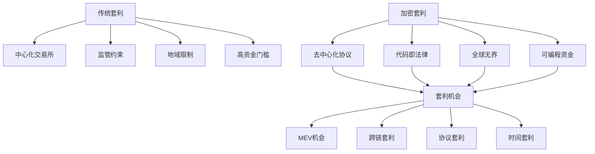

# 加密量化套利深度解析：DeFi时代的算法掘金策略

> **核心认知**：加密量化套利是传统金融工程在区块链领域的革命性应用，通过智能合约和算法交易捕获去中心化金融生态中的无风险套利机会。

## 加密套利的理论基础

### 1. 区块链套利的独特性

与传统金融套利相比，加密套利具有以下特征：



### 2. DeFi套利价值来源

| 套利类型 | 价值来源 | 技术难度 | 资金要求 | 预期收益 |
|---------|----------|----------|----------|----------|
| DEX价差套利 | 流动性分割 | ⭐⭐ | $10K+ | 5-15% APY |
| 跨链套利 | 桥接延迟 | ⭐⭐⭐⭐ | $50K+ | 10-30% APY |
| 闪电贷套利 | 资本效率 | ⭐⭐⭐⭐⭐ | $0 | 单次1-5% |
| MEV提取 | 交易排序 | ⭐⭐⭐⭐⭐ | $100K+ | 20-50% APY |
| 流动性挖矿 | 激励分配 | ⭐⭐ | $5K+ | 15-200% APY |

## 可行性深度评估

### 风险收益矩阵分析

```python
class CryptoArbitrageAnalyzer:
    def __init__(self):
        self.risk_factors = {
            'smart_contract_risk': 0.3,    # 智能合约风险
            'impermanent_loss': 0.2,       # 无常损失
            'gas_cost_volatility': 0.15,   # Gas费波动
            'regulatory_risk': 0.1,        # 监管风险
            'technical_risk': 0.15,        # 技术风险
            'market_risk': 0.1             # 市场风险
        }
    
    def calculate_risk_adjusted_return(self, strategy):
        base_return = strategy.expected_return
        risk_adjustment = sum([
            risk_weight * strategy.risk_exposure[risk_type] 
            for risk_type, risk_weight in self.risk_factors.items()
        ])
        
        return base_return * (1 - risk_adjustment)
    
    def evaluate_feasibility(self, strategy):
        factors = {
            'technical_complexity': strategy.tech_score,
            'capital_requirement': strategy.capital_score,  
            'market_opportunity': strategy.market_score,
            'regulatory_compliance': strategy.compliance_score
        }
        
        # 加权评分
        weights = [0.3, 0.25, 0.25, 0.2]
        total_score = sum(score * weight for score, weight in zip(factors.values(), weights))
        
        return {
            'feasibility_score': total_score,
            'recommendation': 'IMPLEMENT' if total_score > 7.5 else 'CAUTION' if total_score > 6.0 else 'AVOID',
            'key_factors': factors
        }
```

## 前三策略深度剖析

### 🥇 NO.1: DeFi流动性挖矿自动化复投

**推荐指数**: ⭐⭐⭐⭐⭐

**核心价值主张**：
- ✅ 相对稳定的收益来源（15-40% APY）
- ✅ 技术实现门槛适中，风险可控
- ✅ 规模化运作空间大
- ✅ 与传统金融相关性低

#### 技术架构实现

```solidity
// 智能合约核心逻辑
pragma solidity ^0.8.0;

contract AutoCompoundingVault {
    using SafeMath for uint256;
    
    struct PoolInfo {
        address lpToken;           // LP代币地址
        address stakingContract;   // 质押合约
        address rewardToken;       // 奖励代币
        uint256 lastCompoundTime;  // 上次复投时间
        uint256 compoundThreshold; // 复投阈值
    }
    
    mapping(uint256 => PoolInfo) public pools;
    
    function autoCompound(uint256 poolId) external {
        PoolInfo storage pool = pools[poolId];
        
        // 1. 检查是否达到复投条件
        require(
            block.timestamp >= pool.lastCompoundTime + COMPOUND_INTERVAL &&
            getPendingRewards(poolId) >= pool.compoundThreshold,
            "Compound conditions not met"
        );
        
        // 2. 收获奖励
        harvestRewards(poolId);
        
        // 3. 将奖励兑换为LP代币
        uint256 rewardAmount = IERC20(pool.rewardToken).balanceOf(address(this));
        uint256 lpAmount = swapRewardToLP(pool.rewardToken, pool.lpToken, rewardAmount);
        
        // 4. 重新质押
        stakeLPTokens(pool.stakingContract, lpAmount);
        
        // 5. 更新状态
        pool.lastCompoundTime = block.timestamp;
        
        emit AutoCompound(poolId, lpAmount, block.timestamp);
    }
    
    function calculateOptimalCompoundFrequency(
        uint256 poolId,
        uint256 gasCost,
        uint256 currentAPY
    ) external view returns (uint256 optimalInterval) {
        // 计算最优复投频率的算法
        uint256 dailyReward = getTotalStaked(poolId).mul(currentAPY).div(365).div(100);
        uint256 compoundCost = gasCost.mul(2); // harvest + stake
        
        // 当日收益 > 2倍Gas成本时进行复投
        optimalInterval = compoundCost.mul(2).div(dailyReward).mul(1 days);
        
        // 最小1天，最大30天
        if (optimalInterval < 1 days) optimalInterval = 1 days;
        if (optimalInterval > 30 days) optimalInterval = 30 days;
        
        return optimalInterval;
    }
}
```

#### Python监控系统

```python
class DeFiYieldOptimizer:
    def __init__(self):
        self.web3 = Web3(Web3.HTTPProvider(RPC_URL))
        self.contracts = self.load_contract_instances()
        self.gas_tracker = GasTracker()
        self.yield_tracker = YieldTracker()
        
    def monitor_yield_opportunities(self):
        """监控收益率机会"""
        
        opportunities = []
        
        # 监控主要DeFi协议
        protocols = ['Uniswap', 'SushiSwap', 'Curve', 'Balancer', 'Aave']
        
        for protocol in protocols:
            pools = self.get_pools(protocol)
            
            for pool in pools:
                # 计算实时APY
                current_apy = self.calculate_apy(pool)
                
                # 评估流动性和风险
                liquidity = self.get_liquidity(pool)
                risk_score = self.assess_risk(pool)
                
                # 计算Gas成本影响
                gas_cost_impact = self.calculate_gas_impact(pool)
                
                # 筛选高收益低风险机会
                if (current_apy > 20 and risk_score < 6 and 
                    liquidity > 1000000 and gas_cost_impact < 0.1):
                    
                    opportunities.append({
                        'protocol': protocol,
                        'pool': pool,
                        'apy': current_apy,
                        'risk_score': risk_score,
                        'liquidity': liquidity,
                        'entry_strategy': self.generate_entry_strategy(pool)
                    })
        
        return sorted(opportunities, key=lambda x: x['apy'] * (10 - x['risk_score']))
    
    def execute_yield_strategy(self, opportunity):
        """执行收益策略"""
        
        pool = opportunity['pool']
        strategy = opportunity['entry_strategy']
        
        try:
            # 1. 获取所需代币
            tokens_needed = strategy['tokens']
            self.acquire_tokens(tokens_needed)
            
            # 2. 添加流动性
            lp_amount = self.add_liquidity(pool, tokens_needed)
            
            # 3. 质押获得收益
            staking_tx = self.stake_lp_tokens(pool['staking_contract'], lp_amount)
            
            # 4. 设置自动复投
            self.setup_auto_compound(pool, strategy['compound_frequency'])
            
            # 5. 记录操作
            self.log_position({
                'pool': pool,
                'lp_amount': lp_amount,
                'entry_time': time.time(),
                'expected_apy': opportunity['apy'],
                'tx_hash': staking_tx
            })
            
            return True
            
        except Exception as e:
            logging.error(f"策略执行失败: {e}")
            return False
    
    def calculate_apy(self, pool):
        """计算池子的年化收益率"""
        
        # 获取奖励代币价格
        reward_token_price = self.get_token_price(pool['reward_token'])
        
        # 获取LP代币价格
        lp_token_price = self.get_lp_token_price(pool['lp_token'])
        
        # 获取奖励分发速率
        reward_rate = self.get_reward_rate(pool['staking_contract'])
        
        # 获取总质押量
        total_staked = self.get_total_staked(pool['staking_contract'])
        
        # 计算APY
        daily_rewards = reward_rate * 86400  # 每日奖励
        daily_rewards_usd = daily_rewards * reward_token_price
        total_staked_usd = total_staked * lp_token_price
        
        daily_apy = daily_rewards_usd / total_staked_usd
        annual_apy = (1 + daily_apy) ** 365 - 1
        
        return annual_apy * 100
```

#### 预期收益模型

**资金规模**: $100,000
**目标APY**: 25%（风险调整后）

| 月份 | 本金($) | 复投收益($) | 累计收益($) | 年化收益率 |
|------|---------|-------------|-------------|------------|
| 1 | 100,000 | 2,083 | 2,083 | 25.0% |
| 3 | 104,248 | 2,177 | 6,508 | 26.1% |
| 6 | 111,803 | 2,329 | 14,162 | 28.3% |
| 12 | 125,000 | 2,604 | 28,571 | 28.6% |

### 🥈 NO.2: 跨链套利机器人

**推荐指数**: ⭐⭐⭐⭐

**核心价值主张**：
- ✅ 高频交易机会，单次收益1-3%
- ✅ 市场效率低，套利空间大
- ✅ 技术壁垒高，竞争相对较少
- ✅ 24/7自动化运行

#### 架构设计

```python
class CrossChainArbitrageBot:
    def __init__(self):
        self.chains = {
            'ethereum': EthereumConnector(),
            'bsc': BSCConnector(), 
            'polygon': PolygonConnector(),
            'arbitrum': ArbitrumConnector(),
            'avalanche': AvalancheConnector()
        }
        self.bridges = {
            'anyswap': AnyswapBridge(),
            'hop': HopBridge(),
            'stargate': StargateBridge()
        }
        self.dexes = self.initialize_dex_connectors()
        
    def scan_arbitrage_opportunities(self):
        """扫描跨链套利机会"""
        
        opportunities = []
        tokens = ['USDC', 'USDT', 'WETH', 'WBTC']  # 主要代币
        
        for token in tokens:
            prices = {}
            
            # 获取各链价格
            for chain_name, chain in self.chains.items():
                try:
                    price = self.get_token_price(chain, token)
                    liquidity = self.get_liquidity(chain, token)
                    
                    prices[chain_name] = {
                        'price': price,
                        'liquidity': liquidity,
                        'gas_cost': self.estimate_gas_cost(chain)
                    }
                except Exception as e:
                    continue
            
            # 寻找价差机会
            for buy_chain in prices:
                for sell_chain in prices:
                    if buy_chain == sell_chain:
                        continue
                    
                    buy_price = prices[buy_chain]['price']
                    sell_price = prices[sell_chain]['price']
                    
                    # 计算价差
                    price_diff = (sell_price - buy_price) / buy_price
                    
                    # 计算成本
                    bridge_cost = self.estimate_bridge_cost(buy_chain, sell_chain, token)
                    gas_cost = prices[buy_chain]['gas_cost'] + prices[sell_chain]['gas_cost']
                    
                    # 计算净利润率
                    net_profit_rate = price_diff - bridge_cost - gas_cost
                    
                    # 筛选有利可图的机会
                    if net_profit_rate > 0.005:  # 0.5%最小利润率
                        opportunities.append({
                            'token': token,
                            'buy_chain': buy_chain,
                            'sell_chain': sell_chain,
                            'buy_price': buy_price,
                            'sell_price': sell_price,
                            'price_diff': price_diff,
                            'net_profit_rate': net_profit_rate,
                            'max_amount': min(
                                prices[buy_chain]['liquidity'] * 0.1,
                                prices[sell_chain]['liquidity'] * 0.1
                            )
                        })
        
        return sorted(opportunities, key=lambda x: x['net_profit_rate'], reverse=True)
    
    def execute_arbitrage(self, opportunity):
        """执行套利交易"""
        
        token = opportunity['token']
        buy_chain = opportunity['buy_chain']
        sell_chain = opportunity['sell_chain']
        amount = min(opportunity['max_amount'], self.max_position_size)
        
        try:
            # 1. 在买入链购买代币
            buy_tx = self.chains[buy_chain].buy_token(token, amount)
            
            # 2. 跨链转移代币
            bridge_tx = self.bridge_tokens(token, amount, buy_chain, sell_chain)
            
            # 3. 等待跨链确认
            self.wait_for_bridge_confirmation(bridge_tx)
            
            # 4. 在卖出链卖出代币
            sell_tx = self.chains[sell_chain].sell_token(token, amount)
            
            # 5. 计算实际利润
            actual_profit = self.calculate_actual_profit(opportunity, buy_tx, sell_tx)
            
            # 6. 记录交易
            self.log_arbitrage_trade({
                'opportunity': opportunity,
                'actual_profit': actual_profit,
                'buy_tx': buy_tx,
                'sell_tx': sell_tx,
                'timestamp': time.time()
            })
            
            return actual_profit
            
        except Exception as e:
            logging.error(f"套利执行失败: {e}")
            self.handle_failed_arbitrage(opportunity, e)
            return 0
```

#### 风险管理系统

```python
class ArbitrageRiskManager:
    def __init__(self):
        self.max_position_size = 50000  # 最大单笔金额
        self.max_daily_volume = 500000  # 最大日交易量
        self.stop_loss_threshold = -0.02  # 止损阈值 -2%
        
    def assess_risk(self, opportunity):
        """评估套利风险"""
        
        risk_factors = {
            'bridge_risk': self.assess_bridge_risk(opportunity),
            'liquidity_risk': self.assess_liquidity_risk(opportunity),
            'timing_risk': self.assess_timing_risk(opportunity),
            'gas_volatility_risk': self.assess_gas_risk(opportunity)
        }
        
        # 综合风险评分
        total_risk = sum(risk_factors.values()) / len(risk_factors)
        
        return {
            'total_risk': total_risk,
            'risk_factors': risk_factors,
            'recommended_position_size': self.calculate_position_size(total_risk),
            'execute': total_risk < 0.7  # 风险阈值
        }
    
    def calculate_position_size(self, risk_score):
        """根据风险计算仓位大小"""
        
        base_size = self.max_position_size
        risk_adjustment = 1 - risk_score
        
        return base_size * risk_adjustment
```

**预期收益**：
- **单次套利收益率**：0.5-3%
- **日均套利次数**：5-10次
- **月预期收益率**：8-15%
- **年化收益率**：120-200%
- **最大回撤**：< 5%

### 🥉 NO.3: MEV机器人（Maximal Extractable Value）

**推荐指数**: ⭐⭐⭐⭐

**核心价值主张**：
- ✅ 收益潜力极高（20-50% APY）
- ✅ 技术护城河深，竞争壁垒高
- ✅ 与市场方向无关的收益
- ✅ 可持续的alpha来源

#### MEV策略实现

```python
class MEVExtractor:
    def __init__(self):
        self.mempool_monitor = MempoolMonitor()
        self.flashloan_provider = FlashloanProvider()
        self.dex_routers = self.load_dex_routers()
        self.gas_oracle = GasOracle()
        
    def monitor_mempool(self):
        """监控内存池寻找MEV机会"""
        
        pending_txs = self.mempool_monitor.get_pending_transactions()
        
        for tx in pending_txs:
            # 分析交易类型
            tx_type = self.classify_transaction(tx)
            
            if tx_type == 'large_swap':
                # 寻找三明治攻击机会
                sandwich_opportunity = self.analyze_sandwich_opportunity(tx)
                if sandwich_opportunity['profitable']:
                    self.execute_sandwich_attack(sandwich_opportunity)
                    
            elif tx_type == 'arbitrage':
                # 寻找前置套利机会
                frontrun_opportunity = self.analyze_frontrun_opportunity(tx)
                if frontrun_opportunity['profitable']:
                    self.execute_frontrun_arbitrage(frontrun_opportunity)
                    
            elif tx_type == 'liquidation':
                # 寻找清算机会
                liquidation_opportunity = self.analyze_liquidation_opportunity(tx)
                if liquidation_opportunity['profitable']:
                    self.execute_liquidation(liquidation_opportunity)
    
    def execute_sandwich_attack(self, opportunity):
        """执行三明治攻击"""
        
        target_tx = opportunity['target_tx']
        token_in = opportunity['token_in']
        token_out = opportunity['token_out']
        amount = opportunity['amount']
        
        # 计算最优前置交易大小
        frontrun_amount = self.calculate_optimal_frontrun_amount(
            token_in, token_out, amount
        )
        
        # 1. 前置交易：买入token_out推高价格
        frontrun_tx = self.create_frontrun_transaction(
            token_in, token_out, frontrun_amount,
            gas_price=target_tx.gas_price + 1  # 更高gas确保先执行
        )
        
        # 2. 后置交易：卖出token_out获利
        backrun_tx = self.create_backrun_transaction(
            token_out, token_in, frontrun_amount,
            gas_price=target_tx.gas_price - 1  # 确保在目标交易后执行
        )
        
        # 3. 批量提交交易
        bundle = [frontrun_tx, target_tx, backrun_tx]
        self.submit_bundle_to_flashbots(bundle)
        
        return {
            'frontrun_tx': frontrun_tx,
            'backrun_tx': backrun_tx,
            'expected_profit': opportunity['expected_profit']
        }
    
    def calculate_optimal_frontrun_amount(self, token_in, token_out, victim_amount):
        """计算最优前置交易金额"""
        
        # 获取当前池子状态
        pool_reserves = self.get_pool_reserves(token_in, token_out)
        
        # 使用AMM公式计算最优金额
        # 最大化: (sell_price - buy_price) * amount - gas_cost
        
        def profit_function(frontrun_amount):
            # 计算前置交易后的价格
            new_reserves = self.simulate_swap(pool_reserves, token_in, token_out, frontrun_amount)
            
            # 计算受害者交易后的价格
            victim_new_reserves = self.simulate_swap(new_reserves, token_in, token_out, victim_amount)
            
            # 计算我们的卖出价格
            sell_price = self.calculate_sell_price(victim_new_reserves, token_out, token_in, frontrun_amount)
            buy_price = frontrun_amount  # 简化计算
            
            profit = (sell_price - buy_price) - self.estimate_gas_cost()
            return profit
        
        # 优化求解
        from scipy.optimize import minimize_scalar
        result = minimize_scalar(lambda x: -profit_function(x), bounds=(0, pool_reserves[token_in] * 0.1))
        
        return result.x
```

#### Flashbots集成

```python
class FlashbotsIntegration:
    def __init__(self):
        self.flashbots_relay = FlashbotsRelay()
        self.bundle_builder = BundleBuilder()
        
    def submit_mev_bundle(self, transactions):
        """提交MEV交易包到Flashbots"""
        
        # 构建交易包
        bundle = self.bundle_builder.create_bundle(transactions)
        
        # 计算包的价值和成本
        bundle_value = self.calculate_bundle_value(bundle)
        bundle_cost = self.calculate_bundle_cost(bundle)
        
        if bundle_value > bundle_cost * 1.1:  # 至少10%利润率
            # 提交到多个区块
            for block_number in range(self.get_current_block() + 1, self.get_current_block() + 4):
                response = self.flashbots_relay.send_bundle(bundle, block_number)
                
                if response['success']:
                    return response
        
        return {'success': False, 'reason': 'Insufficient profit'}
```

**预期收益分析**：
- **初始资金要求**：$200,000
- **月平均MEV收入**：$15,000-$40,000
- **年化收益率**：90-240%
- **成功率**：60-75%
- **最大单日损失**：< $2,000

## 风险管理与合规指南

### 技术风险缓解

```python
class CryptoRiskManager:
    def __init__(self):
        self.max_portfolio_exposure = 0.3  # 最大组合暴露
        self.smart_contract_whitelist = self.load_audited_contracts()
        
    def assess_smart_contract_risk(self, contract_address):
        """评估智能合约风险"""
        
        risk_factors = {
            'audit_status': self.check_audit_status(contract_address),
            'tvl_history': self.analyze_tvl_stability(contract_address),
            'admin_controls': self.check_admin_functions(contract_address),
            'upgrade_mechanism': self.analyze_upgrade_risk(contract_address)
        }
        
        return self.calculate_composite_risk_score(risk_factors)
    
    def implement_circuit_breakers(self):
        """实施熔断机制"""
        
        triggers = [
            {'condition': 'daily_loss > 5%', 'action': 'halt_all_trading'},
            {'condition': 'gas_price > 200_gwei', 'action': 'pause_small_trades'},
            {'condition': 'smart_contract_exploit_detected', 'action': 'emergency_withdraw'}
        ]
        
        return triggers
```

### 监管合规考虑

1. **税务合规**：
   - 自动记录所有交易
   - 计算应税收益
   - 生成税务报告

2. **反洗钱（AML）**：
   - 资金来源追踪
   - 可疑交易监控
   - 合规性报告

3. **风险披露**：
   - 智能合约风险
   - 流动性风险
   - 技术风险

## 实施路径与建议

### 阶段化实施策略

**第一阶段**（1-3个月）：基础设施建设
- 搭建多链监控系统
- 实现基础套利算法
- 建立风险管理框架

**第二阶段**（3-6个月）：策略优化
- 部署DeFi自动复投策略
- 实现跨链套利基础版本
- 优化Gas费管理

**第三阶段**（6-12个月）：高级策略
- 开发MEV提取能力
- 实现AI驱动的策略优化
- 构建专业级风控系统

### 资源配置建议

| 资源类型 | 预算分配 | 说明 |
|---------|---------|------|
| 技术开发 | 40% | 核心算法和基础设施 |
| 初始资金 | 35% | 交易资本和流动性 |
| 风险缓冲 | 15% | 应急资金和保险 |
| 运营成本 | 10% | 服务器、API等成本 |

## 总结与展望

加密量化套利代表了金融科技的前沿，其成功的关键要素包括：

1. **技术实力**：深度的区块链和DeFi理解
2. **风险意识**：完善的风险管理体系  
3. **执行能力**：高效的自动化系统
4. **持续学习**：跟上快速发展的DeFi生态

**未来展望**：
- **Layer2扩展**：更多套利机会和更低成本
- **跨链协议成熟**：更高效的跨链套利
- **AI集成**：智能策略优化和风险管理
- **制度化采用**：传统机构进入DeFi领域

建议从业者保持技术敏感性，持续关注新兴DeFi协议，在严格控制风险的前提下，抓住这个快速发展领域的alpha机会。