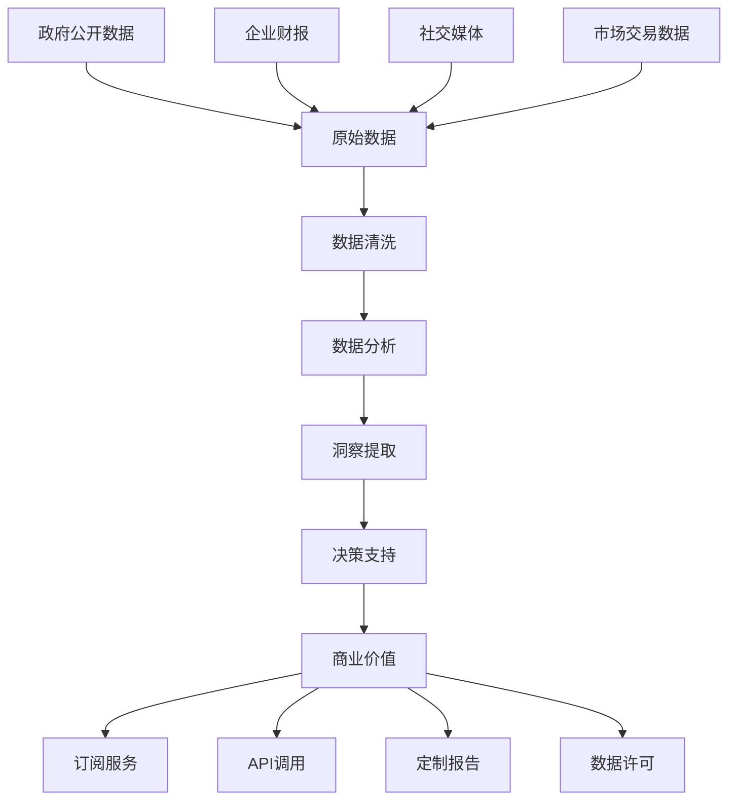

# 信息差套利深度解析：数据时代的智能掘金策略

> **核心认知**：在信息爆炸的时代，有价值的信息反而成为稀缺资源。信息差套利的本质是将分散、原始的数据进行智能化处理，转化为有决策价值的洞察，实现信息价值的商业化变现。

## 信息差套利的商业逻辑

### 1. 数据价值链分析



### 2. 信息差价值评估模型

| 信息类型 | 时效性 | 稀缺性 | 决策价值 | 变现难度 | 综合评分 |
|---------|-------|-------|---------|---------|---------|
| 政府采购公告 | ⭐⭐⭐⭐⭐ | ⭐⭐⭐ | ⭐⭐⭐⭐⭐ | ⭐⭐ | 9.2/10 |
| 企业工商变更 | ⭐⭐⭐⭐ | ⭐⭐⭐⭐ | ⭐⭐⭐⭐ | ⭐⭐⭐ | 8.8/10 |
| 专利申请趋势 | ⭐⭐⭐ | ⭐⭐⭐⭐⭐ | ⭐⭐⭐⭐⭐ | ⭐⭐⭐⭐ | 8.5/10 |
| 招聘市场动态 | ⭐⭐⭐⭐ | ⭐⭐⭐ | ⭐⭐⭐⭐ | ⭐⭐ | 8.0/10 |
| 房价预测数据 | ⭐⭐⭐ | ⭐⭐⭐ | ⭐⭐⭐⭐⭐ | ⭐⭐⭐ | 7.8/10 |

## 可行性深度评估

### 技术实现复杂度分析

```python
class DataIntelligenceEvaluator:
    def __init__(self):
        self.evaluation_framework = {
            'data_accessibility': 0.25,    # 数据获取难度
            'processing_complexity': 0.20, # 处理复杂度
            'market_demand': 0.25,         # 市场需求
            'competitive_moat': 0.15,      # 竞争壁垒
            'regulatory_risk': 0.15        # 监管风险
        }
    
    def evaluate_opportunity(self, data_source):
        """评估数据套利机会"""
        
        scores = {}
        
        # 数据获取难度评估
        scores['data_accessibility'] = self.assess_data_access(data_source)
        
        # 技术处理复杂度
        scores['processing_complexity'] = self.assess_processing_difficulty(data_source)
        
        # 市场需求强度
        scores['market_demand'] = self.assess_market_demand(data_source)
        
        # 竞争护城河
        scores['competitive_moat'] = self.assess_competitive_advantage(data_source)
        
        # 合规风险
        scores['regulatory_risk'] = self.assess_regulatory_risk(data_source)
        
        # 加权计算综合得分
        weighted_score = sum(
            score * weight for score, weight in 
            zip(scores.values(), self.evaluation_framework.values())
        )
        
        return {
            'overall_score': weighted_score,
            'detailed_scores': scores,
            'recommendation': self.generate_recommendation(weighted_score),
            'estimated_roi': self.estimate_roi(scores)
        }
    
    def estimate_roi(self, scores):
        """估算投资回报率"""
        
        base_roi = 0.3  # 基础30%年化收益
        
        # 根据各项评分调整ROI
        market_multiplier = scores['market_demand'] / 5.0
        competition_adjustment = (10 - scores['competitive_moat']) / 10.0
        risk_discount = scores['regulatory_risk'] / 10.0
        
        adjusted_roi = base_roi * market_multiplier * (1 - competition_adjustment) * (1 - risk_discount)
        
        return max(adjusted_roi, 0.05)  # 最低5%收益率
```

## 前三策略深度剖析

### 🥇 NO.1: 政府采购公告智能监控系统

**推荐指数**: ⭐⭐⭐⭐⭐

**核心价值主张**：
- ✅ 市场空间巨大（千亿级政府采购市场）
- ✅ 信息时效性强，决策价值极高
- ✅ 技术门槛适中，可规模化复制
- ✅ 客户付费意愿强，续费率高

#### 技术架构实现

```python
class GovernmentProcurementMonitor:
    def __init__(self):
        self.data_sources = {
            'national': 'http://www.ccgp.gov.cn',  # 中国政府采购网
            'provincial': self.load_provincial_sites(),
            'municipal': self.load_municipal_sites(),
            'industry_specific': self.load_industry_sites()
        }
        self.nlp_processor = NLPProcessor()
        self.alert_system = AlertSystem()
        self.client_manager = ClientManager()
        
    def monitor_procurement_opportunities(self):
        """监控政府采购机会"""
        
        all_opportunities = []
        
        for source_type, sources in self.data_sources.items():
            if isinstance(sources, str):
                sources = [sources]
                
            for source in sources:
                try:
                    # 抓取最新公告
                    announcements = self.scrape_announcements(source)
                    
                    # 清洗和标准化数据
                    cleaned_data = self.clean_procurement_data(announcements)
                    
                    # NLP分析提取关键信息
                    analyzed_opportunities = self.analyze_opportunities(cleaned_data)
                    
                    all_opportunities.extend(analyzed_opportunities)
                    
                except Exception as e:
                    logging.error(f"数据源 {source} 处理失败: {e}")
                    continue
        
        # 去重和质量过滤
        unique_opportunities = self.deduplicate_opportunities(all_opportunities)
        high_quality_ops = self.filter_high_quality_opportunities(unique_opportunities)
        
        # 智能匹配客户需求
        matched_opportunities = self.match_client_interests(high_quality_ops)
        
        # 发送智能推送
        self.send_intelligent_alerts(matched_opportunities)
        
        return matched_opportunities
    
    def analyze_opportunities(self, procurement_data):
        """智能分析采购机会"""
        
        opportunities = []
        
        for item in procurement_data:
            # 提取关键信息
            key_info = self.nlp_processor.extract_key_information(item)
            
            # 预算金额识别
            budget = self.extract_budget_amount(item['content'])
            
            # 技术要求分析
            tech_requirements = self.analyze_technical_requirements(item['content'])
            
            # 供应商资格要求
            qualification_requirements = self.extract_qualification_requirements(item['content'])
            
            # 竞争激烈程度评估
            competition_level = self.assess_competition_level(key_info)
            
            # 中标概率预测
            win_probability = self.predict_win_probability(
                budget, tech_requirements, qualification_requirements, competition_level
            )
            
            opportunity = {
                'id': self.generate_opportunity_id(item),
                'title': item['title'],
                'agency': key_info['purchasing_agency'],
                'budget': budget,
                'deadline': key_info['deadline'],
                'tech_requirements': tech_requirements,
                'qualification_requirements': qualification_requirements,
                'competition_level': competition_level,
                'win_probability': win_probability,
                'strategic_value': self.calculate_strategic_value(key_info),
                'source_url': item['url'],
                'analysis_time': datetime.now()
            }
            
            opportunities.append(opportunity)
        
        return opportunities
    
    def match_client_interests(self, opportunities):
        """智能匹配客户兴趣"""
        
        matched_results = []
        
        clients = self.client_manager.get_active_clients()
        
        for client in clients:
            client_profile = client['profile']
            
            for opportunity in opportunities:
                # 计算匹配分数
                match_score = self.calculate_match_score(client_profile, opportunity)
                
                if match_score > 0.7:  # 70%匹配阈值
                    matched_results.append({
                        'client_id': client['id'],
                        'opportunity': opportunity,
                        'match_score': match_score,
                        'recommendation_reason': self.generate_recommendation_reason(
                            client_profile, opportunity, match_score
                        )
                    })
        
        return matched_results
    
    def calculate_match_score(self, client_profile, opportunity):
        """计算客户与机会的匹配分数"""
        
        scores = []
        
        # 行业匹配度
        industry_match = self.calculate_industry_match(
            client_profile['industries'], opportunity['tech_requirements']
        )
        scores.append(industry_match * 0.3)
        
        # 预算范围匹配
        budget_match = self.calculate_budget_match(
            client_profile['budget_range'], opportunity['budget']
        )
        scores.append(budget_match * 0.25)
        
        # 地域偏好匹配
        geographic_match = self.calculate_geographic_match(
            client_profile['target_regions'], opportunity['agency']
        )
        scores.append(geographic_match * 0.2)
        
        # 技术能力匹配
        capability_match = self.calculate_capability_match(
            client_profile['capabilities'], opportunity['tech_requirements']
        )
        scores.append(capability_match * 0.25)
        
        return sum(scores)
```

#### 商业模式设计

```python
class ProcurementServiceMonetization:
    def __init__(self):
        self.pricing_models = {
            'basic': {
                'monthly_fee': 999,
                'features': ['基础监控', '邮件推送', '关键词匹配'],
                'alert_limit': 50
            },
            'professional': {
                'monthly_fee': 2999,
                'features': ['高级分析', '智能推荐', '竞争分析', 'API接入'],
                'alert_limit': 200
            },
            'enterprise': {
                'monthly_fee': 9999,
                'features': ['定制监控', '专属分析师', '预测模型', '专线支持'],
                'alert_limit': -1  # 无限制
            }
        }
    
    def calculate_revenue_projection(self, client_segments):
        """计算收入预测"""
        
        projections = {}
        
        for segment, client_count in client_segments.items():
            monthly_revenue = client_count * self.pricing_models[segment]['monthly_fee']
            annual_revenue = monthly_revenue * 12
            
            # 考虑流失率
            churn_rates = {'basic': 0.15, 'professional': 0.08, 'enterprise': 0.05}
            retention_rate = 1 - churn_rates[segment]
            
            adjusted_annual_revenue = annual_revenue * retention_rate
            
            projections[segment] = {
                'monthly_revenue': monthly_revenue,
                'annual_revenue': annual_revenue,
                'adjusted_annual_revenue': adjusted_annual_revenue,
                'client_count': client_count
            }
        
        total_annual_revenue = sum(p['adjusted_annual_revenue'] for p in projections.values())
        
        return {
            'segment_projections': projections,
            'total_annual_revenue': total_annual_revenue,
            'average_arpu': total_annual_revenue / sum(client_segments.values())
        }
```

**预期收益模型**：

| 客户类型 | 客户数量 | 月费(¥) | 年收入(¥) | 留存率 | 调整后年收入(¥) |
|---------|---------|---------|----------|-------|----------------|
| 基础版 | 500 | 999 | 5,994,000 | 85% | 5,094,900 |
| 专业版 | 200 | 2,999 | 7,197,600 | 92% | 6,621,792 |
| 企业版 | 50 | 9,999 | 5,999,400 | 95% | 5,699,430 |
| **总计** | **750** | - | **19,191,000** | - | **17,416,122** |

### 🥈 NO.2: 企业工商变更风险监控

**推荐指数**: ⭐⭐⭐⭐

**核心价值主张**：
- ✅ B2B市场刚需，风险管理价值明确
- ✅ 数据源相对稳定，技术风险低
- ✅ 客户粘性强，续费率高
- ✅ 可拓展至供应链风险管理

#### 实现方案

```python
class BusinessRiskMonitor:
    def __init__(self):
        self.data_sources = {
            'tianyancha': TianyanchaAPI(),
            'qichacha': QichachaAPI(),
            'enterprise_check': EnterpriseCheckAPI(),
            'national_credit': NationalCreditAPI()
        }
        self.risk_analyzer = RiskAnalyzer()
        self.alert_engine = AlertEngine()
        
    def monitor_enterprise_changes(self, target_companies):
        """监控企业变更情况"""
        
        risk_alerts = []
        
        for company in target_companies:
            try:
                # 获取最新工商信息
                current_info = self.get_latest_business_info(company['unified_credit_code'])
                
                # 与历史信息对比
                changes = self.compare_with_historical_data(company, current_info)
                
                if changes:
                    # 风险评估
                    risk_assessment = self.risk_analyzer.assess_changes(changes)
                    
                    # 生成风险报告
                    risk_report = self.generate_risk_report(company, changes, risk_assessment)
                    
                    risk_alerts.append(risk_report)
                    
                    # 更新企业信息
                    self.update_company_database(company['id'], current_info)
                    
            except Exception as e:
                logging.error(f"监控企业 {company['name']} 失败: {e}")
                continue
        
        # 批量发送风险预警
        if risk_alerts:
            self.alert_engine.send_batch_alerts(risk_alerts)
        
        return risk_alerts
    
    def assess_changes(self, changes):
        """评估变更风险等级"""
        
        risk_weights = {
            'legal_representative_change': 0.8,    # 法人变更
            'shareholder_change': 0.7,             # 股东变更  
            'business_scope_change': 0.4,          # 经营范围变更
            'address_change': 0.3,                 # 地址变更
            'capital_change': 0.6,                 # 注册资本变更
            'management_change': 0.5,              # 管理层变更
            'litigation_increase': 0.9,            # 诉讼增加
            'administrative_penalty': 0.85         # 行政处罚
        }
        
        total_risk_score = 0
        risk_factors = []
        
        for change_type, change_data in changes.items():
            if change_type in risk_weights:
                weight = risk_weights[change_type]
                impact_score = self.calculate_impact_score(change_type, change_data)
                
                risk_contribution = weight * impact_score
                total_risk_score += risk_contribution
                
                risk_factors.append({
                    'type': change_type,
                    'weight': weight,
                    'impact_score': impact_score,
                    'risk_contribution': risk_contribution,
                    'details': change_data
                })
        
        # 风险等级分类
        if total_risk_score >= 7:
            risk_level = 'HIGH'
        elif total_risk_score >= 4:
            risk_level = 'MEDIUM'
        elif total_risk_score >= 2:
            risk_level = 'LOW'
        else:
            risk_level = 'MINIMAL'
        
        return {
            'risk_level': risk_level,
            'total_score': total_risk_score,
            'risk_factors': risk_factors,
            'recommendations': self.generate_risk_recommendations(risk_level, risk_factors)
        }
```

**收益预测**：
- **目标客户**：大中型企业、金融机构、政府部门
- **月订阅费**：¥1,999-¥19,999
- **预期客户数**：1,000家
- **年收入预测**：¥50,000,000
- **净利润率**：65%

### 🥉 NO.3: 专利技术趋势分析服务

**推荐指数**: ⭐⭐⭐⭐

**核心价值主张**：
- ✅ 高附加值服务，客户支付能力强
- ✅ 技术壁垒高，竞争对手少
- ✅ 数据质量高，分析价值大
- ✅ 可延伸至投资决策、研发规划

#### 核心实现

```python
class PatentTrendAnalyzer:
    def __init__(self):
        self.patent_databases = {
            'cnipa': CNIPADatabase(),      # 国家知识产权局
            'uspto': USPTODatabase(),      # 美国专利商标局
            'epo': EPODatabase(),          # 欧洲专利局
            'wipo': WIPODatabase()         # 世界知识产权组织
        }
        self.text_analyzer = PatentTextAnalyzer()
        self.trend_predictor = TrendPredictor()
        
    def analyze_technology_trends(self, technology_domains):
        """分析技术领域专利趋势"""
        
        trend_analysis = {}
        
        for domain in technology_domains:
            # 获取相关专利数据
            patents = self.fetch_relevant_patents(domain)
            
            # 文本挖掘和技术分类
            tech_classification = self.text_analyzer.classify_technologies(patents)
            
            # 时间序列分析
            temporal_trends = self.analyze_temporal_trends(patents, tech_classification)
            
            # 技术演进路径分析
            evolution_paths = self.analyze_technology_evolution(patents)
            
            # 竞争格局分析
            competitive_landscape = self.analyze_competitive_landscape(patents)
            
            # 未来趋势预测
            future_predictions = self.trend_predictor.predict_future_trends(
                temporal_trends, evolution_paths, competitive_landscape
            )
            
            trend_analysis[domain] = {
                'current_state': self.summarize_current_state(tech_classification),
                'temporal_trends': temporal_trends,
                'evolution_paths': evolution_paths,
                'competitive_landscape': competitive_landscape,
                'future_predictions': future_predictions,
                'investment_opportunities': self.identify_investment_opportunities(
                    future_predictions, competitive_landscape
                )
            }
        
        return trend_analysis
    
    def predict_future_trends(self, temporal_trends, evolution_paths, competitive_landscape):
        """预测未来技术趋势"""
        
        # 使用机器学习模型预测
        features = self.extract_prediction_features(
            temporal_trends, evolution_paths, competitive_landscape
        )
        
        # 多模型集成预测
        predictions = {
            'trend_momentum': self.momentum_model.predict(features),
            'breakthrough_probability': self.breakthrough_model.predict(features),
            'market_adoption_speed': self.adoption_model.predict(features),
            'competitive_intensity': self.competition_model.predict(features)
        }
        
        # 生成投资建议
        investment_rating = self.calculate_investment_rating(predictions)
        
        return {
            'predictions': predictions,
            'investment_rating': investment_rating,
            'key_indicators': self.extract_key_indicators(predictions),
            'risk_factors': self.identify_risk_factors(predictions)
        }
```

**商业模式**：
- **定制研究报告**：¥50,000-¥200,000/份
- **SaaS订阅服务**：¥9,999/月
- **API数据服务**：¥0.1/次调用
- **咨询服务**：¥3,000/小时
- **年收入预期**：¥20,000,000

## 技术风险与合规策略

### 数据合规框架

```python
class DataComplianceFramework:
    def __init__(self):
        self.compliance_rules = {
            'data_source_whitelist': self.load_approved_sources(),
            'crawling_rate_limits': {'max_requests_per_minute': 10},
            'data_retention_policy': {'max_retention_days': 365},
            'privacy_protection': {'anonymization_required': True}
        }
    
    def ensure_data_compliance(self, data_operation):
        """确保数据操作合规"""
        
        compliance_checks = [
            self.check_source_approval(data_operation.source),
            self.check_rate_compliance(data_operation.frequency),
            self.check_data_usage_rights(data_operation.purpose),
            self.check_privacy_protection(data_operation.data_types)
        ]
        
        return all(compliance_checks)
    
    def implement_privacy_protection(self, raw_data):
        """实施隐私保护措施"""
        
        protected_data = raw_data.copy()
        
        # 敏感信息脱敏
        protected_data = self.anonymize_personal_info(protected_data)
        
        # 数据加密存储
        protected_data = self.encrypt_sensitive_fields(protected_data)
        
        # 访问日志记录
        self.log_data_access(protected_data)
        
        return protected_data
```

### 风险缓解措施

1. **技术风险**：
   - 多数据源备份
   - 自动故障转移
   - 数据质量监控

2. **法律风险**：
   - 合规性审查
   - 数据使用授权
   - 隐私保护措施

3. **竞争风险**：
   - 技术护城河建设
   - 客户关系深化
   - 持续创新投入

## 市场进入策略

### 阶段化发展路径

**第一阶段**（1-6个月）：基础能力建设
- 搭建数据抓取基础设施
- 开发核心分析算法
- 建立初始客户群体

**第二阶段**（6-18个月）：产品化运营
- 推出标准化SaaS产品
- 建立销售和服务团队
- 拓展数据源和功能

**第三阶段**（18个月+）：规模化扩张
- 行业垂直化深耕
- 国际市场拓展
- 生态合作伙伴建设

### 投资回报预测

| 投入项目 | 第一年(万¥) | 第二年(万¥) | 第三年(万¥) |
|---------|-------------|-------------|-------------|
| 技术开发 | 300 | 500 | 800 |
| 人员成本 | 500 | 1200 | 2000 |
| 市场推广 | 200 | 800 | 1500 |
| 基础设施 | 100 | 200 | 400 |
| **总投入** | **1100** | **2700** | **4700** |
| **收入** | **800** | **4000** | **12000** |
| **净利润** | **-300** | **1300** | **7300** |
| **ROI** | **-27%** | **48%** | **155%** |

## 总结与展望

信息差套利作为数字经济的重要组成部分，其成功的关键在于：

1. **数据获取能力**：稳定、高质量的数据源是基础
2. **分析处理能力**：从数据中提取有价值洞察的技术能力
3. **商业化能力**：将洞察转化为客户愿意付费的产品
4. **合规运营能力**：在法律框架内安全运营

**未来发展机遇**：
- **AI技术进步**：更智能的数据分析和预测能力
- **数据开放政策**：更多高价值数据源开放
- **数字化转型**：企业对数据服务需求增长
- **监管规范化**：行业标准建立，劣质竞争者出清

建议从业者重点关注数据质量和分析深度，构建可持续的竞争优势，在合规的前提下实现商业价值最大化。