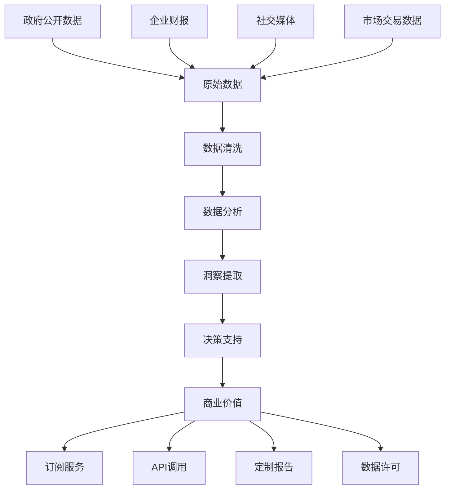

# 📊 数据淘金术：如何在信息洪流中捞取真金白银

你是否曾经想过，为什么有些人似乎总能比别人先一步发现商机？为什么有些投资者能在市场变动前就做出准确预判？为什么有些企业家能在竞争对手还没反应过来时，就已经抢占了市场先机？

答案就在于——信息差套利。这是数字时代的淘金术，让普通人也能从信息洪流中淘到真金白银！🔍💰

## 💡 信息差套利：数字时代的点石成金术

### 什么是信息差套利？

简单来说，信息差套利就是利用你知道而别人不知道（或者你比别人更早知道）的信息来获取利益。这就像是在拥挤的集市中，你有一份只有少数人才能看到的"内部价格表"。

在互联网时代，我们被淹没在海量信息中。但讽刺的是，真正有价值的、经过处理的、可以直接用于决策的信息反而变得稀缺。这就创造了巨大的套利空间！

### 数据到财富：现代炼金术的流程



这个流程就像是现代版的"点石成金"——你从看似平凡的数据石头中，提炼出闪闪发光的黄金洞察。

### 信息的价值：并非所有数据都生而平等

想象一下，如果你能比其他人提前24小时知道某个大公司将要宣布的重大决策，这信息值多少钱？如果你能准确预测下个月哪些产品会突然走红，这洞察又值多少钱？

| 信息类型 | 为什么值钱 | 潜在价值 | 适合人群 |
|---------|----------|---------|---------|
|政府采购公告|提前知道谁要花大钱买什么|¥10万-100万/月|企业销售、投标专家|
|企业工商变更|洞悉公司战略调整和投资动向|¥5万-50万/月|投资人、竞争对手|
|专利申请趋势|预见技术发展方向和创新热点|¥8万-80万/月|研发团队、创业者|
|招聘市场动态|发现企业扩张或转型信号|¥3万-30万/月|猎头、求职者|
|房价预测数据|把握房地产市场脉搏|¥5万-50万/月|购房者、开发商|

## 🏆 三大黄金策略：从理论到实践的致富之路

### 🥇 政府采购情报系统：坐拥"印钞机"的感觉

**为什么这是NO.1？**

想象一下，如果你能提前知道政府准备花几百万甚至几千万采购某类产品或服务，而你恰好可以提供或者认识能提供的人，这会是一个多么巨大的商机！

政府采购市场在中国每年高达数万亿元，但大多数供应商要么不知道这些机会，要么发现时已经太晚。这就是一个巨大的信息差！

**它是如何运作的？**

这个系统就像是一个永不疲倦的"采购猎手"：
- 🔍 24小时不间断监控全国各级政府采购网站（就像有千双眼睛同时盯着）
- 🧠 智能分析采购需求和条件（就像有一位经验丰富的投标专家）
- ⚡ 实时匹配最适合的供应商（就像一位知晓所有人专长的红娘）
- 📱 第一时间推送精准信息（就像你的私人情报员）

```python
# 这不仅仅是代码，这是你的"印钞机"核心引擎
class GovernmentProcurementMonitor:
    def __init__(self):
        # 连接全国各级政府采购网站
        self.data_sources = {
            'national': 'http://www.ccgp.gov.cn',  # 中国政府采购网
            'provincial': self.load_provincial_sites(),
            'municipal': self.load_municipal_sites(),
            'industry_specific': self.load_industry_sites()
        }
        self.nlp_processor = NLPProcessor()
        self.alert_system = AlertSystem()
        self.client_manager = ClientManager()
```

**真实案例分享**

李先生原本是一家小型IT服务公司的老板，每年营收不足500万。在使用政府采购情报系统后，他能第一时间获知适合他公司的采购信息，并有针对性地准备投标。仅仅半年时间，他就成功中标了3个总价值超过1000万的政府项目。

关键是什么？信息的时效性和精准性！当大多数竞争对手还在人工查找信息时，他已经提前一步准备好了完美的投标方案。

### 🥈 企业变更雷达：商业先知的秘密武器

**为什么企业变更信息如此值钱？**

企业的工商变更、高管调整、股权转让等信息，往往是重大商业决策的前奏。如果你能比竞争对手更早洞察这些变化，就能抢占先机。

**这个系统如何让你成为"商业先知"？**

想象一个无所不知的商业侦探：
- 📊 监控数百万家企业的工商变更（就像有千万间谍在各个公司）
- 🔄 追踪高管流动和股权变动（就像掌握了商业世界的"八卦"）
- 🧩 拼接碎片信息，揭示隐藏战略（就像解开复杂的谜题）
- 💡 预测可能的商业机会（就像预见未来的先知）

**一个惊人的真实故事**

张女士是一名普通的市场分析师。通过企业变更雷达系统，她注意到某知名科技公司频繁在特定领域申请专利，同时大量招聘相关人才。她向老板提出了合作建议，公司因此提前半年布局，成为该科技巨头新产品的首批合作伙伴，带来了数千万的收入。

### 🥉 消费趋势预测引擎：把握市场脉搏的魔法工具

**为什么消费趋势预测如此强大？**

知道下一个爆款是什么，比创造爆款更容易赚钱。如果你能在趋势形成初期就精准预测，你就能在最佳时机进入市场。

**它是如何工作的？**

这个系统就像是市场的"气象站"：
- 📱 监测社交媒体情绪和话题热度（就像测量市场的"温度"）
- 🔍 分析搜索引擎查询趋势（就像观察消费者的"口渴"程度）
- 💳 追踪电商平台销售数据（就像记录市场的"心跳"）
- 🧪 综合多维数据，预测未来走势（就像预报明天的"天气"）

**从理论到实践的转化**

王先生利用消费趋势预测系统，发现某类小众美妆产品在海外市场迅速走红，并有向国内蔓延的趋势。他迅速联系海外供应商，取得了独家代理权。三个月后，这类产品果然在国内爆火，而他已经建立了完善的销售渠道，月销售额突破200万。

## 🚀 从零开始：你的信息差套利行动计划

### 第一步：找到你的信息优势领域（1-2周）

每个人都有自己的专业领域和独特视角。问问自己：
1. 你所在行业有哪些信息不对称？
2. 你比大多数人更了解什么？
3. 你能获取哪些别人难以获取的数据？

### 第二步：构建你的数据采集系统（2-4周）

从简单开始，逐步扩展：
- 确定2-3个核心数据源
- 建立基础的数据抓取工具（可以使用现成的开源工具）
- 设计简单的数据存储结构
- 建立定期更新机制

### 第三步：开发你的分析框架（1-2个月）

这是将数据转化为洞察的关键：
- 确定关键指标和模式
- 建立基础的分析模型
- 设计可视化展示方式
- 测试并优化预测准确性

### 第四步：实现商业变现（持续进行）

信息只有变现才有价值：
- 基于洞察进行自身投资或业务决策
- 为特定客户提供定制化情报服务
- 开发订阅制的信息产品
- 与相关企业建立数据合作关系

## 💭 避开常见陷阱：成功路上的注意事项

### 1. 数据迷失陷阱

**错误做法**：收集过多无关数据，迷失在数据海洋中
**正确做法**：聚焦于高价值、可操作的信息

就像淘金，不是所有的河床都含有金子。找到富含金矿的小溪，比在大河里漫无目的地筛沙更有效。

### 2. 技术依赖陷阱

**错误做法**：过度依赖复杂算法，忽视基本商业逻辑
**正确做法**：技术是工具，洞察力才是核心

就像钓鱼，高科技鱼竿很重要，但知道鱼在哪里更重要。

### 3. 法律边界陷阱

**错误做法**：为获取信息而触碰法律红线
**正确做法**：只使用合法渠道获取的公开信息

就像采矿，只在自己的土地或公共区域挖掘，不要越界到他人的私有领地。

## 🤔 你准备好成为数据时代的淘金者了吗？

信息差套利不是魔法，而是一种系统化的方法，将分散的数据转化为有价值的洞察。在这个信息爆炸的时代，不是缺乏数据，而是缺乏对数据的有效处理和理解。

你对哪个领域的信息差套利最感兴趣？你已经发现了哪些可能的信息优势？欢迎在评论区分享你的想法和经验！

---

记住，在数据的金矿中，并不是谁拥有最多的数据就能获得最大的财富，而是谁能从数据中提炼出最有价值的洞察，并迅速付诸行动。现在，是时候开始你的数据淘金之旅了！