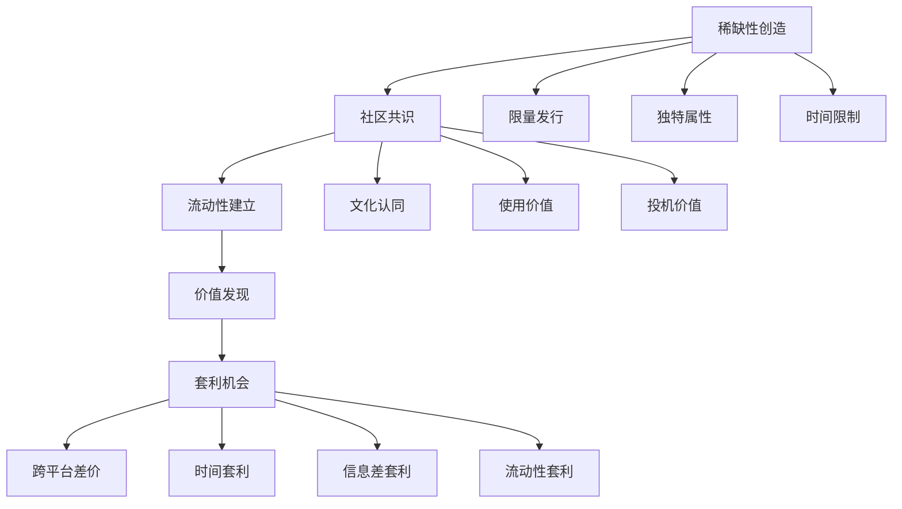

# 💎 数字炼金术：如何在虚拟世界淘金

你是否曾经好奇，为什么有人能花几万元购买一张数字图片？为什么有人愿意为一个虚拟世界中的土地支付真金白银？更令人惊讶的是，为什么这些看似"不存在"的资产，有时价格会在短期内暴涨数倍甚至数十倍？

欢迎来到数字资产的奇妙世界！在这里，价值的定义正在被重新书写，而那些掌握"数字炼金术"的人，正在虚拟与现实之间搭建财富桥梁。🌉

## 💡 数字资产：看不见的财富新大陆

### 什么是数字资产？

简单来说，数字资产就是那些存在于数字世界中的有价值物品。就像现实世界中你拥有房子、车子和手表一样，在数字世界中，你可以拥有NFT艺术品、稀有域名或游戏中的限量装备。

这些资产虽然无法触摸，但它们的价值有时甚至超过实物资产。想象一下，如果你能穿越回1995年，以几百美元注册amazon.com域名，今天它的价值可能超过数百万美元！

### 价值从何而来？数字资产的"魔力源泉"



数字资产的价值形成就像一场集体信仰的仪式：
1. **稀缺性** - 就像钻石，越稀有越珍贵
2. **共识** - 就像货币，大家认可它才有价值
3. **实用性** - 就像工具，能解决问题才值钱
4. **文化意义** - 就像艺术品，承载情感和身份认同

### 数字资产的四大家族

想象数字资产世界是一个奇幻王国，有四个主要家族统治着不同的领地：

1. **NFT家族** 👑 - 艺术品、收藏品、虚拟土地
   > 就像数字世界的"古董收藏"，每件都独一无二

2. **域名家族** 🏰 - 传统域名、Web3域名
   > 就像数字世界的"黄金地段"，位置好的价值连城

3. **虚拟商品家族** 🎮 - 游戏装备、数字藏品
   > 就像数字世界的"奢侈品"，彰显身份和地位

4. **数据资产家族** 📊 - 用户数据、算法模型
   > 就像数字世界的"石油"，驱动整个经济运转

## 📊 数字淘金图谱：现代淘金者的藏宝图

### 黄金机会矩阵

| 套利策略 | 入门资金 | 技术难度 | 月收益潜力 | 适合人群 |
|---------|----------|----------|----------|----------|
|NFT跨链套利|¥5000-20000|⭐⭐⭐|¥5000-30000|区块链爱好者|
|域名抢注|¥2000-10000|⭐⭐|¥3000-50000|投机者|
|游戏道具交易|¥1000-5000|⭐⭐|¥2000-10000|游戏玩家|
|数字藏品发行|¥10000-50000|⭐⭐⭐⭐|¥20000-100000|创作者|
|虚拟土地投资|¥20000-100000|⭐⭐⭐|¥10000-50000|长期投资者|

这些数字看起来很诱人，对吧？但请记住，高回报总是伴随着高风险。就像淘金热中，并非所有人都找到了金子，有些人只收获了满手泥巴。

## 🏆 三大王牌策略：数字炼金师的秘密武器

### 🥇 NFT跨链套利：数字世界的"搬运工"

**为什么它如此吸引人？**

想象一下，同一件艺术品在纽约的画廊卖100美元，而在东京的画廊卖150美元。如果你能以低成本将它从纽约运到东京，这中间的差价就是你的利润。NFT跨链套利就是这个原理！

不同的区块链就像不同的国家，同一个NFT系列在不同链上的价格可能存在差异。掌握了跨链技术，你就成了数字世界的"国际贸易商"。

**它是如何运作的？**

这个系统就像一个永不疲倦的"价格侦探"：
- 🔍 24小时监控多条区块链上的NFT价格（就像同时盯着多个国家的股市）
- 🧮 计算购买、转移和销售的全部成本（就像国际贸易中的进出口成本核算）
- 💰 当利润超过阈值时自动执行交易（就像设置了自动触发的贸易订单）
- 🛡️ 实时风险管理和止损（就像航海中的安全防护措施）

```python
# 这不仅仅是代码，这是你的"数字世界套利机器人"
class NFTCrossChainArbitrage:
    def __init__(self):
        # 连接多条区块链，就像建立多国贸易关系
        self.chains = {
            'ethereum': EthereumConnector(),  # 像连接美国市场
            'polygon': PolygonConnector(),    # 像连接欧洲市场
            'arbitrum': ArbitrumConnector(),  # 像连接亚洲市场
            'optimism': OptimismConnector()   # 像连接非洲市场
        }
        self.bridges = {
            'polygon_bridge': PolygonBridge(),
            'arbitrum_bridge': ArbitrumBridge(),
            'multichain': MultichainBridge()
        }
        self.price_tracker = PriceTracker()
        self.gas_optimizer = GasOptimizer()
```

**一个真实的案例**

李先生是一位区块链爱好者，他注意到Azuki NFT在以太坊上的地板价是8ETH，而在Polygon上却只有7ETH。考虑到跨链转移的成本约0.2ETH，他通过自动化脚本在Polygon购买后转移到以太坊出售，每次交易净赚约0.8ETH（约1.6万元）。一个月内，他完成了15次类似交易，净赚12ETH（约24万元）。

### 🥈 域名抢注：数字地产的"捷足先登"

**为什么域名如此值钱？**

想象互联网是一座不断扩张的城市，域名就是这座城市中的土地。好的位置（域名）不仅稀缺，还能带来持续的客流（流量）。

特别是在Web3时代，ENS域名（如vitalik.eth）已成为数字身份的象征，就像现实世界的名牌包一样，既实用又彰显身份。

**抢注策略的核心**

域名抢注就像是数字世界的"拓荒者"：
- 📊 预测热门词汇和趋势（就像预测哪个区域会发展）
- ⚡ 使用自动化工具快速注册（就像抢购限量商品）
- 🔄 建立投资组合分散风险（就像不把所有鸡蛋放在一个篮子里）
- 💹 选择最佳时机出售（就像房地产投资者等待市场高峰）

**真实成功案例**

张女士在2021年初以0.01ETH（约200元）注册了100个与元宇宙相关的ENS域名。当元宇宙概念爆火后，她将其中10个域名以平均0.5ETH（约1万元）的价格出售，总收益是投资的500倍！

### 🥉 游戏道具交易：虚拟世界的"奢侈品生意"

**为什么游戏道具值钱？**

在游戏世界中，稀有道具就像现实世界的奢侈品。它们不仅提升游戏体验，还是身份和成就的象征。有些玩家愿意花真金白银购买这些虚拟物品，就像有人愿意花几万元买一个奢侈品包包。

**游戏道具套利的秘密**

游戏道具交易就像是虚拟世界的"古董商"：
- 🎯 专注于特定游戏生态（就像专精于某类古董）
- 📈 了解道具价值波动规律（就像了解市场周期）
- 🔍 寻找低估价值的道具（就像发现被低估的艺术品）
- 🤝 建立可靠的交易渠道（就像拥有稳定的客户网络）

**从小白到专家的蜕变**

王先生原本只是一名普通的《CS:GO》玩家，后来他发现游戏皮肤存在跨平台价格差。他开始在Steam社区市场购买低价皮肤，然后在第三方平台高价出售。起初每月只赚几百元，但随着经验积累和资金增加，他现在每月从中获利2万元以上，甚至辞去了日常工作，全职做起了虚拟道具交易。

## 🚀 从零开始：你的数字资产套利之旅

### 第一步：选择你的战场（1-2周）

不同的数字资产领域需要不同的知识和技能：
- NFT交易：需要了解区块链基础和艺术市场
- 域名投资：需要把握互联网趋势和品牌价值
- 游戏道具：需要深入特定游戏生态系统
- 数字藏品：需要理解文化趋势和收藏心理

选择一个你已经熟悉或感兴趣的领域作为起点。

### 第二步：构建你的知识体系（2-4周）

在进入任何市场前，先做好功课：
- 学习该领域的基础知识（术语、规则、平台）
- 研究成功案例和失败教训
- 了解价格形成机制和价值评估方法
- 掌握必要的技术工具（钱包、交易所、API）

### 第三步：小规模实践（1-2个月）

用小资金进行实战练习：
- 设定明确的预算上限（只投入你能承受损失的金额）
- 执行3-5笔小额交易，体验完整流程
- 记录每一步决策和结果，总结经验
- 逐步调整策略，找到适合自己的方法

### 第四步：系统化运营（持续进行）

当你积累了足够经验后：
- 建立自动化工具提高效率
- 扩大资金规模和操作范围
- 多元化投资组合降低风险
- 建立数据分析系统指导决策

## 💭 避开常见陷阱：数字淘金路上的警示牌

### 1. 流动性陷阱

**错误做法**：购买热门但流动性差的资产，无法及时出售
**正确做法**：优先考虑交易活跃的资产类别和平台

就像房地产，位置再好，如果没人愿意接盘，也只是锁死的资金。

### 2. 跟风炒作陷阱

**错误做法**：盲目跟风热点，在高点接盘
**正确做法**：建立自己的价值评估体系，逆向思考

就像股票投资，当大家都在疯狂买入时，往往已经接近顶部。

### 3. 安全隐患陷阱

**错误做法**：忽视安全措施，将资产存放在不可靠平台
**正确做法**：使用硬件钱包，分散存储，定期备份

就像不会把所有现金放在一个不上锁的抽屉里一样。

## 🤔 数字资产的未来：我们将走向何方？

数字资产正在从早期的投机阶段，逐渐走向实用价值阶段。就像互联网从泡沫破裂到成为基础设施一样，数字资产也将经历类似的成熟过程。

**值得思考的问题：**
- 🌐 数字资产会如何重塑我们对"所有权"的理解？
- 💼 传统行业将如何拥抱数字资产革命？
- 🔮 元宇宙的发展会如何影响数字资产的价值？

## 🤝 你准备好踏上数字淘金之旅了吗？

数字资产套利不是一夜暴富的魔法，而是一门需要知识、技能和耐心的现代"炼金术"。它融合了技术理解、市场洞察和风险管理，可以为那些愿意学习和尝试的人带来新的财富可能。

你对哪种数字资产最感兴趣？你已经有过哪些数字资产的投资经历？欢迎在评论区分享你的故事和问题！

---

记住，在数字资产的海洋中，不是所有闪光的东西都是金子。保持好奇心，但也要保持警惕。最重要的是，永远不要投入超过你能承受损失的资金。数字世界的淘金热正在进行，而明智的淘金者不仅带着铲子，还带着地图和指南针。