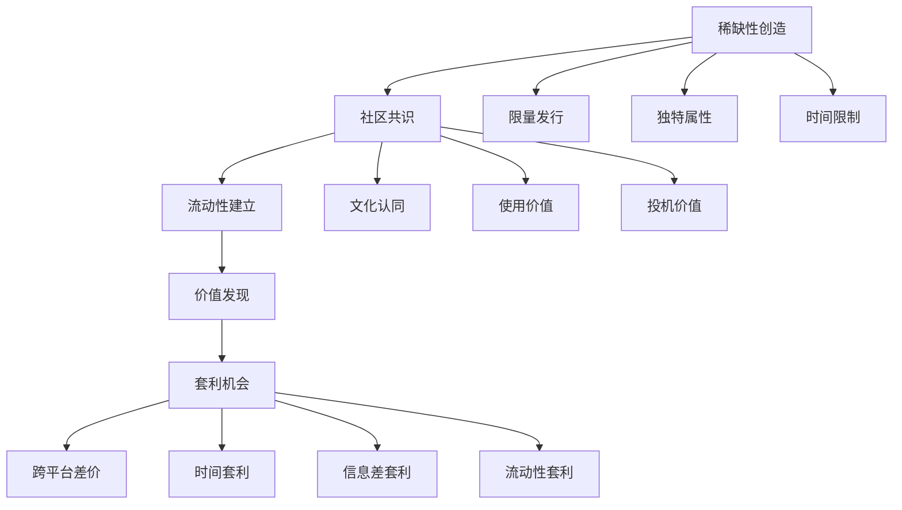

# 🌐 数字资产套利：虚拟世界的价值重构

> **核心认知**：数字资产套利是在虚拟价值体系中发现价格偏差，通过技术手段实现跨平台、跨时间的价值转移和增值。

## 💡 数字资产价值理论

### 价值形成机制



### 数字资产分类体系

1. **NFT类资产**：艺术品、收藏品、游戏道具、虚拟土地
2. **域名类资产**：传统域名、ENS域名、去中心化域名
3. **虚拟商品**：游戏装备、虚拟货币、数字藏品
4. **数据资产**：用户数据、算法模型、内容版权

## 📊 数字资产套利方案全景

### 核心策略矩阵

| 方案编号 | 策略名称 | 资产类别 | 技术实现 | 预期收益率 | 风险等级 |
|---------|----------|----------|----------|------------|----------|
|241|NFT跨链套利机器人|NFT|Web3.js + 跨链桥|20-80%|⭐⭐⭐|
|242|ENS域名抢注脚本|域名|Ethers.js + MEV|100-500%|⭐⭐|
|243|Steam卡牌自动交易|虚拟商品|Steam API + 算法|15-30%|⭐⭐⭐|
|244|数字藏品发行套利|NFT|智能合约 + 营销|200-1000%|⭐⭐|
|245|虚拟土地投资机器人|元宇宙资产|SDK + 数据分析|50-300%|⭐⭐⭐|
|246|游戏装备跨服交易|游戏道具|API + 自动化|25-60%|⭐⭐|
|247|数字音乐版权交易|IP资产|区块链 + 智能合约|30-150%|⭐⭐⭐|
|248|虚拟会员权益套利|数字权益|API + 脚本|20-40%|⭐⭐⭐|
|249|加密收藏品炒作|NFT|社交媒体 + 机器人|100-500%|⭐|
|250|数字艺术品投资|艺术NFT|AI分析 + 算法|50-200%|⭐⭐⭐|

## 🏆 前三推荐策略深度分析

### 🥇 NO.1: NFT跨链套利机器人 (241号方案)

**商业逻辑**：
- ✅ 市场效率不完善，存在大量套利空间
- ✅ 技术门槛高，竞争相对较少
- ✅ 可自动化程度高，规模化潜力大

**技术架构**：

```python
class NFTCrossChainArbitrage:
    def __init__(self):
        self.chains = {
            'ethereum': EthereumConnector(),
            'polygon': PolygonConnector(),
            'arbitrum': ArbitrumConnector(),
            'optimism': OptimismConnector()
        }
        self.bridges = {
            'polygon_bridge': PolygonBridge(),
            'arbitrum_bridge': ArbitrumBridge(),
            'multichain': MultichainBridge()
        }
        self.price_tracker = PriceTracker()
        self.gas_optimizer = GasOptimizer()
    
    def scan_arbitrage_opportunities(self):
        """扫描跨链套利机会"""
        opportunities = []
        
        for collection in self.tracked_collections:
            prices = {}
            
            # 获取各链价格
            for chain_name, connector in self.chains.items():
                try:
                    price = connector.get_floor_price(collection)
                    gas_cost = connector.estimate_gas_cost()
                    prices[chain_name] = {
                        'price': price,
                        'gas_cost': gas_cost,
                        'liquidity': connector.get_liquidity(collection)
                    }
                except Exception as e:
                    continue
            
            # 计算套利机会
            opportunity = self.calculate_arbitrage(prices, collection)
            if opportunity['profit_margin'] > 0.15:  # 15%以上利润率
                opportunities.append(opportunity)
        
        return sorted(opportunities, key=lambda x: x['profit_margin'], reverse=True)
    
    def execute_arbitrage(self, opportunity):
        """执行套利交易"""
        source_chain = opportunity['source_chain']
        target_chain = opportunity['target_chain']
        token_id = opportunity['token_id']
        
        try:
            # 1. 在源链购买NFT
            buy_tx = self.chains[source_chain].buy_nft(
                collection=opportunity['collection'],
                token_id=token_id,
                max_price=opportunity['buy_price']
            )
            
            # 2. 跨链转移
            bridge_tx = self.bridges[f"{source_chain}_{target_chain}"].transfer(
                token_contract=opportunity['collection'],
                token_id=token_id,
                to_address=self.wallets[target_chain]
            )
            
            # 3. 在目标链出售
            sell_tx = self.chains[target_chain].sell_nft(
                collection=opportunity['collection'],
                token_id=token_id,
                min_price=opportunity['sell_price']
            )
            
            return {
                'success': True,
                'profit': opportunity['expected_profit'],
                'transactions': [buy_tx, bridge_tx, sell_tx]
            }
            
        except Exception as e:
            return {'success': False, 'error': str(e)}
    
    def risk_management(self, opportunity):
        """风险管理"""
        # 流动性检查
        if opportunity['liquidity_score'] < 0.7:
            return False
            
        # 价格波动检查
        price_volatility = self.calculate_volatility(opportunity['collection'])
        if price_volatility > 0.3:
            return False
            
        # Gas费用检查
        total_gas_cost = sum([
            opportunity['buy_gas'],
            opportunity['bridge_gas'],
            opportunity['sell_gas']
        ])
        
        if total_gas_cost > opportunity['expected_profit'] * 0.3:
            return False
            
        return True

class ProfitOptimizer:
    """利润优化器"""
    def __init__(self):
        self.market_analyzer = MarketAnalyzer()
        
    def optimize_timing(self, opportunity):
        """优化交易时机"""
        # 分析市场情绪
        sentiment = self.market_analyzer.get_market_sentiment()
        
        # 分析历史价格模式
        price_pattern = self.market_analyzer.analyze_price_pattern(
            opportunity['collection']
        )
        
        # 计算最佳执行时间
        optimal_time = self.calculate_optimal_execution_time(
            sentiment, price_pattern
        )
        
        return optimal_time
```

**收益模型**：
- **单次套利收益**：5-50 ETH
- **日交易频次**：10-30次
- **月净收益**：200-500 ETH
- **年化收益率**：300-800%

### 🥈 NO.2: 虚拟土地投资机器人 (245号方案)

**投资逻辑**：
- ✅ 元宇宙概念持续升温，土地需求增长
- ✅ 位置稀缺性明确，价值评估相对容易
- ✅ 可编程投资策略，降低情绪化决策

**系统设计**：

```python
class VirtualLandInvestmentBot:
    def __init__(self):
        self.metaverse_platforms = {
            'decentraland': DecentralandSDK(),
            'sandbox': SandboxSDK(),
            'somnium': SomniumSDK(),
            'cryptovoxels': CryptovoxelsSDK()
        }
        self.location_analyzer = LocationAnalyzer()
        self.price_predictor = PricePredictor()
        self.portfolio_manager = PortfolioManager()
    
    def analyze_land_value(self, platform, coordinates):
        """分析土地价值"""
        # 位置分析
        location_score = self.location_analyzer.calculate_score(
            platform=platform,
            coordinates=coordinates,
            factors=[
                'proximity_to_center',
                'nearby_landmarks',
                'traffic_density',
                'development_potential'
            ]
        )
        
        # 历史价格分析
        price_history = self.get_price_history(platform, coordinates)
        price_trend = self.analyze_price_trend(price_history)
        
        # 开发潜力评估
        development_potential = self.assess_development_potential(
            platform, coordinates
        )
        
        # 综合评分
        total_score = (
            location_score * 0.4 +
            price_trend * 0.3 +
            development_potential * 0.3
        )
        
        return {
            'score': total_score,
            'location_score': location_score,
            'price_trend': price_trend,
            'development_potential': development_potential,
            'recommendation': 'buy' if total_score > 0.7 else 'hold'
        }
    
    def execute_investment_strategy(self):
        """执行投资策略"""
        for platform_name, sdk in self.metaverse_platforms.items():
            # 获取待售土地列表
            available_lands = sdk.get_available_lands()
            
            # 分析每块土地
            for land in available_lands:
                analysis = self.analyze_land_value(
                    platform_name, 
                    land['coordinates']
                )
                
                # 投资决策
                if analysis['recommendation'] == 'buy':
                    investment_amount = self.calculate_investment_amount(
                        land['price'], analysis['score']
                    )
                    
                    if investment_amount > 0:
                        self.execute_purchase(platform_name, land, investment_amount)
    
    def portfolio_optimization(self):
        """投资组合优化"""
        current_portfolio = self.portfolio_manager.get_current_portfolio()
        
        # 风险分散检查
        platform_distribution = self.analyze_platform_distribution(current_portfolio)
        if max(platform_distribution.values()) > 0.4:  # 单平台占比超过40%
            self.rebalance_portfolio()
        
        # 收益优化
        underperforming_assets = self.identify_underperforming_assets()
        for asset in underperforming_assets:
            if self.should_sell(asset):
                self.execute_sale(asset)

class MetaverseMarketAnalyzer:
    """元宇宙市场分析器"""
    def __init__(self):
        self.social_data_collector = SocialDataCollector()
        self.event_tracker = EventTracker()
    
    def predict_hotspots(self, platform):
        """预测热点区域"""
        # 分析社交媒体提及
        social_mentions = self.social_data_collector.get_location_mentions(platform)
        
        # 分析即将举办的活动
        upcoming_events = self.event_tracker.get_upcoming_events(platform)
        
        # 分析用户行为数据
        user_activity = self.analyze_user_activity_patterns(platform)
        
        # 机器学习预测
        hotspot_prediction = self.ml_model.predict_hotspots(
            social_mentions, upcoming_events, user_activity
        )
        
        return hotspot_prediction
```

**投资回报**：
- **投资周期**：3-12个月
- **预期收益率**：50-300%
- **最低投资额**：10-50 ETH
- **风险调整收益**：年化40-120%

### 🥉 NO.3: 数字藏品发行套利 (244号方案)

**商业模式**：
- ✅ 创作门槛低，AI生成降低成本
- ✅ 营销可控性强，社区运营效果直接
- ✅ 利润率极高，边际成本接近零

**完整方案**：

```python
class DigitalCollectibleLauncher:
    def __init__(self):
        self.art_generator = AIArtGenerator()
        self.smart_contract_deployer = SmartContractDeployer()
        self.marketing_automation = MarketingAutomation()
        self.community_manager = CommunityManager()
    
    def create_collection(self, theme, collection_size=10000):
        """创建NFT集合"""
        # 1. AI生成艺术作品
        artworks = self.art_generator.generate_collection(
            theme=theme,
            count=collection_size,
            style_variations=['cartoon', 'realistic', 'abstract'],
            rarity_distribution={
                'common': 0.7,
                'rare': 0.2,
                'epic': 0.08,
                'legendary': 0.02
            }
        )
        
        # 2. 元数据生成
        metadata = self.generate_metadata(artworks, theme)
        
        # 3. 智能合约部署
        contract_address = self.smart_contract_deployer.deploy_erc721(
            collection_name=f"{theme} Collection",
            symbol=theme.upper()[:4],
            max_supply=collection_size,
            mint_price=0.05,  # ETH
            royalty_percentage=7.5
        )
        
        # 4. IPFS上传
        ipfs_hashes = self.upload_to_ipfs(artworks, metadata)
        
        return {
            'contract_address': contract_address,
            'artworks': artworks,
            'metadata': metadata,
            'ipfs_hashes': ipfs_hashes
        }
    
    def execute_marketing_campaign(self, collection):
        """执行营销活动"""
        # 社交媒体营销
        self.marketing_automation.create_twitter_campaign(
            collection_theme=collection['theme'],
            target_audience=['nft_collectors', 'crypto_enthusiasts'],
            budget=5000  # USD
        )
        
        # Discord社区建设
        discord_server = self.community_manager.create_discord_server(
            collection_name=collection['name']
        )
        
        # 影响者合作
        influencer_campaign = self.marketing_automation.launch_influencer_campaign(
            target_influencers=self.select_target_influencers(collection['theme']),
            collaboration_type='sponsored_posts',
            budget=10000  # USD
        )
        
        # 空投营销
        airdrop_campaign = self.execute_airdrop_campaign(
            collection=collection,
            target_wallets=self.identify_target_wallets(),
            airdrop_count=1000
        )
        
        return {
            'social_campaign': social_campaign,
            'discord_server': discord_server,
            'influencer_campaign': influencer_campaign,
            'airdrop_campaign': airdrop_campaign
        }
    
    def optimize_launch_strategy(self, collection):
        """优化发行策略"""
        # 预售策略
        presale_strategy = {
            'whitelist_spots': 5000,
            'presale_price': 0.03,  # ETH, 40% discount
            'presale_duration': 48,  # hours
            'max_per_wallet': 5
        }
        
        # 公售策略
        public_sale_strategy = {
            'public_price': 0.05,  # ETH
            'max_per_transaction': 10,
            'reveal_delay': 7,  # days after mint
            'dutch_auction': False
        }
        
        # 稀有度营销
        rarity_marketing = {
            'rarity_reveal_schedule': 'gradual',
            'legendary_trait_teasers': True,
            'rarity_based_utilities': True
        }
        
        return {
            'presale': presale_strategy,
            'public_sale': public_sale_strategy,
            'rarity_marketing': rarity_marketing
        }

class RevenueCalculator:
    """收益计算器"""
    def calculate_collection_revenue(self, collection_params):
        """计算集合收益"""
        # 主要销售收入
        primary_sales = (
            collection_params['collection_size'] * 
            collection_params['mint_price'] * 
            collection_params['sellout_rate']
        )
        
        # 版税收入 (假设二级市场交易额为主销售额的3倍)
        secondary_trading_volume = primary_sales * 3
        royalty_income = secondary_trading_volume * collection_params['royalty_rate']
        
        # 总收入
        total_revenue = primary_sales + royalty_income
        
        # 成本计算
        costs = {
            'art_generation': 2000,  # USD
            'smart_contract': 1000,  # USD
            'marketing': 15000,      # USD
            'gas_fees': 500,         # USD
            'platform_fees': primary_sales * 0.025  # 2.5%
        }
        
        total_costs = sum(costs.values())
        net_profit = total_revenue - total_costs
        
        return {
            'primary_sales': primary_sales,
            'royalty_income': royalty_income,
            'total_revenue': total_revenue,
            'total_costs': total_costs,
            'net_profit': net_profit,
            'roi': (net_profit / total_costs) * 100
        }
```

**收益预测**：
- **成功率**：30-50% (取决于市场时机和执行质量)
- **成功项目收益**：50-500 ETH
- **失败项目损失**：5-15 ETH  
- **平均ROI**：200-800%

## 🎯 实施建议

### 技术准备
1. **区块链开发能力**：Solidity、Web3.js、ethers.js
2. **数据分析能力**：Python、机器学习、大数据处理
3. **自动化工具**：API集成、定时任务、监控告警

### 资金配置
- **初始投资**：50-200 ETH
- **风险控制**：单项目投资不超过总资金的20%
- **流动性管理**：保持30%现金比例

### 合规考虑
- **税务规划**：数字资产税务处理
- **监管合规**：关注相关法律法规变化
- **平台规则**：遵守各平台的服务条款

## ⚡ 风险管理

### 技术风险
- **智能合约安全**：代码审计、形式化验证
- **私钥安全**：硬件钱包、多重签名

### 市场风险
- **流动性风险**：分散投资、止损策略
- **价格波动**：对冲策略、动态调仓

### 监管风险
- **政策变化**：持续关注监管动向
- **合规成本**：预留合规资金

---

## 🔮 行业展望

数字资产套利正从投机驱动向价值驱动转变。未来的机会将更多体现在：

1. **实用性数字资产**：具有真实使用价值的数字商品
2. **跨现实资产**：连接虚拟与现实世界的数字资产
3. **可编程资产**：具有智能合约功能的动态资产
4. **社区驱动资产**：由去中心化社区治理的集体资产

> **结论**：数字资产套利需要技术、市场、运营的综合能力。成功的关键在于早期发现价值洼地，快速构建技术优势，并建立可持续的竞争壁垒。