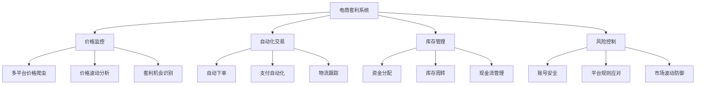

# 🛒 电商套利秘籍：如何用技术在电商平台间赚取差价

你是否曾经有过这样的经历：在某电商平台A看到一款商品售价¥200，而在另一个平台B上同样的商品却要¥300？这时你可能会想："如果我在A平台买入，然后在B平台卖出，岂不是轻松赚¥100？"

恭喜你！你已经发现了电商套利的基本原理。今天，我将揭秘如何将这种直觉转化为可持续的收入来源，让你的"剁手"技能变成"赚钱"技能！💰

## 💡 电商套利：数字时代的"倒买倒卖"

### 什么是电商套利？

简单来说，电商套利就是利用不同平台间的价格差异，低买高卖赚取差价。这就像是数字世界的"倒爷"，只不过你不需要扛着大包小包奔波，而是通过几次鼠标点击就能完成交易。

传统的倒爷需要亲自去进货、搬运、销售，而现代电商套利则依靠信息技术实现自动化，就像是给自己配备了一支"数字分身大军"，24小时不停地为你寻找套利机会。

### 电商套利的四大支柱



就像一座房子需要四根柱子支撑一样，成功的电商套利系统也需要这四大支柱的支持。缺一不可！

## 📊 三大套利模式：选择适合你的致富路径

### 1. 平台间套利：数字世界的"搬运工"

想象一下，你是一个聪明的"搬运工"，发现沃尔玛的某款玩具打折到$15，而亚马逊上同款售价$25。你只需在沃尔玛买入，然后通过亚马逊FBA（Fulfillment by Amazon）卖出，轻松赚取差价。

**这种模式的魅力在于：**
- 完全合法合规，属于正当商业行为
- 可以实现半自动化或全自动化操作
- 风险相对可控，不依赖单一平台政策

**真实案例：**
李先生是一位普通上班族，利用业余时间开发了一个简单的价格监控工具。他专注于沃尔玛和亚马逊之间的价格差异，每月投入1万元人民币，平均每月净赚8000元。一年后，他辞去了工作，全职经营自己的电商套利业务，月收入突破3万元。

### 2. 时间差套利：数字世界的"抢购达人"

这就像是"秒杀限时优惠"的专业玩家。当拼多多推出百亿补贴活动，某款耳机限时降至¥199（原价¥299）时，普通人可能抢不到，但你的自动化脚本可以在毫秒级别完成下单，然后你再以¥259的价格在闲鱼上转售，轻松赚取¥60的差价。

**这种模式的特点：**
- 入门门槛较低，适合小资金起步
- 周转速度快，资金利用率高
- 需要技术支持，特别是自动化抢购能力

**真实案例：**
张同学是一名计算机专业的大学生，他开发了一套拼多多百亿补贴自动抢购系统。每次活动他能抢到30-50件热门商品，平均每件赚40元。一个月下来，纯收入约2000元，足够支付他的日常开销，还能攒下一些钱。

### 3. 信息差套利：数字世界的"情报贩子"

这类套利者就像是掌握了"内幕消息"的交易员。他们通过专业工具获取市场信息，比如Supreme新品发售时间、限量球鞋抽签结果等，然后将这些信息或工具出租给普通消费者，赚取"情报费"。

**这种模式的优势：**
- 无需大量资金，主要靠技术和信息优势
- 风险极低，不需要实际购买商品
- 可以建立长期稳定的订阅收入

**真实案例：**
王先生开发了一款球鞋抢购插件，每月向用户收取98元订阅费。目前他有2000名付费用户，月收入近20万元。而他的主要成本仅是服务器费用和少量客服人员工资，净利润率高达80%。

## 🏆 三大王牌策略：实战指南

### 🥇 沃尔玛→亚马逊FBA套利：稳定的"印钞机"

**为什么它这么有效？**

想象一下两家超市：沃尔玛主打低价策略，经常有清仓特价；而亚马逊则注重便捷体验，消费者愿意为同样的商品支付更高价格。这种价格策略差异创造了套利空间。

**如何操作？**

1. **选品标准**：
   - 轻量商品（<2磅）：减少FBA费用
   - 销量排名好（<10万名）：确保快速周转
   - 价格稳定：避免套利空间突然消失
   - 非季节性：降低滞销风险

2. **实操流程**：
   - 监控沃尔玛清仓特价
   - 对比亚马逊售价和销量
   - 计算扣除所有费用后的利润
   - 只选择利润率>15%的商品

```python
# 这不是枯燥的代码，而是你的"自动寻宝机器人"
class WalmartAmazonArbitrage:
    def __init__(self):
        # 连接各平台API，就像给你的机器人安装"眼睛"
        self.walmart_api = WalmartAPI()
        self.amazon_api = AmazonSPAPI()
        self.keepa_api = KeepaAPI()  # 用于查询历史价格
    
    def find_gold(self):  # 寻找"黄金"商品
        # 1. 获取沃尔玛特价商品，就像淘金者筛沙
        clearance_items = self.walmart_api.get_clearance()
        
        treasures = []  # 存放发现的"宝藏"
        
        # 2. 分析每个商品的套利潜力
        for item in clearance_items:
            # 检查亚马逊价格，就像确认金子的市场价值
            amazon_price = self.amazon_api.get_price(item.sku)
            
            # 检查销量排名，确保商品热门
            sales_rank = self.keepa_api.get_rank_history(item.sku)
            
            # 3. 计算利润，就像称重你的金子
            profit = self.calculate_profit(
                walmart_price=item.price,
                amazon_price=amazon_price,
                fba_fees=self.amazon_api.get_fba_fees(item)
            )
            
            # 如果利润丰厚，就收入囊中
            if profit > item.price * 0.15:  # 利润率>15%
                treasures.append(item)
        
        return treasures  # 返回今天的"收获"
```

**预期收益：**

| 投入资金 | 月周转次数 | 平均利润率 | 月净利润 | 年化收益率 |
|---------|-----------|----------|---------|-----------|
| ¥50,000 | 2次 | 12% | ¥12,000 | 24% |

李先生的真实经历：
"我最初只投入了3万元尝试沃尔玛→亚马逊套利。第一个月就赚了4000元，虽然犯了不少错误。三个月后，我摸索出了一套完整的流程，月利润稳定在8000-10000元。现在我已经辞职全职做这个，团队有3人，月营业额超过30万元。"

### 🥈 礼品卡套利：简单易上手的"入门款"

**为什么它适合新手？**

礼品卡套利就像是一种"无风险套利"。你在Costco（好市多）买入打折礼品卡，然后在礼品卡交易平台以接近面值的价格出售。这种方式：
- 不需要复杂技术
- 几乎没有滞销风险
- 操作简单直观

**操作步骤：**

1. **选择合适的礼品卡**：
   - 星巴克、亚马逊等热门品牌
   - 折扣率至少8%以上
   - 面额适中（100-500元）

2. **购买时机**：
   - 节假日促销季
   - 会员专享活动
   - 限时闪购

3. **销售渠道**：
   - 专业礼品卡交易平台
   - 社交媒体小组
   - 二手交易平台

**预期收益：**

| 投入资金 | 月周转次数 | 平均利润率 | 月净利润 | 年化收益率 |
|---------|-----------|----------|---------|-----------|
| ¥20,000 | 3次 | 6% | ¥3,600 | 18% |

张女士的经验分享：
"我是一名全职妈妈，没有太多时间做复杂的生意。礼品卡套利对我来说非常合适，每天只需要花1-2小时，每月稳定赚3000-4000元。最重要的是，风险几乎为零，我不用担心库存积压或者商品损坏的问题。"

### 🥉 电商差价秒杀：适合技术控的"高频交易"

这就像是电商世界的"高频交易"。你开发一个自动化脚本，监控多个平台的价格波动，当发现某个平台的价格显著低于其他平台时，立即自动下单购买，然后在高价平台出售。

**技术要点：**

1. **多平台监控**：
   - 实时爬取价格数据
   - 建立商品映射关系
   - 设置价差阈值触发器

2. **自动化交易**：
   - 模拟人工操作
   - 多账号轮换
   - 防检测机制

```javascript
// 这是你的"电商套利机器人"
class PriceDifferenceBot {
    constructor() {
        // 连接各大电商平台，就像给机器人装上"雷达"
        this.platforms = {
            taobao: new TaobaoAPI(),
            jd: new JDApi(),
            pdd: new PinduoduoAPI(),
            xianyu: new XianyuAPI()
        };
        
        // 设置你的"猎物"特征
        this.targetProfit = 50;  // 目标利润(元)
        this.minProfitRate = 0.2;  // 最低利润率20%
    }
    
    // 开始狩猎
    async huntForDeals() {
        console.log("🔍 正在搜索套利机会...");
        
        // 获取平台热销商品，就像确定狩猎区域
        const hotItems = await this.getHotSellingItems();
        
        for (let item of hotItems) {
            // 检查各平台价格，寻找价差
            const priceMap = await this.checkAllPlatformsPrices(item);
            
            // 找出最低价和最高价
            const lowestPlatform = this.findLowestPrice(priceMap);
            const highestPlatform = this.findHighestPrice(priceMap);
            
            // 计算利润
            const profit = priceMap[highestPlatform] - priceMap[lowestPlatform];
            const profitRate = profit / priceMap[lowestPlatform];
            
            // 如果利润丰厚，立即行动
            if (profit > this.targetProfit && profitRate > this.minProfitRate) {
                console.log(`💰 发现套利机会: ${item.name}`);
                console.log(`   买入平台: ${lowestPlatform}, 价格: ${priceMap[lowestPlatform]}元`);
                console.log(`   卖出平台: ${highestPlatform}, 价格: ${priceMap[highestPlatform]}元`);
                console.log(`   预期利润: ${profit}元 (${(profitRate*100).toFixed(1)}%)`);
                
                // 执行套利
                await this.executeArbitrage(item, lowestPlatform, highestPlatform);
            }
        }
    }
}
```

**预期收益：**

| 投入资金 | 日交易次数 | 平均单笔利润 | 月净利润 | 年化收益率 |
|---------|-----------|----------|---------|-----------|
| ¥10,000 | 5-10次 | ¥30-50 | ¥4,500-9,000 | 45%-90% |

王同学的故事：
"我是计算机专业的学生，利用课余时间开发了一个电商差价监控系统。最初只是为了自己省钱，后来发现可以通过这个系统赚钱。现在系统每天能发现15-20个套利机会，我选择其中最好的5-8个执行。平均每天能赚200-300元，对学生来说是笔不错的收入。"

## 🚀 从零开始：你的电商套利之旅

### 第一步：选择适合你的套利模式（1周）

根据你的资源和能力选择合适的切入点：
- **有技术能力**：尝试开发自动化工具
- **有资金优势**：从沃尔玛→亚马逊模式入手
- **时间充裕**：可以从手动操作开始积累经验
- **风险厌恶**：从礼品卡套利起步

### 第二步：搭建基础设施（2-4周）

1. **账号准备**：
   - 各平台买家账号
   - 卖家账号及认证
   - 支付工具关联

2. **工具准备**：
   - 价格监控工具
   - 库存管理系统
   - 自动化脚本（可选）

3. **知识准备**：
   - 平台规则学习
   - 物流选择策略
   - 税务合规知识

### 第三步：小规模测试（1个月）

从小额资金开始，验证你的套利模式：
- 投入不超过总资金的20%
- 执行5-10笔测试交易
- 记录每一步的时间和成本
- 分析成功和失败案例

### 第四步：优化和扩展（持续进行）

根据测试结果不断改进：
- 提高自动化程度
- 扩大商品品类
- 优化资金分配
- 建立风险控制机制

## 💭 避坑指南：新手常见的三大陷阱

### 1. 忽视隐藏成本陷阱

**错误示例**：小明看到某款耳机在平台A售价¥199，平台B售价¥259，认为可以赚¥60。

**实际情况**：加上平台佣金(5%)、物流费(¥10)、退货率(3%)等因素，实际利润只有¥30左右。

**解决方法**：建立完整的成本计算模型，包括：
- 平台佣金和费用
- 物流和仓储成本
- 退货和售后成本
- 时间成本

### 2. 忽视库存周转陷阱

**错误示例**：小红一次性投入全部资金(¥50,000)购买了100件同款商品。

**实际情况**：销售速度不如预期，资金被长期占用，错过了其他套利机会。

**解决方法**：
- 分散投资，单品投入不超过总资金的20%
- 优先选择销量稳定的商品
- 建立库存预警机制
- 设定最长持有期限

### 3. 忽视平台规则陷阱

**错误示例**：小张使用同一IP地址操作多个账号进行高频交易。

**实际情况**：账号被平台识别为异常，全部被封禁，造成严重损失。

**解决方法**：
- 熟读平台规则和政策
- 使用合规的操作方式
- 避免过度自动化和机器行为
- 建立账号安全保护机制

## 🤔 电商套利的未来：机遇与挑战

### 行业趋势

1. **算法定价普及**：平台间价格差异将更加短暂
2. **跨境电商机会**：国际平台间套利空间扩大
3. **垂直领域深耕**：专注特定品类的套利更有优势

### 技术演进

1. **AI选品工具**：从海量商品中精准识别套利机会
2. **全自动化系统**：从发现机会到完成交易全流程自动化
3. **风险预警机制**：提前预测价格波动和政策变化

## 🤝 开启你的电商套利之旅

电商套利不是一夜暴富的魔法，而是一种需要耐心、知识和系统思维的商业模式。它融合了技术、市场洞察和运营能力，可以为那些愿意学习和坚持的人带来稳定的收益。

你是否已经尝试过电商套利？你遇到了哪些挑战？或者你有什么问题想要解答？欢迎在评论区分享你的经历和疑问！

---

**小贴士**：记住，成功的电商套利者不是那些寻找捷径的人，而是那些建立系统、持续学习和适应变化的人。就像沃伦·巴菲特说的："价格是你付出的，价值是你获得的。"电商套利的本质，就是找到价格与价值之间的差距。