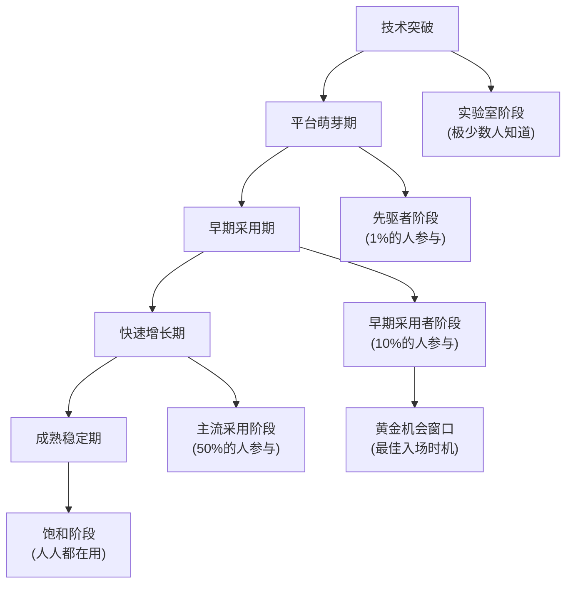

# 🚀 未来淘金指南：如何在新兴平台上抢占先机

还记得2009年比特币刚诞生时，一枚币只值几美分吗？还记得2012年Instagram被脸书以10亿美元收购时，它只有13名员工吗？还记得2020年初，谁能想到一年后NFT市场会爆发，让一些早期参与者一夜暴富？

这些都是"新兴平台红利"的经典案例。而好消息是，这样的机会并未消失，反而在不断涌现！今天，我将带你一起探索数字经济的下一个淘金地，让你提前布局未来的财富风口。🌟

## 💡 新兴平台红利：为什么早鸟总能吃到虫子？

### 平台红利的生命周期

想象一下新兴平台就像一座正在建设的城市。最早入驻的人可以用极低的成本获得黄金地段，随着城市发展，这些地段的价值会成倍增长。



### 为什么新兴平台蕴含巨大机会？

1. **马太效应** - 在数字世界，"赢家通吃"现象更加明显。早期进入者能建立难以撼动的优势，就像抢占了城市中心的地产。

2. **网络效应** - 平台价值随用户数量呈指数级增长，就像电话网络一样，用户越多，每个用户获得的价值就越大。

3. **复合增长** - 早期的小优势会随时间推移变成巨大差距，就像复利效应一样神奇。

## 📊 未来三大风口：数字时代的"加州淘金热"

### 1. AI代理经济：智能助手的千亿市场

想象一下，未来每个人都会拥有多个AI助手，帮助处理工作、学习和生活中的各种任务。这些AI助手就像数字世界的"员工"，为你创造价值，而你则成为"AI经纪人"，管理和优化这支数字员工队伍。

**为什么现在是入场好时机？**
- GPT商店、Claude市场等AI代理平台刚刚起步
- 技术门槛正在降低，但专业知识仍有优势
- 商业模式尚未固化，创新空间巨大

**普通人如何参与？**
- 开发专业领域的AI代理（无需深厚编程基础）
- 为现有AI代理提供训练数据和优化服务
- 搭建连接AI代理与用户需求的中介平台

### 2. Web3社交网络：去中心化的社交新范式

传统社交平台如Facebook和Twitter(现X)已经存在十多年，它们控制着用户数据和创作者收入。而Web3社交平台正在改变这一模式，让用户真正拥有自己的数据和创作内容。

**为什么值得关注？**
- 用户拥有数据主权，创作者获得更公平的收益分配
- 社交代币经济正在形成，早期参与者可获得可观代币激励
- 去中心化社交图谱是未来数字身份的基础设施

**如何抓住这波浪潮？**
- 在新兴Web3社交平台上建立个人品牌和影响力
- 参与社区治理，获取治理代币和决策权
- 开发连接Web2和Web3社交生态的桥梁应用

### 3. 元宇宙商业空间：虚拟世界的商业版图

元宇宙不仅是游戏和社交空间，更是未来的商业前沿。从虚拟房地产到数字时尚，从虚拟会展到元宇宙营销，商业机会正在爆发式增长。

**市场潜力何在？**
- 虚拟土地和建筑已成为新型数字资产类别
- 数字时尚和虚拟商品市场正以每年100%的速度增长
- 元宇宙营销预算在品牌支出中占比不断提升

**入场策略有哪些？**
- 投资潜力区域的虚拟土地（类似现实世界的房地产投资）
- 开设元宇宙商店或服务（虚拟世界的"小商贩"）
- 提供元宇宙建设和运营服务（数字世界的"建筑师"）

## 🏆 三大套利策略：未来淘金者的实战指南

### 🥇 AI代理经济：打造你的"数字员工军团"

**核心思路：**

想象你是一位"AI经纪人"，你的工作是培养和管理一支高效的AI助手团队，为不同客户提供专业服务。这些AI助手就像你的"数字员工"，不需要工资，只需要你的指导和优化。

**实操步骤：**

1. **选择专精领域**
   - 专注于你熟悉的行业或领域
   - 找出现有AI解决方案的不足
   - 确定目标用户的具体痛点

2. **打造专业AI代理**
   - 使用现有AI平台（如OpenAI、Anthropic、Google）
   - 通过提示工程和微调提升AI性能
   - 设计用户友好的交互界面

```python
# 这不是冰冷的代码，而是你的"AI员工培训手册"
class AIAgentBuilder:
    def __init__(self, domain_expertise):
        # 选择你的专业领域，就像选择创业方向
        self.domain = domain_expertise
        self.training_materials = []
        self.user_personas = []
        
    def define_agent_purpose(self, primary_goal, user_needs):
        # 确定AI助手的核心使命，就像公司的使命宣言
        self.mission = {
            "primary_goal": primary_goal,
            "user_needs": user_needs,
            "success_metrics": self._derive_metrics(user_needs)
        }
        return self.mission
    
    def collect_training_materials(self):
        # 收集训练资料，就像准备教材
        print(f"收集{self.domain}领域的专业知识...")
        print("整理行业最佳实践...")
        print("分析常见问题和解决方案...")
        
        # 这里你会添加真实的专业资料
        self.training_materials = ["领域知识", "案例研究", "专家观点"]
        
    def create_user_personas(self):
        # 创建用户画像，了解你的客户
        print("分析目标用户的需求和行为...")
        print("创建详细的用户画像...")
        
        # 定义不同类型的用户
        self.user_personas = ["初学者", "专业人士", "管理者"]
        
    def train_specialized_agent(self):
        # 训练你的AI助手，就像培训新员工
        if not self.training_materials or not self.user_personas:
            print("请先收集训练材料并创建用户画像！")
            return None
            
        print("开始训练专业AI代理...")
        print(f"应用{self.domain}领域知识...")
        print("优化响应质量和相关性...")
        
        return f"一个专精于{self.domain}的AI助手已准备就绪！"
```

3. **多元化变现模式**
   - 订阅模式：用户按月付费使用你的AI助手
   - 使用量计费：按API调用次数或使用时长收费
   - 增值服务：提供定制化训练和优化服务

**真实案例：**

李先生是一位有10年经验的财务顾问。他发现许多中小企业负担不起专业财务顾问的费用，但又需要财务建议。于是他开发了一款财务顾问AI助手，通过自己的专业知识对AI进行训练和优化。

这款AI助手能帮助中小企业进行基础财务分析、预算规划和税务建议。他采用月订阅模式，每月收费198元，远低于真人财务顾问的费用。上线6个月后，他已有500多名付费用户，月收入近10万元，而系统维护成本仅占收入的15%。

### 🥈 Web3社交布局：数字身份的先行者

**核心思路：**

传统社交平台就像封闭的花园，用户创造内容和价值，但平台获取大部分收益。Web3社交平台则像一个公共广场，每个参与者都能公平分享创造的价值。早期参与者不仅能建立影响力，还能获得代币激励和治理权。

**实操指南：**

1. **选择有潜力的平台**
   - 关注用户体验流畅的平台
   - 评估代币经济模型的可持续性
   - 考察团队背景和投资方实力

2. **建立内容矩阵**
   - 创建原创、高质量的内容
   - 建立跨平台的内容分发网络
   - 培养忠实粉丝社区

3. **参与平台治理**
   - 积极参与社区提案和投票
   - 贡献建设性意见和反馈
   - 通过治理获取代币奖励

**实战案例：**

张女士是一位时尚博主，她在2022年初开始在一个Web3社交平台上分享内容，当时该平台月活用户仅有5万。她坚持每周发布优质内容，积极参与社区讨论，并帮助新用户了解平台功能。

一年后，该平台用户增长到100万，并推出了代币激励计划。由于张女士的早期贡献，她获得了大量代币奖励，价值超过50万元。更重要的是，她在平台上建立的影响力为她带来了多个品牌合作机会，月收入是她在传统平台的3倍。

### 🥉 元宇宙商业：虚拟世界的"房地产商"

**核心思路：**

元宇宙就像一个正在建设中的新城市，早期进入者可以低价获取黄金位置的"土地"，随着用户增长和商业活动增加，这些虚拟资产的价值会大幅提升。

**实操策略：**

1. **虚拟地产投资**
   - 研究不同元宇宙平台的发展潜力
   - 选择交通要道和活动中心附近的地块
   - 分散投资于多个平台降低风险

2. **开发商业应用**
   - 建设虚拟商店或展示空间
   - 举办虚拟活动和体验
   - 提供元宇宙营销服务

3. **资产增值管理**
   - 通过建筑和设计提升地产价值
   - 出租闲置虚拟空间获取被动收入
   - 在适当时机进行资产重组和变现

**成功故事：**

王先生在2021年投资了5万元购买某知名元宇宙平台的虚拟土地。他并没有急于出售，而是在土地上建设了一个虚拟艺术画廊，展示NFT艺术品并收取佣金。

随着平台用户增长，他的画廊位于一个交通枢纽，访问量不断增加。一年后，他的虚拟地产估值已达25万元，而画廊每月也能带来约8000元的佣金收入。更令他惊喜的是，一家大型品牌看中了他的位置，提出以40万元的价格收购他的虚拟地产。

## 🚀 从零开始：你的新兴平台套利之旅

### 第一步：选择适合你的赛道（1-2周）

根据你的背景和兴趣选择入场方向：
- **有技术背景**：AI代理开发可能更适合你
- **有内容创作能力**：Web3社交平台是理想选择
- **有商业头脑**：元宇宙商业可能更对你胃口

### 第二步：深入了解所选领域（2-4周）

- 关注行业新闻和研究报告
- 参与相关社区和讨论组
- 尝试使用现有产品和服务

### 第三步：小规模实验（1-2个月）

- 投入少量资金和时间
- 测试不同策略和方法
- 收集数据和反馈

### 第四步：优化和扩展（持续进行）

- 根据实验结果调整策略
- 扩大成功模式的规模
- 建立自动化系统提高效率

## 💭 风险与挑战：未来淘金者的避坑指南

### 1. 技术风险

**陷阱**：过度依赖单一技术路线，被技术变革淘汰
**对策**：保持技术敏感度，关注多元化技术路径

就像19世纪的淘金者，不能只带一种工具去淘金。技术世界变化太快，要时刻准备调整策略。

### 2. 监管风险

**陷阱**：忽视合规要求，面临监管打击
**对策**：关注政策动向，选择合规性强的平台

就像在新领土开拓时，需要了解当地法律法规。数字世界也有其"法律"，忽视它们可能导致严重后果。

### 3. 市场风险

**陷阱**：盲目追随热点，高位接盘
**对策**：坚持价值投资理念，关注长期价值创造

热门并不等于有价值。真正的机会往往在人们还不太关注的领域，就像在人迹罕至的河流中更容易发现金子。

## 🤔 思考与展望：数字经济的下一个十年

### 未来趋势预测

1. **AI与人类协作**将成为主流工作模式
2. **数据主权**将成为用户的基本诉求
3. **虚实融合**将重塑商业和社交体验

### 给未来淘金者的建议

1. **保持好奇心**：新技术总是先看起来像玩具，后来才改变世界
2. **培养跨界思维**：最大的创新往往发生在不同领域的交叉点
3. **重视社区建设**：在数字经济中，社区就是最有价值的资产

## 🤝 你准备好成为数字时代的先行者了吗？

新兴平台套利不是一夜暴富的捷径，而是需要眼光、耐心和行动力的长期游戏。它需要你走在大多数人的前面，看到别人还没看到的机会，并且有勇气采取行动。

你对哪个新兴平台最感兴趣？你认为未来十年会出现什么样的颠覆性平台？欢迎在评论区分享你的想法和问题！

---

记住，在数字经济的浪潮中，不是最强大的物种生存下来，也不是最聪明的，而是最能适应变化的。提前布局，持续学习，勇于尝试，你就能在这场数字淘金热中找到属于自己的一片天地。