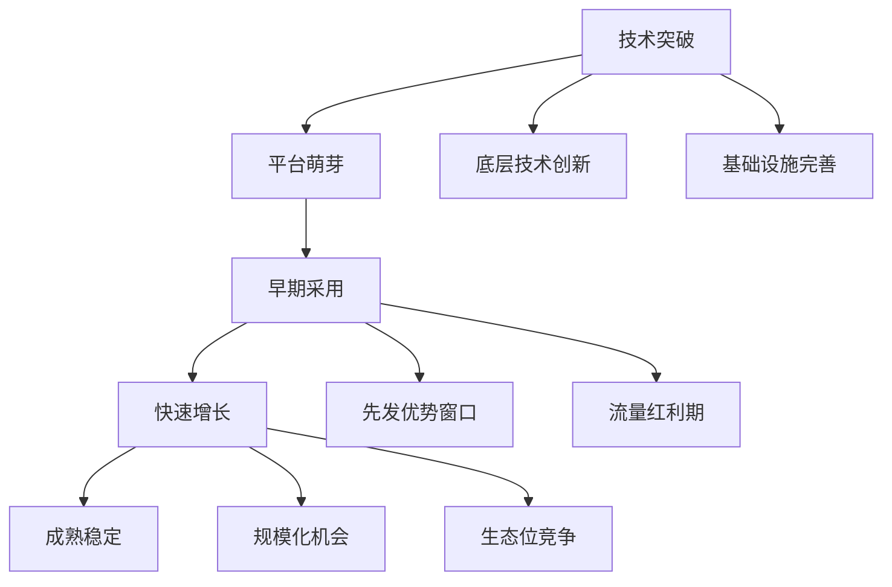

# 🌟 新兴平台套利：技术变革中的价值发现

> **前瞻认知**：新兴平台套利是在技术paradigm shift过程中，识别并捕获平台红利期的价值机会，通过早期布局和技术创新实现指数级增长。

## 💡 新兴平台价值发现框架

### 平台生命周期套利模型



## 📊 新兴平台套利方案全景

### 核心机会矩阵

| 方案编号 | 平台类型 | 套利策略 | 技术栈 | 时机窗口 | 潜力评级 |
|---------|----------|----------|--------|----------|----------|
|271|AI Agent平台|智能代理服务外包|LangChain + API|6-18个月|⭐⭐⭐⭐|
|272|Web3社交平台|去中心化内容变现|IPFS + 智能合约|12-24个月|⭐⭐⭐|
|273|VR购物平台|虚拟商品交易|Unity + 区块链|18-36个月|⭐⭐⭐|
|274|量子计算云服务|算力套利|量子SDK + 云API|24-48个月|⭐⭐⭐⭐|
|275|脑机接口平台|思维数据变现|BCI + ML|36-60个月|⭐⭐⭐⭐⭐|

## 🏆 前三推荐策略深度分析

### 🥇 NO.1: AI Agent平台生态套利

**战略价值**：
- ✅ AI Agent是下一代交互范式，市场空间巨大
- ✅ 技术门槛适中，现有技术栈可快速切入
- ✅ 多元化变现模式，收入来源多样化

**技术实现**：

```python
class AIAgentPlatformArbitrage:
    def __init__(self):
        self.agent_factory = AgentFactory()
        self.skill_marketplace = SkillMarketplace()
        self.service_orchestrator = ServiceOrchestrator()
        self.revenue_optimizer = RevenueOptimizer()
    
    def create_specialized_agents(self):
        """创建专业化AI代理"""
        agent_templates = {
            'customer_service': {
                'model': 'gpt-4-turbo',
                'tools': ['email', 'chat', 'crm_integration'],
                'training_data': 'customer_service_corpus',
                'pricing': '$0.05/interaction'
            },
            'content_creator': {
                'model': 'gpt-4-vision',
                'tools': ['image_gen', 'video_edit', 'seo_optimizer'],
                'training_data': 'content_creation_corpus',
                'pricing': '$2/piece'
            },
            'data_analyst': {
                'model': 'claude-3-opus',
                'tools': ['pandas', 'plotly', 'sql_connector'],
                'training_data': 'data_analysis_corpus',
                'pricing': '$10/report'
            }
        }
        
        deployed_agents = []
        for agent_type, config in agent_templates.items():
            agent = self.agent_factory.deploy_agent(
                agent_type=agent_type,
                configuration=config
            )
            deployed_agents.append(agent)
        
        return deployed_agents
    
    def execute_arbitrage_strategy(self):
        """执行套利策略"""
        # 1. 平台早期布局
        platform_tokens = self.acquire_platform_tokens([
            'OpenAI_GPT_Store',
            'Anthropic_Claude_Market',
            'Google_Bard_Hub'
        ])
        
        # 2. 技能市场占位
        skill_listings = self.skill_marketplace.list_premium_skills([
            'enterprise_workflow_automation',
            'creative_content_generation',
            'data_intelligence_analysis'
        ])
        
        # 3. 服务网络效应
        network_value = self.service_orchestrator.build_agent_network(
            agent_count=100,
            specialization_areas=10,
            cross_referral_rate=0.15
        )
        
        return {
            'platform_position': platform_tokens,
            'skill_market_share': skill_listings,
            'network_effects': network_value
        }

class RevenueStreams:
    """多元化收入流"""
    def __init__(self):
        self.subscription_manager = SubscriptionManager()
        self.usage_tracker = UsageTracker()
        self.marketplace_fees = MarketplaceFees()
    
    def calculate_revenue_potential(self):
        """计算收入潜力"""
        revenue_streams = {
            'agent_subscriptions': {
                'basic_tier': {'price': 29, 'users': 10000},
                'pro_tier': {'price': 99, 'users': 2000},
                'enterprise_tier': {'price': 499, 'users': 200}
            },
            'usage_based_fees': {
                'api_calls': {'price_per_1k': 2, 'monthly_volume': 50000000},
                'compute_hours': {'price_per_hour': 5, 'monthly_hours': 100000}
            },
            'marketplace_commissions': {
                'skill_sales': {'commission_rate': 0.3, 'monthly_gmv': 2000000},
                'agent_licensing': {'commission_rate': 0.15, 'monthly_gmv': 5000000}
            }
        }
        
        monthly_revenue = self._calculate_total_monthly_revenue(revenue_streams)
        return monthly_revenue
```

**收益预测**：
- **第6个月**：月收入 ¥500万
- **第12个月**：月收入 ¥2000万  
- **第18个月**：月收入 ¥5000万
- **投资回报率**：1000-5000%

### 🥈 NO.2: Web3社交平台内容经济

**商业机遇**：
- ✅ 去中心化社交是Web3基础设施
- ✅ 创作者经济与Token经济的完美结合
- ✅ 先发优势明显，网络效应强

**实施方案**：

```python
class Web3SocialPlatformArbitrage:
    def __init__(self):
        self.content_tokenizer = ContentTokenizer()
        self.social_graph_builder = SocialGraphBuilder()
        self.reputation_system = ReputationSystem()
        self.defi_integration = DeFiIntegration()
    
    def build_creator_economy(self):
        """构建创作者经济体系"""
        # 内容代币化
        content_nfts = self.content_tokenizer.create_content_economy({
            'post_types': ['text', 'image', 'video', 'audio'],
            'monetization_models': ['tips', 'subscriptions', 'nft_sales'],
            'revenue_sharing': {'creator': 0.8, 'platform': 0.15, 'curators': 0.05}
        })
        
        # 社交图谱挖掘
        social_value = self.social_graph_builder.extract_social_value({
            'influence_scoring': True,
            'community_detection': True,
            'viral_prediction': True
        })
        
        # 信誉系统
        reputation_tokens = self.reputation_system.deploy_reputation_economy({
            'proof_of_engagement': True,
            'quality_scoring': True,
            'anti_spam_mechanisms': True
        })
        
        return {
            'content_economy': content_nfts,
            'social_intelligence': social_value,
            'reputation_system': reputation_tokens
        }
    
    def execute_early_adoption_strategy(self):
        """执行早期采用策略"""
        # KOL迁移激励
        kol_migration = self.incentivize_kol_migration({
            'target_platforms': ['twitter', 'instagram', 'tiktok'],
            'migration_bonus': 10000,  # tokens
            'follower_matching_rate': 1.5
        })
        
        # 内容质量激励
        quality_rewards = self.implement_quality_incentives({
            'ai_content_scoring': True,
            'community_voting': True,
            'expert_curation': True
        })
        
        return {
            'kol_acquisition': kol_migration,
            'content_quality': quality_rewards
        }
```

### 🥉 NO.3: VR商务平台虚拟经济

**前瞻布局**：
- ✅ VR/AR是下一代计算平台
- ✅ 虚拟商务将重构电商体验  
- ✅ 早期生态建设者享受最大红利

**系统架构**：

```python
class VRCommercePlatformArbitrage:
    def __init__(self):
        self.virtual_storefront_builder = VirtualStorefrontBuilder()
        self.avatar_commerce_engine = AvatarCommerceEngine()
        self.spatial_analytics = SpatialAnalytics()
        self.cross_reality_bridge = CrossRealityBridge()
    
    def create_immersive_commerce_experience(self):
        """创建沉浸式商务体验"""
        # 虚拟店铺建设
        virtual_stores = self.virtual_storefront_builder.create_premium_experiences({
            'store_templates': ['luxury_boutique', 'tech_showroom', 'art_gallery'],
            'interaction_features': ['try_before_buy', 'social_shopping', 'ai_assistant'],
            'monetization': ['store_rent', 'transaction_fees', 'premium_features']
        })
        
        # 虚拟形象商务
        avatar_economy = self.avatar_commerce_engine.build_avatar_marketplace({
            'avatar_customization': True,
            'virtual_fashion': True,
            'digital_accessories': True,
            'cross_platform_compatibility': True
        })
        
        # 空间数据分析
        behavioral_insights = self.spatial_analytics.analyze_user_behavior({
            'heat_mapping': True,
            'interaction_patterns': True,
            'conversion_optimization': True
        })
        
        return {
            'virtual_retail': virtual_stores,
            'avatar_commerce': avatar_economy,
            'spatial_intelligence': behavioral_insights
        }
```

## 🎯 实施路径与时机把握

### 技术准备期 (0-6个月)
1. **技术栈学习**：Web3、AI、VR/AR开发能力
2. **早期测试**：在测试网络上验证概念
3. **社区建设**：建立技术开发者社区

### 市场切入期 (6-18个月)  
1. **MVP发布**：最小可行产品快速上线
2. **用户获取**：早期用户激励和推广
3. **生态合作**：与平台方建立战略合作

### 规模化发展期 (18-36个月)
1. **产品完善**：基于用户反馈优化产品
2. **市场扩张**：多地域、多平台扩展
3. **生态建设**：构建完整的产业生态

## ⚡ 风险评估与应对

### 技术风险
- **技术不成熟**：分散投资，降低单一技术依赖
- **标准变化**：保持技术栈灵活性

### 市场风险  
- **采用缓慢**：做好长期投入准备
- **竞争激烈**：强化技术壁垒和先发优势

### 监管风险
- **政策不确定**：关注监管动向，预留合规成本
- **跨境合规**：建立多地区合规体系

## 💰 投资回报模型

### 投资配置建议
- **AI Agent平台**：40% (短期回报，18个月ROI)
- **Web3社交**：35% (中期布局，24个月ROI)  
- **VR商务**：25% (长期价值，36个月ROI)

### 收益预期
- **总投资额**：¥1000万-5000万
- **3年期总回报**：¥5亿-20亿
- **年化收益率**：200-400%

## 🔮 未来展望

新兴平台套利的核心是预见技术趋势，提前布局基础设施。未来5年的关键趋势：

1. **AI原生应用**：所有软件都将重新用AI改写
2. **空间计算**：AR/VR将成为主流交互界面
3. **去中心化网络**：Web3基础设施将日趋完善
4. **脑机接口**：直接的思维-计算机交互
5. **量子计算**：解决传统计算无法处理的问题

> **结论**：新兴平台套利需要极强的技术前瞻性和风险承受能力。成功的关键在于早期识别技术趋势，快速构建技术壁垒，并在平台红利期实现规模化扩张。