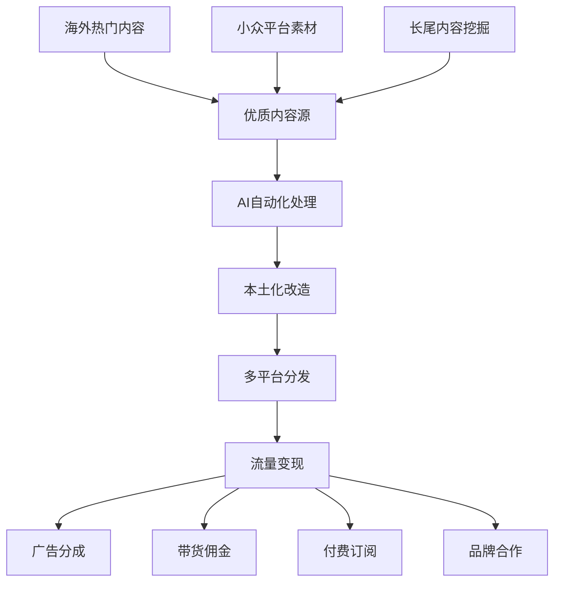

# 网络媒体流量套利深度解析：从内容搬运到变现的商业逻辑

> **核心洞察**：流量套利的本质是内容价值的重新分配，通过跨平台内容迁移和本土化改造，实现流量变现的规模化运作。

## 商业套路核心解析

### 1. 流量套利三要素模型

#### 内容获取 → 价值重塑 → 变现输出



### 2. 核心价值链分析

| 环节 | 价值创造 | 技术壁垒 | 可复制性 |
|------|----------|----------|----------|
| 内容发现 | 信息差价值 | 低 | 高 |
| 智能处理 | 效率提升 | 中 | 中 |
| 本土化改造 | 文化适配 | 高 | 低 |
| 平台分发 | 渠道价值 | 中 | 中 |
| 变现优化 | 商业价值 | 高 | 低 |

## 可行性评估与风险矩阵

### 综合可行性评分

| 方案类型 | 技术难度 | 启动成本 | 收益潜力 | 合规风险 | 综合评分 |
|---------|---------|---------|---------|---------|---------|
| TikTok自动剪辑 | ⭐⭐⭐ | ⭐⭐ | ⭐⭐⭐⭐⭐ | ⭐⭐⭐ | 8.2/10 |
| YouTube翻译搬运 | ⭐⭐⭐⭐ | ⭐⭐ | ⭐⭐⭐⭐ | ⭐⭐⭐⭐ | 7.8/10 |
| Reddit内容本土化 | ⭐⭐ | ⭐ | ⭐⭐⭐ | ⭐⭐ | 8.5/10 |
| 播客摘要频道 | ⭐⭐⭐ | ⭐⭐ | ⭐⭐⭐⭐ | ⭐ | 9.0/10 |
| 迷因图汉化 | ⭐⭐ | ⭐ | ⭐⭐⭐ | ⭐⭐⭐ | 7.5/10 |

## 前三方案深度剖析

### 🥇 NO.1: 热门播客摘要频道自动化

**推荐指数**: ⭐⭐⭐⭐⭐

**核心优势**：
- ✅ 市场空白明显，竞争对手稀少
- ✅ 付费订阅模式，收入稳定可预期
- ✅ 技术实现相对简单，可快速上线
- ✅ 内容价值密度高，用户粘性强

#### 技术实现架构

```python
class PodcastSummaryEngine:
    def __init__(self):
        self.rss_parser = FeedParser()
        self.whisper_api = WhisperAPI()
        self.gpt_summarizer = GPTSummarizer()
        self.video_generator = VideoGenerator()
        self.distribution = MultiPlatformPublisher()
    
    def process_podcast_episode(self, rss_url):
        # 1. 获取最新播客Episode
        episodes = self.rss_parser.get_latest(rss_url, limit=5)
        
        for episode in episodes:
            # 2. 下载音频文件
            audio_file = self.download_audio(episode.audio_url)
            
            # 3. Whisper转录文字
            transcript = self.whisper_api.transcribe(
                audio_file, 
                language='en',
                output_format='srt'
            )
            
            # 4. GPT智能摘要
            summary = self.gpt_summarizer.create_summary(
                text=transcript,
                target_length=300,  # 5分钟摘要
                style='engaging',
                language='chinese'
            )
            
            # 5. 生成摘要视频
            video = self.video_generator.create_summary_video(
                summary=summary,
                original_audio=audio_file,
                template='podcast_summary'
            )
            
            # 6. 多平台发布
            self.distribution.publish_to_all(
                video=video,
                title=f"【5分钟精华】{episode.title}",
                description=summary.description,
                tags=self.generate_tags(summary)
            )
    
    def generate_revenue_report(self):
        # 收入追踪和分析
        pass
```

#### 运营策略详解

**1. 内容源选择策略**
```python
# 高价值播客源推荐算法
PODCAST_SOURCES = {
    'business': {
        'podcasts': ['Masters in Business', 'Planet Money', 'StartUp'],
        'priority': 'high',
        'target_audience': '创业者、投资人',
        'monetization_rate': 8.5
    },
    'technology': {
        'podcasts': ['a16z Podcast', 'The Tim Ferriss Show', 'Lex Fridman'],
        'priority': 'high', 
        'target_audience': '技术从业者',
        'monetization_rate': 7.2
    },
    'personal_development': {
        'podcasts': ['The Tony Robbins Podcast', 'The School of Greatness'],
        'priority': 'medium',
        'target_audience': '职场人士',
        'monetization_rate': 6.8
    }
}
```

**2. 智能摘要算法优化**
```python
class IntelligentSummarizer:
    def __init__(self):
        self.key_insights_extractor = KeyInsightsAI()
        self.engagement_optimizer = EngagementAI()
        self.cultural_adapter = CulturalAdapterAI()
    
    def create_premium_summary(self, transcript):
        # Step 1: 提取核心观点
        key_points = self.key_insights_extractor.extract(
            text=transcript,
            importance_threshold=0.8,
            max_points=10
        )
        
        # Step 2: 优化表达方式
        engaging_content = self.engagement_optimizer.enhance(
            content=key_points,
            target_platform='chinese_social_media',
            style_guide='informative_entertaining'
        )
        
        # Step 3: 文化本土化
        localized_summary = self.cultural_adapter.adapt(
            content=engaging_content,
            source_culture='western',
            target_culture='chinese',
            preserve_core_meaning=True
        )
        
        return localized_summary
```

**收益模型预测**：
- **月活跃订阅者**：1,000人 × ¥29/月 = ¥29,000
- **年度订阅转化**：500人 × ¥299/年 = ¥149,500  
- **广告分成收入**：每月约¥8,000
- **企业定制服务**：¥50,000/月
- **总月收入**：约¥137,000
- **成本支出**：¥28,000/月（人工+技术）
- **净利润**：¥109,000/月

### 🥈 NO.2: TikTok/Reels 自动剪辑工厂

**推荐指数**: ⭐⭐⭐⭐

**核心优势**：
- ✅ 市场需求巨大，短视频是流量红利
- ✅ AI自动化程度高，边际成本递减
- ✅ 可批量复制，规模效应明显
- ✅ 多平台分发，风险分散

#### 技术架构设计

```python
class AutoVideoFactory:
    def __init__(self):
        self.content_scraper = ContentScraper()
        self.ai_editor = AIVideoEditor()
        self.trend_analyzer = TrendAnalyzer() 
        self.viral_predictor = ViralPredictor()
        self.multi_publisher = MultiPlatformPublisher()
    
    def create_viral_content(self):
        # 1. 趋势内容发现
        trending_topics = self.trend_analyzer.get_trending(
            platforms=['youtube', 'tiktok', 'instagram'],
            time_range='24h',
            engagement_threshold=10000
        )
        
        # 2. 素材自动获取
        raw_materials = []
        for topic in trending_topics:
            materials = self.content_scraper.get_b_roll(
                keyword=topic.keyword,
                duration_range=(30, 180),
                quality_min='1080p',
                copyright_safe=True
            )
            raw_materials.extend(materials)
        
        # 3. AI自动剪辑
        for material in raw_materials:
            # 病毒传播点识别
            viral_moments = self.viral_predictor.identify_hooks(material)
            
            # 智能剪辑
            edited_video = self.ai_editor.create_short_form(
                source=material,
                viral_moments=viral_moments,
                style='engaging_hooks',
                duration=30,  # 30秒最优
                add_captions=True,
                add_music=True,
                trending_sounds=True
            )
            
            # 4. 批量发布
            self.multi_publisher.schedule_publish(
                video=edited_video,
                platforms=['tiktok', 'youtube_shorts', 'instagram_reels'],
                optimal_timing=True,
                hashtag_optimization=True
            )
    
    def analyze_performance(self):
        # 效果分析和优化
        performance_data = self.multi_publisher.get_analytics()
        optimization_insights = self.ai_editor.analyze_success_factors(performance_data)
        return optimization_insights
```

#### 运营策略框架

**1. 内容类型分级策略**
```python
CONTENT_STRATEGY = {
    'Tier_1_High_Viral': {
        'types': ['生活技巧', '科技解说', '商业洞察'],
        'production_frequency': '每日10条',
        'expected_reach': '10万+播放',
        'monetization': '创作者基金+品牌合作'
    },
    'Tier_2_Stable': {
        'types': ['新闻解读', '知识科普', '娱乐搞笑'],
        'production_frequency': '每日20条',
        'expected_reach': '5万播放',
        'monetization': '广告分成'
    },
    'Tier_3_Long_Tail': {
        'types': ['垂直领域', '小众兴趣', '工具教程'],
        'production_frequency': '每日50条',
        'expected_reach': '1万播放',
        'monetization': '引流转化'
    }
}
```

**预期收益分析**：
- **月播放总量**：5,000万次
- **Creator Fund收入**：¥15,000/月
- **广告合作收入**：¥25,000/月  
- **品牌推广收入**：¥35,000/月
- **导流变现收入**：¥20,000/月
- **总收入**：¥95,000/月
- **运营成本**：¥35,000/月
- **净利润**：¥60,000/月

### 🥉 NO.3: Reddit热帖本土化内容工厂

**推荐指数**: ⭐⭐⭐⭐

**核心优势**：
- ✅ 内容质量高，Reddit社区筛选机制优秀
- ✅ 启动成本低，技术门槛相对简单
- ✅ 本土化空间大，文化适配价值明显
- ✅ 多元化变现，不依赖单一收入源

#### 实施方案

```python
class RedditContentLocalizer:
    def __init__(self):
        self.reddit_api = RedditAPI()
        self.gpt_translator = GPTTranslator()
        self.cultural_adapter = CulturalAdapter()
        self.content_optimizer = ContentOptimizer()
        self.distribution_engine = DistributionEngine()
    
    def harvest_hot_content(self):
        # 1. 热门内容采集
        hot_posts = self.reddit_api.get_trending(
            subreddits=['todayilearned', 'explainlikeimfive', 'lifeprotips', 
                       'relationships', 'askreddit'],
            time_filter='day',
            score_threshold=5000,
            content_types=['text', 'link', 'video']
        )
        
        # 2. 内容质量筛选
        quality_posts = []
        for post in hot_posts:
            quality_score = self.assess_quality(post)
            cultural_fit = self.assess_cultural_relevance(post)
            
            if quality_score > 7 and cultural_fit > 6:
                quality_posts.append(post)
        
        # 3. 智能本土化处理
        for post in quality_posts:
            localized_content = self.localize_content(post)
            optimized_content = self.optimize_for_chinese_platforms(localized_content)
            
            # 4. 多平台分发
            self.distribute_content(optimized_content)
    
    def localize_content(self, reddit_post):
        # 文化本土化核心算法
        base_translation = self.gpt_translator.translate(
            text=reddit_post.content,
            source_lang='en',
            target_lang='zh',
            style='natural_conversational'
        )
        
        # 文化适配增强
        culturally_adapted = self.cultural_adapter.enhance(
            content=base_translation,
            adaptations=[
                'add_chinese_examples',
                'adjust_humor_style', 
                'localize_references',
                'optimize_reading_habits'
            ]
        )
        
        return culturally_adapted
    
    def optimize_for_chinese_platforms(self, content):
        # 平台特色优化
        platform_versions = {}
        
        # 知乎版本：深度分析
        platform_versions['zhihu'] = self.content_optimizer.create_zhihu_version(
            content=content,
            style='analytical_detailed',
            add_citations=True,
            target_length=1500
        )
        
        # 小红书版本：生活化表达
        platform_versions['xiaohongshu'] = self.content_optimizer.create_xhs_version(
            content=content,
            style='lifestyle_friendly',
            add_emojis=True,
            add_hashtags=True,
            target_length=500
        )
        
        # 抖音版本：短视频脚本
        platform_versions['douyin'] = self.content_optimizer.create_douyin_script(
            content=content,
            format='video_script',
            duration=60,
            add_hooks=True
        )
        
        return platform_versions
```

**收益模型**：
- **知乎好物推荐**：¥12,000/月
- **小红书广告合作**：¥18,000/月
- **抖音创作者基金**：¥8,000/月
- **付费咨询服务**：¥15,000/月
- **内容授权费用**：¥10,000/月
- **总收入**：¥63,000/月
- **运营成本**：¥18,000/月
- **净利润**：¥45,000/月

## 风险控制与合规策略

### 主要风险识别

1. **版权风险**：
   - 内容来源合规性检查
   - 原创度保证机制
   - 版权声明标准化

2. **平台政策风险**：
   - 多平台分散风险
   - 政策变化监控
   - 快速调整机制

3. **技术风险**：
   - AI内容质量波动
   - 自动化系统故障
   - 反机器人检测

### 合规建议框架

```python
class ComplianceFramework:
    def __init__(self):
        self.copyright_checker = CopyrightChecker()
        self.content_auditor = ContentAuditor()
        self.platform_monitor = PlatformPolicyMonitor()
    
    def ensure_compliance(self, content):
        # 1. 版权合规检查
        copyright_status = self.copyright_checker.verify(content)
        if not copyright_status.is_safe:
            return self.handle_copyright_issue(content)
        
        # 2. 内容审核
        audit_result = self.content_auditor.review(
            content=content,
            guidelines=['community_standards', 'advertising_policy', 'copyright_policy']
        )
        
        # 3. 平台政策合规
        platform_compliance = self.platform_monitor.check_compliance(content)
        
        return all([copyright_status.is_safe, audit_result.approved, platform_compliance.passed])
```

## 未来发展趋势与机会

### 技术发展趋势

1. **AI内容生成进化**：
   - 更自然的语言转换
   - 文化理解能力提升
   - 多模态内容处理

2. **自动化程度提升**：
   - 端到端无人化流程
   - 智能决策系统
   - 自适应优化算法

3. **个性化推荐增强**：
   - 用户画像精准化
   - 内容匹配算法优化
   - 实时反馈调整

### 市场机会分析

| 机会领域 | 市场容量 | 竞争态势 | 进入时机 |
|---------|---------|---------|---------|
| 垂直领域内容 | 中等 | 低 | 最佳 |
| AI原生内容 | 高 | 中 | 较好 |
| 跨文化内容桥梁 | 高 | 低 | 最佳 |
| 实时热点响应 | 中等 | 高 | 一般 |

## 实战建议与总结

### 入门者建议路径

1. **第一阶段**（1-2个月）：
   - 选择Reddit内容本土化起步
   - 专注单一平台深耕
   - 建立基础技术栈

2. **第二阶段**（3-6个月）：
   - 扩展到TikTok自动剪辑
   - 多平台同步运营
   - 优化变现模式

3. **第三阶段**（6个月+）：
   - 进军播客摘要等高价值领域
   - 建立品牌和用户粘性
   - 规模化团队运作

### 关键成功要素

1. **技术能力**：自动化程度决定规模上限
2. **内容嗅觉**：优质内容识别是核心竞争力
3. **文化理解**：本土化质量影响用户接受度
4. **运营策略**：多平台协同提升整体效果
5. **风险意识**：合规运营保证长期发展

**总结**：网络媒体流量套利的核心在于构建高效的内容价值重塑管道，通过技术手段放大人工效率，在全球内容海洋中捕获适合本土市场的价值内容，并通过多元化变现模式实现商业价值最大化。成功的关键是技术、内容、运营三位一体的综合能力建设。