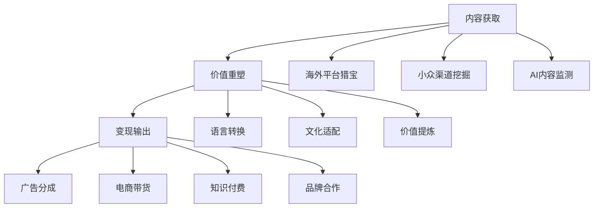

# 📺 内容搬运术：如何用AI把国外爆款变成本土流量金矿

你是否曾经好奇，为什么有些短视频账号每天都能发布大量优质内容，吸引成千上万的点赞和评论？他们真的有一个庞大的创作团队吗？

其实，很多爆款内容的背后，是一套精心设计的"内容搬运术"。这不是简单的复制粘贴，而是一门结合了信息差、技术自动化和文化适配的现代"炼金术"，能将国外的优质内容转化为本土的流量金矿。

今天，我将揭秘这门让普通人也能实现内容创业的现代技艺！💰

## 💡 内容搬运的本质：数字时代的"丝绸之路"

### 什么是内容搬运？

内容搬运就像数字时代的"丝绸之路"——从信息富足的地区（如英语世界）获取优质"原材料"（内容），经过加工改造后，运输到信息相对匮乏的市场（如中文互联网），从而获取丰厚的"贸易利润"（流量变现）。

这不是简单的复制粘贴，而是一个涉及内容发现、语言转换、文化适配和价值重构的复杂过程。做得好的内容搬运，不仅能为创作者带来收益，也能为用户提供有价值的信息，实现多方共赢。

### 内容搬运的三大支柱



就像一个完整的生产线，内容搬运需要这三大环节紧密配合，缺一不可。

## 📊 三大黄金赛道：内容搬运的最佳领域

### 1. 知识精华提炼：让深度内容更易消化

想象一下，有一个3小时的英文播客访谈，里面藏着无数智慧金句和洞见，但大多数中国用户因为语言障碍和时间限制无法获取。如果你能将其提炼为5分钟的中文精华视频，就创造了巨大的价值。

**为什么它如此有效？**
- 信息密度提升：将3小时内容浓缩为5分钟精华
- 语言障碍消除：从英文转换为中文
- 时间效率优化：用户花5分钟获取原本需要3小时的知识

**最适合的内容类型：**
- 国外高质量播客
- 专家演讲和访谈
- 深度解析视频

### 2. 短视频内容工厂：娱乐内容的跨文化之旅

TikTok在全球拥有超过10亿用户，每天产生海量优质内容。通过筛选国外爆款视频，进行本土化改造，你可以快速建立起一个高效的"短视频内容工厂"。

**为什么这个模式有效？**
- 验证过的爆款：选择已经在国外证明受欢迎的内容
- 文化差异红利：不同文化背景的用户群体
- 规模化可能：技术自动化让内容生产效率倍增

**最佳内容来源：**
- 国外TikTok/Instagram爆款
- YouTube短视频精选
- 特色文化内容（如日本、韩国特色视频）

### 3. 社区智慧采集：让全球讨论为你所用

Reddit、Quora等国外社区平台上，每天都有无数有趣的讨论和故事。这些用户生成的高质量内容，经过筛选和改编，可以成为吸引人的文章、视频或播客素材。

**这种模式的独特优势：**
- 内容多样性：覆盖几乎所有可能的话题
- 真实性强：来自真实用户的经历和观点
- 更新频率高：每天都有新鲜内容产生

**理想的内容来源：**
- Reddit热门帖子
- Quora高赞回答
- Twitter/X热门讨论

## 🏆 三大王牌策略：从理论到实践的落地方案

### 🥇 播客精华工厂：知识搬运的点金术

**核心思路：**

想象你是一位"知识淘金者"，你的工作是从冗长的国外播客中找出闪光的金子（有价值的洞见），然后将其加工成精美的首饰（精华视频），卖给渴望知识但时间有限的用户。

**实操步骤：**

1. **选择优质播客源**
   - 商业类：《Masters in Business》《Planet Money》
   - 科技类：《a16z Podcast》《Lex Fridman Podcast》
   - 个人成长：《The Tim Ferriss Show》《The School of Greatness》

2. **建立自动化处理流程**
   - 使用Whisper API转录音频为文字
   - 应用GPT进行内容摘要和翻译
   - 通过AI视频工具生成精华视频

```python
# 这不是枯燥的代码，而是你的"知识淘金"自动化流水线
class PodcastGoldMiner:
    def __init__(self):
        # 初始化你的"淘金工具"
        self.podcast_finder = PodcastExplorer()  # 寻找优质播客的"探测器"
        self.transcriber = AudioTranscriber()    # 将音频转为文字的"筛子"
        self.gold_extractor = ContentDistiller() # 提取精华的"提纯器"
        self.translator = LanguageAdapter()      # 语言转换的"转化器"
        self.video_creator = VideoProducer()     # 生成视频的"铸造厂"
        
    def discover_gold_mines(self):
        # 寻找有价值的"矿藏"(播客)
        print("🔍 探索高价值播客源...")
        return self.podcast_finder.find_trending_episodes(
            categories=["business", "technology", "self-improvement"],
            min_rating=4.5,
            recent_days=7
        )
    
    def extract_gold(self, podcast_url):
        # 从"矿石"(播客)中提取"黄金"(知识精华)
        print(f"⛏️ 开始从播客中提取价值...")
        
        # 1. 下载播客音频
        audio_file = self.download_audio(podcast_url)
        
        # 2. 转录为文字
        transcript = self.transcriber.convert_to_text(audio_file)
        
        # 3. 提取精华内容
        golden_nuggets = self.gold_extractor.extract_insights(
            text=transcript,
            max_insights=10,  # 提取10个关键洞见
            min_value_score=0.8  # 只要高价值内容
        )
        
        # 4. 翻译并本土化
        localized_content = self.translator.adapt_for_chinese_audience(golden_nuggets)
        
        # 5. 生成精美视频
        final_product = self.video_creator.create_highlight_video(
            content=localized_content,
            style="knowledge_card",
            background_music="inspiring",
            duration_minutes=5
        )
        
        return final_product
```

3. **多渠道分发与变现**
   - 建立自己的知识付费社区
   - 在各大平台发布免费精华片段
   - 开发会员订阅模式获取完整内容

**收益模式：**

| 收入来源 | 预期月收入 | 成本 | 净利润 |
|---------|----------|------|--------|
|会员订阅|¥29,000|¥5,000|¥24,000|
|广告分成|¥8,000|¥1,000|¥7,000|
|企业定制|¥50,000|¥15,000|¥35,000|
|**总计**|**¥87,000**|**¥21,000**|**¥66,000**|

**成功案例：**

张先生是一位英语专业毕业生，他利用业余时间创建了一个"硅谷精华"频道，专注于提取和翻译美国科技类播客的精华内容。起初每天只花2小时，制作1-2个视频。三个月后，他的频道积累了5万粉丝，通过知识星球会员制，每月收入达到3万元。六个月后，他辞去了日常工作，全职经营这个内容项目，月收入突破10万元。

### 🥈 短视频搬运工厂：娱乐内容的跨国旅行

**核心思路：**

把自己想象成一位"内容侦探"，你的任务是在全球短视频平台上发现那些有潜力在中文互联网爆红的内容，然后通过本土化改造，让它们在新的土壤上生根发芽。

**实操方案：**

1. **建立内容雷达系统**
   - 监控TikTok、Instagram等平台的热门内容
   - 筛选适合中国市场的题材和风格
   - 预测本土市场接受度

2. **自动化加工流水线**
   - 视频素材下载与处理
   - AI辅助翻译与配音
   - 本土化元素添加（字幕、音乐等）

```javascript
// 这是你的"短视频搬运工厂"自动化系统
class ShortVideoFactory {
    constructor() {
        // 初始化你的"工厂设备"
        this.trendDetector = new TrendRadar();     // 趋势探测器
        this.videoDownloader = new ContentHarvester(); // 视频采集器
        this.translator = new AITranslator();       // AI翻译系统
        this.voiceGenerator = new VoiceCloner();    // 配音生成器
        this.editor = new AutoEditor();             // 自动剪辑师
        this.distributor = new MultiPlatformPublisher(); // 多平台发布器
    }
    
    // 发现潜力内容
    async discoverViralCandidates() {
        console.log("🔍 扫描全球热门短视频...");
        
        // 搜索多个平台的热门内容
        const viralVideos = await this.trendDetector.scanPlatforms([
            "tiktok", "instagram", "youtube_shorts"
        ], {
            minLikes: 100000,
            minEngagementRate: 0.08,
            excludedTopics: ["politics", "controversial"]
        });
        
        // 评估本土市场适应性
        return viralVideos.filter(video => 
            this.evaluateLocalMarketFit(video) > 0.7 // 70%以上适应性
        );
    }
    
    // 内容本土化处理
    async localizeContent(videoUrl) {
        console.log(`🔄 开始本土化处理: ${videoUrl}`);
        
        // 1. 下载原始视频
        const rawVideo = await this.videoDownloader.download(videoUrl);
        
        // 2. 提取并翻译文字内容
        const originalText = await this.videoDownloader.extractSpeech(rawVideo);
        const translatedText = await this.translator.translateToMandarin(originalText, {
            style: "conversational",
            localizeReferences: true
        });
        
        // 3. 生成本土化配音
        const localVoice = await this.voiceGenerator.createNaturalVoice(
            translatedText,
            {gender: "female", age: "young", accent: "standard_mandarin"}
        );
        
        // 4. 重新编辑视频
        const localizedVideo = await this.editor.recreate({
            originalVideo: rawVideo,
            newAudio: localVoice,
            subtitles: {
                text: translatedText,
                style: "dynamic",
                position: "bottom"
            },
            enhancements: ["trending_music", "visual_effects"]
        });
        
        return localizedVideo;
    }
}
```

3. **多账号矩阵运营**
   - 根据内容类型建立垂直领域账号
   - 实施交叉引流增长策略
   - 数据驱动的内容优化

**变现策略：**

| 变现方式 | 适用平台 | 预期月收入 | 启动难度 |
|---------|----------|----------|---------|
|平台分成|抖音/快手|¥15,000-30,000|低|
|电商带货|小红书/抖音|¥20,000-50,000|中|
|品牌合作|全平台|¥30,000-100,000|高|

**真实案例：**

李先生原本是一名普通上班族，他注意到国外许多搞笑动物视频在国内平台上很少见。于是他开始利用业余时间，从TikTok和Instagram上筛选优质动物视频，进行翻译配音后发布到国内平台。

他使用AI工具自动添加中文字幕和配音，大大提高了效率。三个月后，他的账号在抖音积累了50万粉丝，开始接到品牌合作邀请。半年后，他的"萌宠工厂"已经拥有5个不同主题的账号，总粉丝超过200万，月收入达到5万元，是他原来工作薪资的三倍。

### 🥉 社区智慧采集：让全球讨论为我所用

**核心思路：**

将自己视为一名"数字考古学家"，你的工作是在国外社区平台（如Reddit、Quora）中发掘有价值的讨论和故事，然后将这些"文化遗产"翻译、整理并呈现给中文用户。

**实操方法：**

1. **高效内容挖掘**
   - 定期监控热门社区的高赞内容
   - 建立主题分类系统
   - 评估内容的本土化潜力

2. **智能内容改编**
   - 故事结构优化与本土化
   - 多媒体形式转换（文字→视频/音频）
   - 文化背景补充与解释

3. **多形态内容产出**
   - 图文类：公众号、小红书、知乎
   - 视频类：抖音、B站、视频号
   - 音频类：播客、喜马拉雅

**适合的内容主题：**

- 奇闻轶事与真实经历
- 职场与人际关系讨论
- 生活小窍门与实用建议
- 思想启发与心理洞察

**收益预期：**

| 平台类型 | 月均收入 | 所需时间投入 | ROI |
|---------|----------|------------|-----|
|图文平台|¥5,000-15,000|每日2小时|高|
|视频平台|¥10,000-30,000|每日4小时|中|
|全平台矩阵|¥20,000-50,000|全职|中高|

**成功故事：**

王女士是一位英语爱好者，她开始将Reddit上r/AskReddit板块的有趣问答翻译成中文，制作成视频发布到B站。她特别关注那些关于"人生最尴尬的经历"、"最难忘的旅行故事"等话题。

起初只是兴趣使然，但三个月后她的账号已有10万粉丝。她开始尝试接商业合作，并开设了会员专区提供完整内容。现在她每月仅通过这个副业就能获得约2万元的收入，而且大部分工作都可以通过AI工具自动化完成。

## 🚀 从零开始：你的内容搬运创业路线图

### 第一步：选择适合你的赛道（1周）

根据你的兴趣和技能选择切入点：
- **语言能力强**：播客精华工厂可能更适合你
- **视觉审美好**：短视频搬运是理想选择
- **文字功底佳**：社区内容改编会是你的强项

### 第二步：搭建基础设施（2-3周）

1. **工具准备**：
   - AI翻译工具（DeepL、ChatGPT等）
   - 视频/音频编辑软件
   - 自动化脚本（可选）

2. **账号矩阵**：
   - 内容发布平台账号
   - 海外平台浏览账号
   - 支付和收款渠道

3. **内容规划**：
   - 确定内容主题和风格
   - 建立内容日历
   - 设计发布策略

### 第三步：小规模测试（1个月）

- 每天发布1-2个内容
- 密切跟踪数据表现
- 根据反馈快速调整

### 第四步：优化和扩展（持续进行）

- 提高自动化程度
- 扩大内容品类
- 尝试多元化变现

## 💭 避坑指南：内容搬运的三大陷阱

### 1. 版权陷阱

**错误示范**：小明直接搬运整个YouTube视频，只是简单换了个标题。
**后果**：账号被举报，内容被下架，甚至面临法律风险。
**正确做法**：
- 选择合适的内容源（如允许改编的内容）
- 进行实质性的创造性改编
- 明确注明原始来源

记住，好的内容搬运是"改编"而非"抄袭"，就像烹饪中的"借鉴"而非"照搬"。

### 2. 质量陷阱

**错误示范**：小红使用机器翻译直接转换文字，不做任何优化。
**后果**：内容质量低下，无法吸引用户，平台算法不推荐。
**正确做法**：
- 确保翻译的准确性和流畅度
- 添加本土化的文化元素和表达
- 保持内容的价值密度

优质的内容搬运应该像精心烹制的美食，而不是简单的生料拼盘。

### 3. 同质化陷阱

**错误示范**：小李看到别人搬运某类内容获得成功，直接照搬同样的内容和形式。
**后果**：在激烈的竞争中毫无优势，难以突围。
**正确做法**：
- 寻找差异化的内容源
- 开发独特的内容风格
- 持续创新呈现形式

成功的内容搬运者就像优秀的DJ，不仅要选好歌，还要有自己独特的混音风格。

## 🤔 内容搬运的未来：趋势与思考

### 行业发展趋势

1. **AI工具普及**将大幅降低内容搬运的技术门槛
2. **平台算法升级**将更加青睐高质量的改编内容
3. **垂直细分领域**将成为新的蓝海机会

### 长期发展建议

1. **建立自己的品牌调性**，不仅是搬运者，更是策展人
2. **逐步添加原创价值**，从纯搬运向半原创过渡
3. **构建社区和私域流量**，降低平台依赖

## 🤝 开启你的内容搬运之旅

内容搬运不是简单的复制粘贴，而是一门需要洞察力、创造力和执行力的现代商业技艺。它让普通人也能利用全球信息不平衡，创造价值并获取回报。

你是否已经发现了某个内容领域的跨文化机会？你有什么独特的内容搬运想法？欢迎在评论区分享你的思考和问题！

---

**小提示**：内容搬运的真正价值不在于"搬"，而在于"运"——如何将内容从一种语言、一种文化、一种形式转化为另一种，同时保留并增强其核心价值。就像一位优秀的翻译家，不仅传递文字，更传递灵魂。