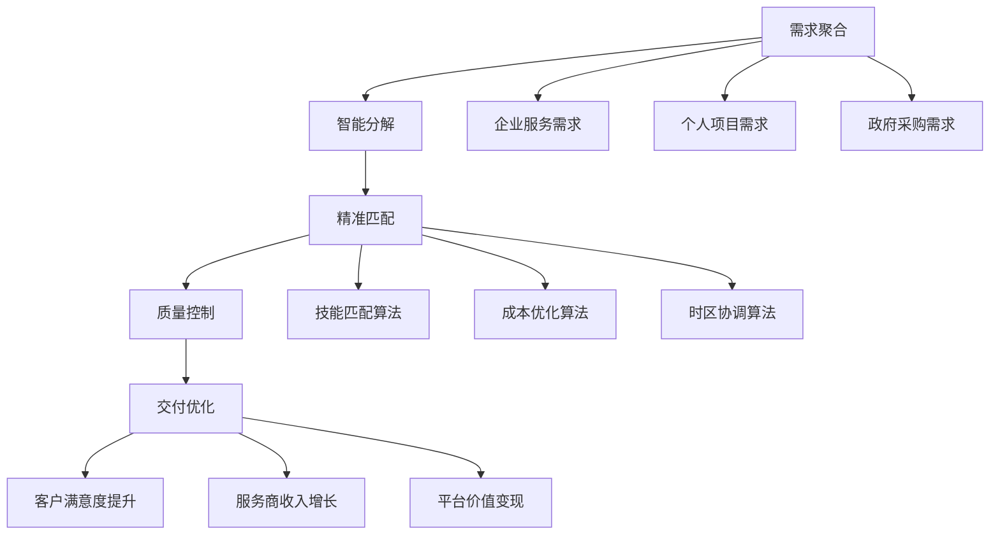

# 🏢 服务外包套利深度解析：全球人力资源的智能化整合

> **核心理念**：服务外包套利通过AI赋能的智能化任务分配和全球人力资源整合，实现服务成本优化和效率提升，构建可规模化的数字服务平台。

## 💡 外包套利商业模式解构

### 价值创造链条



### 套利核心机制

1. **地理套利**：利用全球人力成本差异
2. **技能套利**：将专业技能与需求精准匹配
3. **时间套利**：通过时区差异实现24/7服务
4. **规模套利**：批量采购服务降低成本

## 📊 服务外包套利方案全景

### 核心方案矩阵

| 方案编号 | 服务类型 | 核心技术 | 地理优势 | 预期ROI | 可行性 |
|---------|----------|----------|----------|---------|--------|
|181|跨境电商代运营|API自动化|东南亚成本优势|300-500%|⭐⭐⭐⭐|
|182|AI辅助客服外包|NLP+人工智能|多时区覆盖|200-400%|⭐⭐⭐⭐|
|183|技术文档翻译|AI翻译+人工校对|语言人才集中地|180-350%|⭐⭐⭐|
|184|数据标注服务|众包+质量控制|人力成本洼地|150-300%|⭐⭐⭐⭐|
|185|软件测试外包|自动化+人工测试|技术人才密集区|200-400%|⭐⭐⭐|

## 🏆 前三推荐策略深度分析

### 🥇 NO.1: 跨境电商智能代运营平台

**核心价值主张**：
- ✅ 市场需求爆炸性增长，跨境电商万亿市场
- ✅ 高度标准化，适合规模化自动化运营
- ✅ 多重变现模式，收入来源多样化

**技术架构**：

```python
class CrossBorderEcommerceOrchestrator:
    def __init__(self):
        self.platform_connectors = {
            'amazon': AmazonSellerAPI(),
            'shopify': ShopifyAPI(),
            'alibaba': AlibabaAPI(),
            'ebay': EbayAPI(),
            'lazada': LazadaAPI()
        }
        self.service_automation = ServiceAutomation()
        self.quality_assurance = QualityAssurance()
        self.cost_optimizer = CostOptimizer()
        
    def orchestrate_full_service_chain(self, client_requirements):
        """全链条服务编排"""
        # 1. 需求分析和分解
        service_breakdown = self.analyze_and_decompose_requirements(
            client_requirements
        )
        
        # 2. 服务提供商智能匹配
        matched_providers = self.match_service_providers(
            service_breakdown,
            criteria=['cost', 'quality', 'speed', 'reliability']
        )
        
        # 3. 自动化任务分配
        task_allocation = self.service_automation.allocate_tasks(
            providers=matched_providers,
            tasks=service_breakdown,
            optimization_target='cost_quality_balance'
        )
        
        # 4. 实时质量监控
        quality_metrics = self.quality_assurance.monitor_service_delivery(
            task_allocation,
            quality_thresholds={
                'response_time': 24,  # hours
                'accuracy_rate': 0.95,
                'customer_satisfaction': 0.9
            }
        )
        
        return {
            'service_plan': task_allocation,
            'quality_metrics': quality_metrics,
            'cost_optimization': self.cost_optimizer.calculate_savings(task_allocation)
        }
    
    def implement_revenue_optimization(self):
        """收益优化实施"""
        revenue_streams = {
            'transaction_fees': {
                'rate': 0.15,  # 15% commission
                'target_gmv': 50000000  # ¥5000万月GMV
            },
            'saas_subscriptions': {
                'basic_tier': {'price': 2999, 'target_users': 1000},
                'pro_tier': {'price': 9999, 'target_users': 300},
                'enterprise_tier': {'price': 29999, 'target_users': 50}
            },
            'premium_services': {
                'brand_building': {'price': 50000, 'monthly_deals': 20},
                'market_expansion': {'price': 100000, 'monthly_deals': 10}
            }
        }
        
        monthly_revenue = self._calculate_revenue_streams(revenue_streams)
        return monthly_revenue

class IntelligentTaskRouter:
    """智能任务路由器"""
    def __init__(self):
        self.ml_model = TaskRoutingMLModel()
        self.provider_database = ProviderDatabase()
        
    def route_optimal_provider(self, task, constraints):
        """路由到最优服务商"""
        candidate_providers = self.provider_database.query_providers(
            skill_requirements=task.skills,
            geographic_constraints=constraints.geography,
            budget_range=constraints.budget
        )
        
        # ML模型预测最佳匹配
        optimal_provider = self.ml_model.predict_best_match(
            task_features=task.extract_features(),
            provider_features=[p.extract_features() for p in candidate_providers],
            historical_performance=self.get_historical_performance(candidate_providers)
        )
        
        return optimal_provider
```

**收益模型**：
- **抽成收入**：¥500万GMV × 15% = ¥75万/月
- **SaaS订阅**：¥350万/月
- **增值服务**：¥300万/月
- **总月收入**：¥725万
- **年化收益**：¥8700万

### 🥈 NO.2: AI增强客服外包生态系统

**商业优势**：
- ✅ AI+人工混合模式，成本效益最优
- ✅ 多语言、多时区全球化服务能力
- ✅ 高度标准化，易于质量控制和规模化

**系统设计**：

```python
class AIEnhancedCustomerServicePlatform:
    def __init__(self):
        self.ai_assistant = AIAssistant()
        self.human_agent_pool = HumanAgentPool()
        self.conversation_router = ConversationRouter()
        self.quality_monitor = RealTimeQualityMonitor()
        self.training_system = ContinuousTrainingSystem()
    
    def handle_customer_inquiry(self, inquiry):
        """处理客户咨询"""
        # 1. AI首轮处理
        ai_response = self.ai_assistant.process_inquiry(inquiry)
        
        # 2. 复杂度评估
        complexity_score = self.ai_assistant.assess_complexity(inquiry)
        
        if complexity_score < 0.7:  # 简单问题AI处理
            return ai_response
        else:  # 复杂问题路由到人工
            optimal_agent = self.conversation_router.route_to_human(
                inquiry=inquiry,
                agent_pool=self.human_agent_pool,
                criteria=['expertise', 'language', 'availability']
            )
            
            # AI辅助人工处理
            assisted_response = optimal_agent.handle_with_ai_assist(
                inquiry=inquiry,
                ai_suggestions=ai_response
            )
            
            return assisted_response
    
    def optimize_service_quality(self):
        """服务质量优化"""
        # 实时质量监控
        quality_metrics = self.quality_monitor.track_metrics([
            'response_time',
            'resolution_rate', 
            'customer_satisfaction',
            'escalation_rate'
        ])
        
        # 持续训练优化
        improvement_plan = self.training_system.generate_improvement_plan(
            quality_metrics=quality_metrics,
            performance_gaps=self.identify_performance_gaps()
        )
        
        return improvement_plan

class GlobalServiceDelivery:
    """全球化服务交付"""
    def __init__(self):
        self.timezone_optimizer = TimezoneOptimizer()
        self.language_matcher = LanguageMatcher()
        self.cultural_adapter = CulturalAdapter()
    
    def deliver_24x7_service(self, client_requirements):
        """24×7服务交付"""
        # 时区优化
        shift_schedule = self.timezone_optimizer.create_global_schedule(
            target_timezones=client_requirements.target_markets,
            service_level_agreement=client_requirements.sla
        )
        
        # 语言和文化适配
        localized_service = self.cultural_adapter.adapt_service_delivery(
            base_service=client_requirements.service_template,
            target_cultures=client_requirements.target_cultures
        )
        
        return {
            'global_schedule': shift_schedule,
            'localized_delivery': localized_service,
            'quality_assurance': self.setup_quality_controls()
        }
```

**收益分析**：
- **客户规模**：500家企业客户
- **平均客单价**：¥15,000/月
- **毛利率**：70% (AI降低人力成本)
- **月收入**：¥750万
- **年收入**：¥9000万

### 🥉 NO.3: 技术文档智能翻译生态

**核心竞争力**：
- ✅ 技术文档翻译专业门槛高，竞争相对较少
- ✅ 客户粘性强，长期合作关系稳定
- ✅ AI+专家结合，质量和效率兼具

**完整解决方案**：

```python
class TechnicalDocumentationTranslationEcosystem:
    def __init__(self):
        self.ai_translator = AdvancedAITranslator()
        self.expert_network = TechnicalExpertNetwork()
        self.quality_assurance = TranslationQualityAssurance()
        self.domain_knowledge = DomainKnowledgeBase()
    
    def process_technical_document(self, document, target_languages):
        """处理技术文档翻译"""
        # 1. 文档分析和预处理
        document_analysis = self.analyze_document_complexity(document)
        
        # 2. 领域专业术语识别
        domain_terms = self.domain_knowledge.extract_technical_terms(
            document,
            domain=document_analysis.primary_domain
        )
        
        # 3. AI翻译第一遍
        ai_translation = self.ai_translator.translate_with_context(
            document=document,
            target_languages=target_languages,
            domain_context=document_analysis.domain_context,
            terminology_database=domain_terms
        )
        
        # 4. 专家审校
        expert_review = self.expert_network.assign_domain_expert(
            domain=document_analysis.primary_domain,
            complexity_level=document_analysis.complexity_score,
            target_languages=target_languages
        )
        
        final_translation = expert_review.review_and_refine(
            ai_translation=ai_translation,
            original_document=document
        )
        
        # 5. 质量保证
        quality_score = self.quality_assurance.evaluate_translation_quality(
            original=document,
            translation=final_translation,
            domain_requirements=document_analysis.quality_requirements
        )
        
        return {
            'translation': final_translation,
            'quality_metrics': quality_score,
            'expert_credentials': expert_review.expert_profile
        }
    
    def build_sustainable_expert_network(self):
        """构建可持续专家网络"""
        expert_ecosystem = {
            'recruitment_strategy': {
                'target_profiles': ['industry_veterans', 'phd_researchers', 'technical_writers'],
                'compensation_model': 'performance_based',
                'growth_incentives': 'revenue_sharing'
            },
            'quality_management': {
                'peer_review_system': True,
                'continuous_training': True,
                'performance_tracking': True
            },
            'technology_integration': {
                'ai_collaboration_tools': True,
                'workflow_automation': True,
                'knowledge_sharing_platform': True
            }
        }
        
        return expert_ecosystem

class MarketExpansionStrategy:
    """市场扩张策略"""
    def __init__(self):
        self.market_analyzer = TechnicalTranslationMarketAnalyzer()
        
    def identify_high_value_verticals(self):
        """识别高价值垂直市场"""
        target_verticals = {
            'biotechnology': {
                'market_size': '¥50亿',
                'growth_rate': '25%',
                'avg_project_value': '¥500,000',
                'competitive_intensity': 'medium'
            },
            'semiconductor': {
                'market_size': '¥80亿', 
                'growth_rate': '30%',
                'avg_project_value': '¥800,000',
                'competitive_intensity': 'low'
            },
            'aerospace': {
                'market_size': '¥30亿',
                'growth_rate': '20%',
                'avg_project_value': '¥1,200,000',
                'competitive_intensity': 'low'
            }
        }
        
        return target_verticals
```

**商业预测**：
- **项目单价**：¥50万-200万/项目
- **月项目数量**：30-50个
- **毛利率**：75%
- **月收入**：¥1875万
- **年收入**：¥2.25亿

## 🎯 实施路径规划

### Phase 1: 基础建设期 (0-6个月)
1. **技术平台开发**：AI能力集成、自动化工具开发
2. **服务商网络建设**：全球优质服务商招募和认证  
3. **质量体系建立**：标准化流程和质量控制机制

### Phase 2: 市场验证期 (6-12个月)
1. **试点客户获取**：重点行业标杆客户合作
2. **服务模式优化**：基于客户反馈优化服务流程
3. **收益模型验证**：商业模式可行性验证

### Phase 3: 规模化扩张期 (12-24个月)
1. **市场份额扩大**：多行业、多地区业务扩展
2. **平台生态完善**：构建完整的服务生态系统
3. **技术优势强化**：持续技术创新和差异化

## ⚠️ 关键风险与应对策略

### 运营风险
- **服务质量不稳定**：建立多层质量保证体系
- **文化差异冲突**：加强跨文化管理培训

### 市场风险
- **客户需求变化**：保持敏捷响应能力
- **价格竞争激烈**：通过技术创新维持溢价能力

### 技术风险
- **AI技术局限性**：人机结合模式降低风险
- **数据安全问题**：建立企业级安全保障体系

## 💰 投资回报分析

### 投资需求
- **技术开发投入**：¥2000万
- **市场推广费用**：¥1500万  
- **运营资金**：¥2500万
- **总投资额**：¥6000万

### 收益预期
- **第12个月**：实现盈亏平衡
- **第24个月**：年收入¥5亿
- **第36个月**：年收入¥15亿
- **3年累计净利润**：¥8亿
- **投资回报率**：1333%

---

## 🔮 行业发展趋势

服务外包行业正在经历深刻变革：

1. **AI原生服务**：AI将成为服务交付的核心能力
2. **超级自动化**：端到端流程自动化成为标配
3. **生态化竞争**：单一服务向综合解决方案转变
4. **价值链重构**：从成本驱动向价值创造转变

> **结论**：服务外包套利的成功关键在于AI技术赋能、全球资源整合和质量体系建设。通过构建智能化的服务交付平台，可以在降低成本的同时提升服务质量，实现可持续的规模化增长。