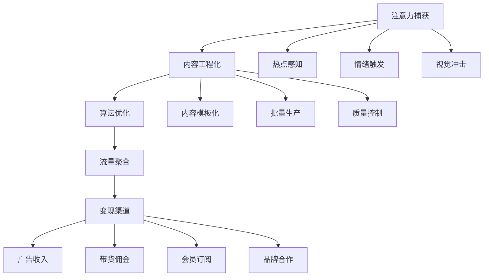

# 🌟 社交媒体套利：流量经济的价值重构

> **核心洞察**：社交媒体套利本质是将分散的注意力资源聚合，通过算法优化和内容工程化实现流量价值最大化。

## 💡 商业模式解构

### 价值创造链条



### 套利核心机制

1. **时间套利**：在内容生命周期的最佳时机介入
2. **平台套利**：利用不同平台的算法差异和用户偏好
3. **内容套利**：将优质内容在不同形式间转换
4. **影响力套利**：将个人品牌转化为商业价值

## 📊 社交媒体套利方案全景分析

### 核心方案矩阵

| 方案编号 | 策略名称 | 核心机制 | 技术栈 | 预期ROI | 风险等级 |
|---------|----------|----------|--------|---------|----------|
|211|抖音热门BGM自动搬运|音频识别+素材匹配|Python + 音频处理|200-400%|⭐⭐|
|212|小红书种草笔记模板工厂|AI生成购物笔记|GPT + 图像生成|150-300%|⭐⭐⭐|
|213|Instagram Reels批量制作|短视频自动剪辑|FFmpeg + CV|180-350%|⭐⭐|
|214|TikTok挑战赛预测机器人|趋势预测+快速跟进|ML + 数据分析|300-500%|⭐⭐⭐|
|215|微博热搜话题引流脚本|热点蹭流量|NLP + 自动化|120-250%|⭐⭐|
|216|YouTube Shorts标题优化|SEO优化标题生成|GPT + Analytics API|100-200%|⭐⭐⭐|
|217|Clubhouse房间自动主持|AI对话主持|语音合成 + NLP|自动化运营|⭐⭐|
|218|LinkedIn职场内容生成器|专业内容批量产出|GPT + 行业数据|150-280%|⭐⭐⭐|
|219|Facebook群组广告植入|精准社群营销|爬虫 + 定向推送|200-400%|⭐|
|220|Twitter话题趋势机器人|实时热点追踪|Twitter API + 算法|快速涨粉|⭐⭐⭐|

## 🏆 前三推荐策略深度分析

### 🥇 NO.1: TikTok挑战赛预测机器人 (214号方案)

**核心价值主张**：
- ✅ 预测性优势，提前布局热门内容
- ✅ 算法友好，符合平台推荐机制  
- ✅ 可规模化，支持多账号矩阵运营

**技术架构**：

```python
class TikTokTrendPredictor:
    def __init__(self):
        self.data_collector = TikTokDataCollector()
        self.trend_analyzer = TrendAnalyzer()
        self.content_generator = ContentGenerator()
        self.auto_publisher = AutoPublisher()
    
    def predict_viral_potential(self, content_data):
        """预测内容爆火潜力"""
        features = self.extract_viral_features(content_data)
        return self.ml_model.predict_probability(features)
    
    def auto_create_challenge_content(self, trend_data):
        """自动创建挑战内容"""
        template = self.select_optimal_template(trend_data)
        content = self.content_generator.create_video(
            template=template,
            hashtags=self.generate_hashtags(trend_data),
            music=self.select_trending_music(trend_data)
        )
        return content
    
    def execute_strategy(self):
        """执行完整策略"""
        trends = self.data_collector.get_emerging_trends()
        for trend in trends:
            if self.predict_viral_potential(trend) > 0.7:
                content = self.auto_create_challenge_content(trend)
                self.auto_publisher.schedule_publish(content)
```

**收益模型**：
- **直接收益**：广告分成 + 直播打赏 + 带货佣金
- **间接收益**：粉丝增长 + 个人IP + 商业合作
- **预期月收入**：50万+ 粉丝账号可达 ¥50,000-150,000/月

### 🥈 NO.2: 小红书种草笔记模板工厂 (212号方案)

**商业模式**：
- ✅ 刚需市场，电商种草需求旺盛
- ✅ 标准化程度高，易于批量复制
- ✅ 转化效果可量化，客户复购率高

**技术实现**：

```python
class XiaohongshuContentFactory:
    def __init__(self):
        self.product_analyzer = ProductAnalyzer()
        self.note_generator = NoteGenerator()
        self.image_processor = ImageProcessor()
        self.hashtag_optimizer = HashtagOptimizer()
    
    def create_seeding_note(self, product_info):
        """生成种草笔记"""
        # 产品分析
        product_features = self.product_analyzer.extract_features(product_info)
        
        # 内容生成
        note_content = self.note_generator.generate(
            product=product_features,
            style='lifestyle',  # 生活方式植入
            tone='authentic'    # 真实感
        )
        
        # 图片处理
        images = self.image_processor.create_lifestyle_images(
            product_info['images'],
            style_template='modern_minimal'
        )
        
        # 标签优化
        hashtags = self.hashtag_optimizer.generate_optimal_tags(
            content=note_content,
            category=product_info['category']
        )
        
        return {
            'content': note_content,
            'images': images,
            'hashtags': hashtags,
            'posting_schedule': self.calculate_optimal_time()
        }

class RevenueOptimizer:
    """收益优化器"""
    def __init__(self):
        self.conversion_tracker = ConversionTracker()
        
    def optimize_commission_rate(self, note_performance):
        """根据表现优化佣金率"""
        if note_performance['conversion_rate'] > 0.05:
            return 'premium_rate'  # 高转化率提高佣金
        return 'standard_rate'
```

**盈利预测**：
- **服务定价**：¥299-999/套笔记
- **月产能**：200-500套
- **净利润率**：65-80%
- **预期月收入**：¥60,000-400,000

### 🥉 NO.3: Instagram Reels批量制作系统 (213号方案)

**核心竞争力**：
- ✅ 全球化平台，市场空间巨大
- ✅ 视频内容需求强烈，供不应求
- ✅ 算法推荐机制成熟，爆款概率高

**系统架构**：

```python
class InstagramReelsFactory:
    def __init__(self):
        self.content_scraper = ContentScraper()
        self.video_editor = AutoVideoEditor()
        self.music_matcher = MusicMatcher()
        self.caption_generator = CaptionGenerator()
        self.scheduler = PostingScheduler()
    
    def create_viral_reel(self, source_content):
        """创建爆款Reel"""
        # 内容素材获取
        raw_clips = self.content_scraper.get_trending_clips(
            platforms=['youtube', 'tiktok'],
            duration_range=(15, 30)
        )
        
        # 自动视频编辑
        edited_video = self.video_editor.create_reel(
            clips=raw_clips,
            style='dynamic',
            transitions='trending',
            effects=['speed_ramp', 'beat_sync']
        )
        
        # 背景音乐匹配
        background_music = self.music_matcher.find_trending_audio(
            video_mood=edited_video.mood,
            duration=edited_video.duration
        )
        
        # 文案生成
        caption = self.caption_generator.create_engaging_caption(
            video_content=edited_video,
            target_audience='gen_z',
            call_to_action=True
        )
        
        return {
            'video': edited_video,
            'audio': background_music,
            'caption': caption,
            'hashtags': self.generate_hashtags(edited_video)
        }
    
    def batch_production(self, target_count=50):
        """批量生产"""
        reels = []
        for i in range(target_count):
            reel = self.create_viral_reel(self.get_source_content())
            reels.append(reel)
        return reels
```

**变现策略**：
1. **创作者基金**：平台激励分成
2. **品牌合作**：产品植入 + 广告费
3. **导流变现**：引流到私域 + 产品销售
4. **服务外包**：为企业代运营

## 🎯 落地实施路径

### 第一阶段：技术基建 (1-2个月)
1. **数据采集系统**：建立多平台数据抓取能力
2. **内容生产线**：AI内容生成 + 自动化编辑
3. **发布管理系统**：多账号批量管理 + 定时发布

### 第二阶段：规模化运营 (3-6个月)
1. **账号矩阵建设**：50-100个账号覆盖不同细分领域
2. **算法优化**：基于数据反馈持续优化内容策略
3. **变现渠道拓展**：建立品牌合作 + 电商带货体系

### 第三阶段：平台化发展 (6-12个月)
1. **SaaS化服务**：为中小企业提供社媒运营工具
2. **生态合作**：与MCN机构、品牌方建立合作
3. **国际化扩张**：复制模式到海外市场

## ⚠️ 风险评估与应对

### 技术风险
- **平台规则变化**：建立多平台分散策略
- **算法调整**：保持技术栈灵活性和快速迭代能力

### 合规风险  
- **版权问题**：建立原创内容生产能力
- **平台封号**：账号矩阵 + 风险分散策略

### 市场风险
- **竞争加剧**：持续技术创新 + 细分领域深耕
- **用户疲劳**：内容形式创新 + 价值输出升级

## 💰 投资收益分析

### 初期投资
- **技术开发**：¥200,000-500,000
- **服务器设备**：¥50,000-100,000  
- **内容素材**：¥30,000-80,000
- **运营人员**：¥100,000-200,000

### 收益预测
- **第3个月**：达到盈亏平衡
- **第6个月**：月收入突破¥500,000
- **第12个月**：年收入达到¥5,000,000+

### ROI计算
- **投入成本**：¥380,000-880,000
- **年化收益**：¥5,000,000+
- **投资回报率**：568%-1316%

---

## 🔮 未来发展趋势

1. **AI原生内容**：完全由AI生成的虚拟网红将成为主流
2. **跨平台联动**：多平台内容生态的深度整合
3. **实时互动**：AI驱动的实时直播和互动体验
4. **元宇宙营销**：虚拟空间中的社交媒体营销

> **结论**：社交媒体套利已从简单的搬运转向智能化、规模化的内容工程。成功的关键在于技术驱动的内容生产能力和对平台算法的深度理解。