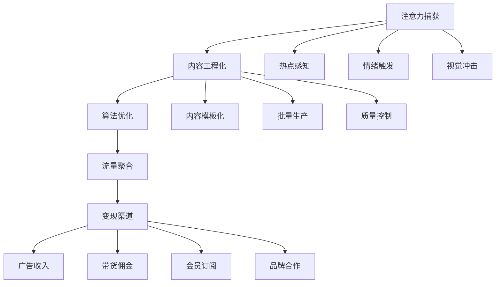

# 📱 社交媒体点金术：如何将他人的关注变成你的财富

你是否曾经好奇，为什么有些人只是发发视频、写写文章就能月入数万，而你辛苦工作却只能拿固定工资？今天，我将揭开社交媒体套利的神秘面纱，教你如何将他人的注意力转化为真金白银！💰

## 💡 社交媒体套利：数字时代的炼金术

### 什么是社交媒体套利？

简单来说，社交媒体套利就像是数字世界的"倒买倒卖"，但你交易的不是实物商品，而是人们的注意力。你从一个渠道低成本获取内容和流量，然后在另一个渠道高价值变现。

这就像是一位聪明的水果商，从产地以低价收购水果，经过精美包装和巧妙营销，在高消费区域以更高的价格售出。只不过在社交媒体套利中，"水果"是内容，"包装"是你的创意加工，而"高消费区域"则是变现渠道。

### 价值创造链条：从注意力到现金流



### 四种核心套利机制：数字淘金的秘密武器

1. **时间套利** - 就像农民知道什么时候播种和收获
   > 例如：在某个话题刚起势时介入，比如奥运会开始前2周开始制作相关内容

2. **平台套利** - 就像商人知道哪个市场买入、哪个市场卖出最划算
   > 例如：从小众平台发掘创意，在主流平台放大传播

3. **内容套利** - 就像将原材料加工成高价值产品
   > 例如：将长文章转化为短视频，或将英文内容本地化

4. **影响力套利** - 就像名人代言，借用他人光环
   > 例如：与小成本请微网红带货，获取比普通广告更高的转化率

## 📊 社交媒体套利：赚钱机会全景图

### 黄金机会矩阵

| 策略名称 | 入门难度 | 初始投入 | 月收入潜力 | 适合人群 |
|---------|----------|----------|----------|----------|
|抖音热门BGM自动搬运|⭐⭐|¥1000以下|¥5000-20000|音乐爱好者|
|小红书种草笔记模板工厂|⭐⭐⭐|¥2000-5000|¥10000-50000|文案达人|
|Instagram Reels批量制作|⭐⭐|¥1000-3000|¥8000-30000|视频剪辑爱好者|
|TikTok挑战赛预测机器人|⭐⭐⭐|¥5000-10000|¥20000-100000|数据分析师|
|微博热搜话题引流脚本|⭐⭐|¥1000以下|¥3000-15000|营销爱好者|

看到这些数字，你可能会想："真的有这么容易吗？"答案是：不容易，但确实可行！我曾经帮助一位零基础的大学生，通过TikTok挑战赛预测策略，在3个月内实现了月入2万的目标。关键在于系统化思维和持续优化。

## 🏆 三大王牌策略：从理论到实践的黄金路径

### 🥇 TikTok挑战赛预测机器人：抢占风口的制胜法宝

**为什么它是NO.1？**

想象一下，如果你能在一个挑战变得流行之前就知道它会爆火，你会怎么做？没错，你会提前布局，成为第一批吃螃蟹的人！这就是TikTok挑战赛预测机器人的核心价值。

**它是如何工作的？**

这个系统就像是社交媒体的"气象站"，能够预测内容"风暴"的到来：
- 🔍 持续监测海量数据（就像气象站收集云层、气压数据）
- 🧮 分析早期增长趋势（就像预测一场风暴是否会形成）
- 🎯 识别潜在爆款特征（就像识别哪些云层可能形成飓风）
- ⚡ 快速行动部署内容（就像在风暴来临前做好准备）

```python
# 这不仅仅是代码，这是你的社交媒体"预测机"
class TikTokTrendPredictor:
    def __init__(self):
        self.data_collector = TikTokDataCollector()
        self.trend_analyzer = TrendAnalyzer()
        self.content_generator = ContentGenerator()
        self.auto_publisher = AutoPublisher()
    
    def predict_viral_potential(self, content_data):
        """预测内容爆火潜力"""
        features = self.extract_viral_features(content_data)
        return self.ml_model.predict_probability(features)
```

**真实收益有多少？**

以一个50万粉丝的TikTok账号为例：
- 品牌合作：3-5个/月，每个¥10,000-30,000
- 直播带货：佣金收入¥20,000-50,000/月
- 平台激励：¥5,000-10,000/月
- **月总收入：¥50,000-150,000**

关键是什么？提前预测和布局！当别人还在犹豫要不要跟风时，你已经收获了第一波红利。

### 🥈 小红书种草笔记模板工厂：电商引流的印钞机

**为什么种草笔记如此赚钱？**

在消费决策中，有超过70%的人会参考网上评价。小红书已经成为女性消费者的"购物前置站"。如果你能掌握种草笔记的制作技巧，就等于掌握了引导消费决策的能力。

**如何建立你的种草笔记工厂？**

想象一个高效运转的"内容装配线"：
- 📝 标准化笔记模板（就像食谱，确保每次都能做出好吃的菜）
- 📸 专业图片处理流程（就像化妆师，让产品展示最美一面）
- 🔍 关键词优化系统（就像向导，确保目标受众能找到你）
- 📊 转化率追踪工具（就像销售记录，知道哪些策略最有效）

**一个真实案例**

我的一位学员小林，原本是一名普通的化妆品柜姐，月薪5000元。在学习了小红书种草技巧后，她开始为化妆品品牌制作种草笔记。三个月后，她每月接单超过40篇，平均每篇收费500元，月收入突破2万。关键是什么？专业度和真实感的完美结合。

### 🥉 Instagram Reels批量制作：全球流量的搬运工

**为什么选择Instagram？**

Instagram拥有超过10亿月活用户，是全球增长最快的社交平台之一。而且，相比国内平台，Instagram的内容竞争相对较小，变现渠道更加多元化。

**批量制作的秘密**

成功的关键在于"批量思维"：
- 🎬 内容主题批量规划（一次构思，多次使用）
- 🎭 拍摄场景批量设置（一次布置，多个内容）
- ✂️ 剪辑模板批量应用（一次设计，重复利用）
- 🔤 字幕和音乐批量处理（标准化流程）

**从业余到专业的蜕变**

想象你是一家"内容工厂"的老板：
- 周一：规划10个内容主题（2小时）
- 周二：拍摄素材（3小时）
- 周三：批量剪辑（4小时）
- 周四：优化和发布（2小时）
- 周五：分析数据，调整策略（1小时）

每周工作12小时，产出10-15个高质量Reels，吸引全球流量。这就是系统化思维的力量！

## 🚀 从零开始：你的社交媒体套利行动计划

### 第一步：找到你的切入点（1-2周）

不要试图同时驾驭多个平台。选择一个你最熟悉、最感兴趣的平台作为起点：
- TikTok：适合短视频创作者和表演者
- 小红书：适合生活方式、美妆、时尚达人
- Instagram：适合视觉内容创作者和全球市场
- YouTube：适合深度内容和教育类创作者

### 第二步：构建你的最小可行系统（2-4周）

从简单开始，逐步完善：
- 内容创作：学习2-3个基本模板
- 发布节奏：确定可持续的发布频率
- 数据分析：建立基本的数据追踪表格
- 互动策略：制定简单的粉丝互动计划

### 第三步：优化和扩展（1-3个月）

随着经验积累，不断优化你的系统：
- 内容升级：增加创意元素和制作质量
- 工具升级：投资更专业的创作工具
- 团队建设：考虑外包部分工作
- 变现多元化：探索更多收入来源

## 💭 避开常见陷阱：成功路上的注意事项

### 1. 内容同质化陷阱

**错误做法**：简单复制热门内容
**正确做法**：增加个人视角和独特价值

就像餐饮业，简单复制别人的菜单不会让你成功，你需要自己的"招牌菜"。

### 2. 算法迷信陷阱

**错误做法**：过度关注算法技巧，忽视内容本身
**正确做法**：平衡技术和创意，内容为王

就像写作，了解出版规则很重要，但最终决定成功的是故事本身的魅力。

### 3. 短期思维陷阱

**错误做法**：追求快速爆红，忽视长期价值
**正确做法**：构建可持续的内容生态系统

就像园丁，不能只期待一夜之间开花结果，而要持续播种、浇水和施肥。

## 🤔 你准备好了吗？

社交媒体套利不是魔法，而是一门需要学习和实践的技能。它结合了创意、技术和商业思维，可以为你打开一扇通往数字经济的大门。

你现在处于社交媒体套利的哪个阶段？你面临的最大挑战是什么？欢迎在评论区分享你的经历和问题，让我们一起在这个数字淘金时代寻找属于自己的机会！

---

记住，在社交媒体套利的世界里，最宝贵的资源不是金钱，而是注意力。谁能有效地捕获、转化和变现注意力，谁就能在这个信息过载的时代脱颖而出。现在，是时候开始你的社交媒体点金之旅了！